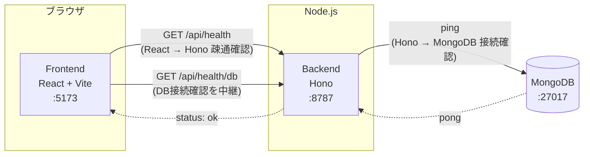

# Digger

Digger は「興味を持ったことを深掘りし、理解したことを蓄積して次の理解につなげる」ためのサービスです。
最初の入力手段としてニュースURLを想定していますが、ニュースに限定されない汎用的な「深掘り・蓄積」の仕組みを目指します。

MVPとして、記事URLを入力すると固定のモック解析結果を返す「掘る」機能を実装しています（記事取得・LLM連携・DB保存は未実装）。

## 構成

- `frontend/` — React + Vite + TypeScript
- `backend/` — Hono + TypeScript（Node.js ランタイム上で `@hono/node-server` を使用）
- MongoDB — Docker Compose で起動するコンテナ

```
digger/
├── docker-compose.yml
├── frontend/   # React + Vite + TypeScript
└── backend/    # Hono + TypeScript
```

## 疎通イメージ



- フロントエンドは `VITE_API_BASE_URL`（既定 `http://localhost:8787`）宛にブラウザから直接 `fetch` します。
- バックエンドは `FRONTEND_ORIGIN` を許可オリジンとした CORS 設定で応答します。
- `/api/health/db` はバックエンドが MongoDB に ping し、その結果をフロントエンドに返す構成です。

## 「掘る」機能（MVP）

トップ画面のURL入力欄に記事URLを入力して「掘る」を押すと、`POST /api/dig` が呼ばれ、解析結果（タイトル・要約・なぜ重要か・前提知識・関連トピック・深掘りの問い）が画面に表示されます。

バックエンドは入力されたURLに実際にアクセスしてHTMLを取得し、[Mozilla Readability](https://github.com/mozilla/readability)（Firefoxのリーダービューと同じ抽出エンジン）でnav/footer/広告などを除いた本文と`title`を抽出します。ニュースサイト専用のパースは行わず、一般的なWeb記事を対象にした構造です。

抽出した本文は「Article Analysis」というLLM処理（[`backend/README.md`](backend/README.md#llm処理article-analysis--personalized-analysis--knowledge-extraction--deep-dive)を参照）に渡され、要約・重要性・前提知識・関連人物や組織・関連トピック・深掘りの問いを生成します。環境変数`LLM_PROVIDER`で切り替え可能で、`mock`（デフォルト）なら固定のデモデータ（日銀の利上げに関するサンプル）、`vertex`ならGoogle Cloud Vertex AI Geminiが実際の記事内容を解析した結果を返します。

```
POST /api/dig
Content-Type: application/json

{ "url": "https://example.com/article" }
```

- URLが未指定・不正な形式・`http`/`https`以外のプロトコル・アクセスが許可されていないホスト（下記SSRF対策を参照）の場合は `400 { "error": "..." }` を返します。
- robots.txtにより取得が許可されていない場合は `403 { "error": "..." }` を返します。
- 記事取得・抽出に失敗した場合は `422`（本文抽出失敗・HTML以外のコンテンツ）または `502`（アクセス失敗・非2xxレスポンス・ホスト名解決失敗）で `{ "error": "..." }` を返します。詳細は [`backend/README.md`](backend/README.md) を参照してください。
- 成功時は以下の形のJSONを返します（`source.title`は実際に取得した値、`analysis`以下は現時点ではモックのサンプルデータ）。

```json
{
  "source": { "type": "web_article", "url": "https://example.com/article", "title": "（取得した実際の記事タイトル）" },
  "analysis": {
    "summary": "この記事では日本銀行が政策金利の引き上げを決定したことが報じられています。...",
    "whyItMatters": "金利の変化は物価・為替・家計や企業の資金繰りなど経済全体に波及するため...",
    "concepts": [
      { "id": "concept-policy-rate", "name": "政策金利", "description": "...", "importance": "required" }
    ],
    "entities": [
      { "name": "日本銀行", "type": "organization", "description": "..." }
    ],
    "connections": [
      { "topic": "円安", "relation": "金利差を通じて為替に影響する" }
    ],
    "deepDiveQuestions": ["なぜ利上げすると円高になりやすい？", "..."]
  }
}
```

記事本文そのものはレスポンスに含めていません（フロントエンドへ大量のテキストを返さないため）。前提知識（`concepts`）は表示のみです。`deepDiveQuestions`（AIが提示する次の質問候補）はデータとしては返しますが、**Diggerの「ユーザー自身の疑問を起点に掘る」という方針により、frontendのUIには一切表示していません**。深掘りは常に下記の自由入力欄から行います。

画面はこの解析結果を並べた「情報カード中心」のUIではなく、**会話中心**のUIです。記事を掘った直後に見えるのは、短い地の文の要約（`summary`の冒頭3文）と「この記事について、何が気になりますか？」という大きめの自由入力欄（テキストエリア、Enterで送信・Shift+Enterで改行）のみです。`concepts`・`whyItMatters`・`connections`・`entities`はカードとして並べず、「前提知識を見る」「この記事の背景」という控えめなリンクからのみ、ユーザーが望んだ場合に表示されます。ユーザーが最初の質問を送ると画面はほぼ会話のみの表示に切り替わり、記事情報は退いて会話に集中できるようにしています（詳細は[`frontend/README.md`](frontend/README.md)を参照）。

## 深掘り対話機能

解析結果の下に「他に気になることは？」という自由入力欄があり、`POST /api/deep-dive` を使ってその場でチャット形式の深掘りができます（ページ遷移なし）。

```
POST /api/deep-dive
Content-Type: application/json

{
  "articleAnalysis": { ... },
  "question": "なぜ利上げすると円高になりやすいの？",
  "conversationHistory": []
}
```

- 質問は常に自由入力欄から行います（AIが提示する質問候補をクリックする導線はUI上にありません）。
- 2回目以降の質問では、これまでの会話（`{ role: "user" | "assistant", content: string }[]`）を`conversationHistory`として送ります。
- 成功時のレスポンスは `{ answer, relatedConcepts, suggestedFollowUps }`。**frontendは`answer`のみを表示し、`relatedConcepts`/`suggestedFollowUps`は受け取っても画面には出しません**（Diggerの「ユーザー自身の疑問を起点に掘る」という方針のため）。backendの型・schemaはこれらのフィールドを引き続き保持しています（将来的な別用途のため）。
- `LLM_PROVIDER`で切り替え可能: `mock`（デフォルト）なら記事の解析結果（`concepts`/`deepDiveQuestions`）から組み立てた固定応答、`vertex`ならVertex AI Geminiが記事のArticle Analysis・会話履歴・（あれば）ユーザーの理解履歴を踏まえて実際に回答します。Diggerは一般的な雑談チャットではなく、今読んでいる記事・テーマを理解するための専用家庭教師として振る舞うよう指示しています。
- **保存済みKnowledgeを自動的に活用します**: クライアントから明示的に渡さなくても、サーバー側が保存済みKnowledge（`status: active`/`foundational`のみ）の中から今回の質問・記事に関連しそうなものだけを自動的に選び、Geminiに「このユーザーが過去に理解したこと」として渡します（毎回全件を送るのではなく、関連しそうな3〜5件程度に絞り込みます。詳細は[`backend/README.md`](backend/README.md)を参照）。Geminiは、関連性が高ければ過去の理解と自然につなげて説明しますが、毎回答で無理に「以前あなたは○○を理解しました」のように触れることはありません。関連するKnowledgeが無い場合は従来通り通常の説明をします。
- 会話履歴はMongoDBにはまだ保存されません（ページをリロードすると消えます）。認証も不要です。

## 理解の蓄積（Knowledge Extraction）

「掘る → 分かる → 理解したことが蓄積される」というDiggerのコアループの最後のステップです。深掘り会話をある程度した後、チャット画面の下に控えめな「今回わかったことを残す」リンクが表示されます。押すと、その会話ログをもとにKnowledge Extraction（LLM処理）が「今回新しく理解したと考えられる内容」の候補を生成します。

```
POST /api/knowledge/extract
Content-Type: application/json

{
  "source": { "type": "web_article", "url": "...", "title": "..." },
  "articleAnalysis": { ... },
  "conversationHistory": [ ... ]
}
```

- **AIは理解を勝手に確定しません**。返ってくるのはあくまで"候補"（`KnowledgeCandidate[]`、各`concept`/`statement`/`confidence`/`evidence`等を持つ）で、記事本文に書いてあるだけの内容やユーザーが質問しただけの内容は候補から除外するようpromptで指示しています。`confidence: "low"`の候補はUXをシンプルに保つため、確認UIに出す前にサーバー側で除外しています。
- **Knowledgeは「不変のメモ」ではなく「現在の理解状態を構成する要素」として扱います**。新しい候補が既存Knowledgeとどう関係するか（`relationToExisting`: `new`＝新しい理解／`reinforces`＝別の文脈での再確認／`extends`＝既存を前提にさらに理解が広がった／`supersedes`＝既存の理解を置き換える）もAIが判定し、確認パネルに「以前の理解を深める内容です」のような控えめなヒントとして表示することがあります。今回はこの関係を判定・記録するところまでで、既存Knowledgeの自動的な書き換えや統合は行いません。
- 候補は小さな確認パネルにチェックボックス付きで表示され、ユーザーが選んだものだけが`POST /api/knowledge/save`で保存されます（AIが自動保存することはありません）。`reinforces`と判定された候補は、ユーザーが選択しても新規保存されません（既存の理解の再確認のため）。
- 保存済みKnowledgeと（`concept`完全一致 + `statement`正規化後一致で）重複するものは無条件に保存せず、スキップします（Embedding等の高度な類似度判定はMVPのスコープ外）。
- 保存完了後は画面遷移せず、チャット画面上に「N件の理解を保存しました」という小さなフィードバックのみを表示します。
- **現時点では認証未実装のため、すべてのKnowledgeは固定ユーザー（`local-user`）に紐づきます**。
- Knowledge Extractionは`LLM_PROVIDER=vertex`のときArticle Analysisと同じパターンでVertex AI Geminiに実接続されます（詳細は[`backend/README.md`](backend/README.md)を参照）。保存済みKnowledgeは、タグライン直下の「保存済みの理解を見る（テスト表示）」から動作確認用の暫定的な一覧表示のみ可能です（きちんとした一覧UIは未実装）。

### 記事取得ポリシー

Diggerが外部Webサイトへアクセスする際は、以下の方針を守ります。

- **robots.txtを尊重する**: リクエストされたURL（およびリダイレクト先の各URL）のオリジンから`/robots.txt`を取得し、Diggerの User-Agent（`Digger/...`）または`*`に対して対象パスが`Disallow`であれば取得を行わず、`403`エラーを返します。
- **robots.txtが取得できない場合は許可されているものとして扱います**（ネットワークエラー・タイムアウト・404など）。記事取得自体を過度に妨げないための実用上の判断です。
- **ログイン回避・paywall突破はしません**。認証やペイウォールを回避する実装は行わず、結果として本文抽出に失敗した場合はエラーを返します。
- **CAPTCHA回避はしません**。ボット判定・CAPTCHAが表示されるサイトはそのまま取得失敗として扱います。
- **取得した本文は現時点では永続保存しません**（MongoDBへの保存は未実装）。
- **原文全文をフロントエンドに返しません**。抽出した本文はサーバー内部でのみ保持し、レスポンスにはタイトルなど必要な情報のみを含めます。
- **SSRF対策**として、`localhost` / ループバック / プライベートIP / リンクローカル（クラウドのメタデータエンドポイントを含む）への直接アクセス、およびそれらへリダイレクトされるケースを拒否します。ホスト名はDNS解決した実IPまで検証し、DNSリバインディングにも対応しています。

## 起動方法（Docker Compose）

前提: Docker / Docker Compose がインストールされていること。

```bash
docker compose up --build
```

起動後、以下にアクセスできます。

- フロントエンド: http://localhost:5173
- バックエンドAPI: http://localhost:8787
  - `GET /api/health` — React → Hono の疎通確認
  - `GET /api/health/db` — Hono → MongoDB の接続確認
  - `POST /api/dig` — URLを受け取り、記事解析結果を返す（[「掘る」機能](#掘る機能mvp)を参照）
  - `POST /api/deep-dive` — 解析結果と質問を受け取り、深掘りの回答を返す（[深掘り対話機能](#深掘り対話機能)を参照）
  - `POST /api/knowledge/extract` / `POST /api/knowledge/save` / `GET /api/knowledge` — 深掘り会話から理解の候補を抽出し、ユーザーが選んだものだけをMongoDBへ保存する（[理解の蓄積（Knowledge Extraction）](#理解の蓄積knowledge-extraction)を参照）
  - `POST /api/llm/test` — 開発用のLLM疎通確認API。詳細は [`backend/README.md`](backend/README.md#vertex-ai-gemini-のセットアップ) を参照
- MongoDB: `mongodb://localhost:27017`（ホストからも接続可能）

フロントエンドの画面 (http://localhost:5173) を開くと、URL入力欄と「掘る」ボタンが表示されます。記事URLを入力して「掘る」を押すと解析結果が表示され、その下から自由入力や質問候補のクリックで深掘りができます。

停止する場合:

```bash
docker compose down
```

MongoDB のデータも含めて完全に削除する場合:

```bash
docker compose down -v
```

## 起動方法（Docker を使わないローカル開発）

Node.js 22 系、および MongoDB（ローカルまたはリモート）が必要です。

### 1. MongoDB を起動

Docker で MongoDB だけ起動する場合:

```bash
docker run -d --name digger-mongo -p 27017:27017 mongo:7
```

### 2. バックエンド

```bash
cd backend
cp .env.example .env
npm install
npm run dev
```

`http://localhost:8787/api/health` と `http://localhost:8787/api/health/db` にアクセスして動作確認できます。

### 3. フロントエンド

別ターミナルで:

```bash
cd frontend
cp .env.example .env
npm install
npm run dev
```

`http://localhost:5173` を開いて確認します。

## 環境変数

### backend/.env

| 変数名 | 説明 | デフォルト |
| --- | --- | --- |
| `PORT` | バックエンドの待受ポート | `8787` |
| `MONGODB_URI` | MongoDB接続文字列 | `mongodb://localhost:27017` |
| `MONGODB_DB_NAME` | 使用するDB名 | `digger` |
| `FRONTEND_ORIGIN` | CORSで許可するフロントエンドのオリジン | `http://localhost:5173` |

### frontend/.env

| 変数名 | 説明 | デフォルト |
| --- | --- | --- |
| `VITE_API_BASE_URL` | バックエンドAPIのベースURL | `http://localhost:8787` |

## 今後について

記事の取得・本文抽出、Article Analysis・Deep Dive・Knowledge ExtractionのVertex AI（Gemini）実LLM化、「掘る → 分かる → 理解したことが蓄積される」というコアループのMongoDBへの永続化、保存済みKnowledgeのDeep Diveでの再利用、Knowledgeの理解状態（`status`）・既存Knowledgeとの関係（`relationToExisting`）の判定は実装済みですが、以下は未実装・未設計です。

- Personalized Analysis（ユーザーの過去の理解と照合するLLM処理）を呼び出す導線（型・モックは実装済み）
- Deep Diveの会話履歴の要約（現状は直近20件を単純に切り詰めるだけ）
- 保存済みKnowledgeのきちんとした一覧UI（現状は動作確認用の暫定的なテスト表示のみ）
- Knowledge Extractionの重複判定を、文字列の正規化一致からEmbedding/Vector Searchベースの意味的な類似度判定に強化する
- **Knowledgeの自動統合**: `relationToExisting`（`extends`/`supersedes`）を使って、既存Knowledgeを実際に`merged`/`outdated`へ遷移させたり書き換えたりする処理（今回は判定・記録のみ）
- **`active`→`foundational`への自動昇格**（「十分理解された」Knowledgeを暗黙の前提として扱う仕組み。`status`フィールド自体は用意済み）
- 認証・ユーザーごとのデータ分離（現状はすべてのKnowledgeが固定ユーザーに紐づくMVP実装）

ニュースURLはあくまで最初の入力手段の一例であり、将来的には記事・動画・書籍・会話メモなど、さまざまな「興味の入口」を扱えるデータモデルにする想定です。設計は今後のイテレーションで詰めていきます。
