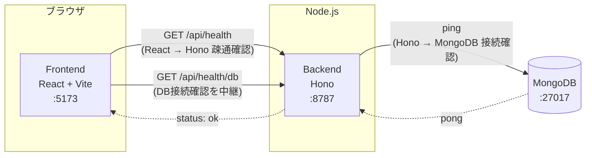

# Digger

Digger は「興味を持ったことを深掘りし、理解したことを蓄積して次の理解につなげる」ためのサービスです。
最初の入力手段としてニュースURLを想定していますが、ニュースに限定されない汎用的な「深掘り・蓄積」の仕組みを目指します。

現時点ではまだ業務機能はなく、開発環境の土台（React ⇄ Hono の疎通確認、Hono ⇄ MongoDB の接続確認）のみを実装しています。

## 構成

- `frontend/` — React + Vite + TypeScript
- `backend/` — Hono + TypeScript（Node.js ランタイム上で `@hono/node-server` を使用）
- MongoDB — Docker Compose で起動するコンテナ

```
digger/
├── docker-compose.yml
├── frontend/   # React + Vite + TypeScript
└── backend/    # Hono + TypeScript
```

## 疎通イメージ



- フロントエンドは `VITE_API_BASE_URL`（既定 `http://localhost:8787`）宛にブラウザから直接 `fetch` します。
- バックエンドは `FRONTEND_ORIGIN` を許可オリジンとした CORS 設定で応答します。
- `/api/health/db` はバックエンドが MongoDB に ping し、その結果をフロントエンドに返す構成です。

## 起動方法（Docker Compose）

前提: Docker / Docker Compose がインストールされていること。

```bash
docker compose up --build
```

起動後、以下にアクセスできます。

- フロントエンド: http://localhost:5173
- バックエンドAPI: http://localhost:8787
  - `GET /api/health` — React → Hono の疎通確認
  - `GET /api/health/db` — Hono → MongoDB の接続確認
- MongoDB: `mongodb://localhost:27017`（ホストからも接続可能）

フロントエンドの画面 (http://localhost:5173) を開くと、上記2つのAPIを呼び出した結果がカードとして表示されます。両方とも `status: "ok"` になっていれば疎通・接続ともに成功しています。

停止する場合:

```bash
docker compose down
```

MongoDB のデータも含めて完全に削除する場合:

```bash
docker compose down -v
```

## 起動方法（Docker を使わないローカル開発）

Node.js 20 系、および MongoDB（ローカルまたはリモート）が必要です。

### 1. MongoDB を起動

Docker で MongoDB だけ起動する場合:

```bash
docker run -d --name digger-mongo -p 27017:27017 mongo:7
```

### 2. バックエンド

```bash
cd backend
cp .env.example .env
npm install
npm run dev
```

`http://localhost:8787/api/health` と `http://localhost:8787/api/health/db` にアクセスして動作確認できます。

### 3. フロントエンド

別ターミナルで:

```bash
cd frontend
cp .env.example .env
npm install
npm run dev
```

`http://localhost:5173` を開いて確認します。

## 環境変数

### backend/.env

| 変数名 | 説明 | デフォルト |
| --- | --- | --- |
| `PORT` | バックエンドの待受ポート | `8787` |
| `MONGODB_URI` | MongoDB接続文字列 | `mongodb://localhost:27017` |
| `MONGODB_DB_NAME` | 使用するDB名 | `digger` |
| `FRONTEND_ORIGIN` | CORSで許可するフロントエンドのオリジン | `http://localhost:5173` |

### frontend/.env

| 変数名 | 説明 | デフォルト |
| --- | --- | --- |
| `VITE_API_BASE_URL` | バックエンドAPIのベースURL | `http://localhost:8787` |

## 今後について

業務機能（URL/コンテンツの取り込み、深掘りメモの蓄積、関連付けなど）やDBスキーマは未設計です。ニュースURLはあくまで最初の入力手段の一例であり、将来的には記事・動画・書籍・会話メモなど、さまざまな「興味の入口」を扱えるデータモデルにする想定です。設計は今後のイテレーションで詰めていきます。
