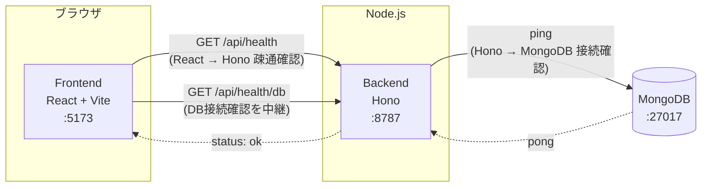

# Digger

Digger は「興味を持ったことを深掘りし、理解したことを蓄積して次の理解につなげる」ためのサービスです。
最初の入力手段としてニュースURLを想定していますが、ニュースに限定されない汎用的な「深掘り・蓄積」の仕組みを目指します。

MVPとして、記事URLを入力すると固定のモック解析結果を返す「掘る」機能を実装しています（記事取得・LLM連携・DB保存は未実装）。

## 構成

- `frontend/` — React + Vite + TypeScript
- `backend/` — Hono + TypeScript（Node.js ランタイム上で `@hono/node-server` を使用）
- MongoDB — Docker Compose で起動するコンテナ

```
digger/
├── docker-compose.yml
├── frontend/   # React + Vite + TypeScript
└── backend/    # Hono + TypeScript
```

## 疎通イメージ



- フロントエンドは `VITE_API_BASE_URL`（既定 `http://localhost:8787`）宛にブラウザから直接 `fetch` します。
- バックエンドは `FRONTEND_ORIGIN` を許可オリジンとした CORS 設定で応答します。
- `/api/health/db` はバックエンドが MongoDB に ping し、その結果をフロントエンドに返す構成です。

## 「掘る」機能（MVP）

Diggerの本質は「記事を読むこと」ではなく「気になったものを掘り、理解し、理解を蓄積すること」なので、入力方式はURLに限定していません。トップ画面のComposer（1つの入力欄＋画像添付ボタン）にURL・貼り付けテキスト・画像のいずれかを入れて「掘る」を押すと、`POST /api/dig` が呼ばれ、解析結果（タイトル・要約・なぜ重要か・前提知識・関連トピック・深掘りの問い）が画面に表示されます。URLかテキストかはユーザーに選ばせず、backendが自動判定します。

- **URL**: 実際にアクセスしてHTMLを取得し、[Mozilla Readability](https://github.com/mozilla/readability)（Firefoxのリーダービューと同じ抽出エンジン）でnav/footer/広告などを除いた本文と`title`を抽出します。ニュースサイト専用のパースは行わず、一般的なWeb記事を対象にした構造です（従来と同じ）。
- **テキスト**: 記事本文の引用・ニュースの一節・メモ・SNS投稿のコピペなど、貼り付けた自由なテキストをそのまま解析に渡します。外部への`fetch`は行いません。
- **画像**: スクリーンショット・新聞紙面・グラフや図表・写真中の文章などをアップロードすると、Google Cloud Vertex AI Geminiのマルチモーダル入力でそのまま解析します。OCRで文字起こしするだけでなく、画像の意味（グラフの傾向、SNS投稿の文脈、紙面の見出し等）まで理解しようとします。専用のOCRパイプラインは実装していません。

いずれの入力も、最終的には同じ「Article Analysis」というLLM処理（[`backend/README.md`](backend/README.md#llm処理article-analysis--personalized-analysis--knowledge-extraction--deep-dive)を参照）に渡され、要約・重要性・前提知識・関連人物や組織・関連トピック・深掘りの問いを生成します。環境変数`LLM_PROVIDER`で切り替え可能で、`mock`（デフォルト）なら固定のデモデータ（日銀の利上げに関するサンプル）、`vertex`ならGoogle Cloud Vertex AI Geminiが実際の入力内容を解析した結果を返します。

```
POST /api/dig
Content-Type: application/json

{ "input": "https://example.com/article" }
```

貼り付けテキストの場合は`input`に自由なテキストを、画像の場合は`image: { "data": "（base64）", "mimeType": "image/png" }`を渡します（`input`は画像に添える補足コメントとして任意で併用可能）。

- 入力が未指定・空・URLとして不正な形式・`http`/`https`以外のプロトコル・アクセスが許可されていないホスト（下記SSRF対策を参照）・テキストが長すぎる・画像が対応形式外の場合は `400 { "error": "..." }` を、画像サイズが大きすぎる場合は `413 { "error": "..." }` を返します。
- robots.txtにより取得が許可されていない場合は `403 { "error": "..." }` を返します（URL入力のみ）。
- 記事取得・抽出に失敗した場合は `422`（本文抽出失敗・HTML以外のコンテンツ、URL入力のみ）または `502`（アクセス失敗・非2xxレスポンス・ホスト名解決失敗）で `{ "error": "..." }` を返します。詳細は [`backend/README.md`](backend/README.md) を参照してください。
- 成功時は以下の形のJSONを返します（`source.title`は実際に取得した値、`analysis`以下は現時点ではモックのサンプルデータ）。テキスト・画像入力の場合、`source`は`{ "type": "text" }`/`{ "type": "image" }`となり`url`は含まれません。

```json
{
  "source": { "type": "web_article", "url": "https://example.com/article", "title": "（取得した実際の記事タイトル）" },
  "analysis": {
    "summary": "この記事では日本銀行が政策金利の引き上げを決定したことが報じられています。...",
    "whyItMatters": "金利の変化は物価・為替・家計や企業の資金繰りなど経済全体に波及するため...",
    "concepts": [
      { "id": "concept-policy-rate", "name": "政策金利", "description": "...", "importance": "required" }
    ],
    "entities": [
      { "name": "日本銀行", "type": "organization", "description": "..." }
    ],
    "connections": [
      { "topic": "円安", "relation": "金利差を通じて為替に影響する" }
    ],
    "deepDiveQuestions": ["なぜ利上げすると円高になりやすい？", "..."]
  }
}
```

記事本文そのものはレスポンスに含めていません（フロントエンドへ大量のテキストを返さないため）。前提知識（`concepts`）は表示のみです。`deepDiveQuestions`（AIが提示する次の質問候補）はデータとしては返しますが、**Diggerの「ユーザー自身の疑問を起点に掘る」という方針により、frontendのUIには一切表示していません**。深掘りは常に下記の自由入力欄から行います。

画面はこの解析結果を並べた「情報カード中心」のUIではなく、**会話中心**のUIです。掘った直後に見えるのは、短い地の文の要約（`summary`の冒頭3文）と「気になることを聞いてみましょう」という大きめの自由入力欄（テキストエリア、Enterで送信・Shift+Enterで改行）のみです。`concepts`・`whyItMatters`・`connections`・`entities`はカードとして並べず、「前提知識を見る」「背景を見る」という控えめなリンクからのみ、ユーザーが望んだ場合に表示されます。ユーザーが最初の質問を送ると画面はほぼ会話のみの表示に切り替わり、入力元の情報は退いて会話に集中できるようにしています（詳細は[`frontend/README.md`](frontend/README.md)を参照）。

## 深掘り対話機能

解析結果の下に「他に気になることは？」という自由入力欄があり、`POST /api/deep-dive` を使ってその場でチャット形式の深掘りができます（ページ遷移なし）。

```
POST /api/deep-dive
Content-Type: application/json

{
  "articleAnalysis": { ... },
  "question": "なぜ利上げすると円高になりやすいの？",
  "conversationHistory": []
}
```

- 質問は常に自由入力欄から行います（AIが提示する質問候補をクリックする導線はUI上にありません）。
- 2回目以降の質問では、これまでの会話（`{ role: "user" | "assistant", content: string }[]`）を`conversationHistory`として送ります。
- 成功時のレスポンスは `{ answer, relatedConcepts, suggestedFollowUps }`。**frontendは`answer`のみを表示し、`relatedConcepts`/`suggestedFollowUps`は受け取っても画面には出しません**（Diggerの「ユーザー自身の疑問を起点に掘る」という方針のため）。backendの型・schemaはこれらのフィールドを引き続き保持しています（将来的な別用途のため）。
- `LLM_PROVIDER`で切り替え可能: `mock`（デフォルト）なら記事の解析結果（`concepts`/`deepDiveQuestions`）から組み立てた固定応答、`vertex`ならVertex AI Geminiが記事のArticle Analysis・会話履歴・（あれば）ユーザーの理解履歴を踏まえて実際に回答します。Diggerは一般的な雑談チャットではなく、今読んでいる記事・テーマを理解するための専用家庭教師として振る舞うよう指示しています。
- **回答は短く会話的で、質問の種類に応じて長さが変わります**: Diggerは1回の回答でテーマ全体を説明し切るのではなく、ユーザーとの往復で理解を深めるサービスという方針のもと、まず質問に直接答え、今回質問された範囲に集中し、不要な背景説明や周辺知識まで広げすぎないようpromptで指示しています。「MI6の起源は？」のような単純な事実質問は150〜300文字程度、「なぜ利上げすると円高になりやすい？」のような因果関係・仕組みの質問は300〜500文字程度（3〜5段落程度）を目安にし、「詳しく」「もっと深掘りして」のように明示的に詳細を求められた場合のみ、その目安にとらわれず詳しく説明します。「詳しい回答」より「今の疑問にちょうどよく答える」ことを優先していますが、短くするために情報を曖昧にすることはありません。
- **保存済みKnowledgeを自動的に活用します**: クライアントから明示的に渡さなくても、サーバー側が保存済みKnowledge（`status: active`/`foundational`のみ）の中から今回の質問・記事に関連しそうなものだけを自動的に選び、Geminiに「このユーザーが過去に理解したこと」として渡します（毎回全件を送るのではなく、関連しそうな3〜5件程度に絞り込みます。詳細は[`backend/README.md`](backend/README.md)を参照）。Geminiは、関連性が高ければ過去の理解と自然につなげて説明しますが、毎回答で無理に「以前あなたは○○を理解しました」のように触れることはありません。関連するKnowledgeが無い場合は従来通り通常の説明をします。
- 会話履歴はMongoDBにはまだ保存されません（ページをリロードすると消えます）。認証も不要です。

## 理解・判断の蓄積（Memory Extraction）

「掘る → 分かる → 理解したことが蓄積される」というDiggerのコアループの最後のステップです。Diggerは「AIがKnowledgeを記録するサービス」ではなく「ユーザーが理解・判断・検討を育てていくサービス」なので、保存対象はKnowledge（理解した事実・概念）だけに限定していません。深掘り会話をある程度した後、チャット画面の下に控えめな「今回残したいこと」リンクが表示されます。押すと、その会話ログをもとにMemory Extraction（LLM処理、旧Knowledge Extractionを一般化したもの）が保存候補を生成します。

```
POST /api/memory/extract
Content-Type: application/json

{
  "source": { "type": "web_article", "url": "...", "title": "..." },
  "articleAnalysis": { ... },
  "conversationHistory": [ ... ]
}
```

候補（`MemoryCandidate[]`）には5種類の`type`があります。

- **knowledge**: ユーザーが理解した事実・概念（例:「SUVは一般にミニバンより重心が低く、揺れを感じにくい傾向がある」）。従来のKnowledgeと同じもの。
- **preference**: ユーザー自身の条件・好み・重視点（例:「子供2人が酔いづらいことを重視する」「国産車を優先したい」）。
- **candidate**: ユーザーが検討している具体的な対象（例:「トヨタ RAV4」）。会話で実際に挙がった理由・懸念があれば`metadata.reasons`/`metadata.concerns`として残ります（将来の比較機能のための受け皿。今回は比較UI自体は作っていません）。
- **decision**: ユーザーが会話中に決めたこと（例:「RAV4とフォレスターを比較する」）。
- **open_question**: まだ結論が出ていない疑問・確認したいこと（例:「フォレスターとRAV4では車酔いしにくさがどちらが上か確認したい」）。

- **AIは保存内容を勝手に確定しません**。返ってくるのはあくまで"候補"です。特にpreference/candidate/decisionは、AIの提案にユーザーが反応しただけでは確定させず、ユーザー自身が実際に発言した内容（「RAV4良さそう」「候補に入れたい」等）を根拠にするようpromptで指示しています。knowledgeは従来通り、記事本文に書いてあるだけの内容やユーザーが質問しただけの内容を除外します。`confidence: "low"`の候補はtype問わずUXを単純に保つため確認UIから除外しています。
- knowledgeのみ、既存Knowledgeとの関係（`relationToExisting`: `new`/`reinforces`/`extends`/`supersedes`）をAIが判定します（従来のKnowledge Extractionと同じ判定基準）。
- **確認パネルは「今回残したいこと」として、type別（理解したこと/条件・好み/候補/決めたこと/未解決）にグルーピングして表示します**。該当候補が無いtypeの見出しは表示しません。
- **AI候補はユーザーが編集できます**（最低限title/contentを、candidateはさらにreasons/concernsも編集可能）。編集すると、その候補の`origin`が保存時に`ai_extracted`から`user_edited`に切り替わります。編集しなければ`ai_extracted`のまま保存されます。
- **「＋ 自分で追加」から、ユーザー自身がAI候補を介さずMemoryItemを追加できます**（type選択＋内容＋任意の補足）。この場合`origin`は`user_created`になります。
- 選んだ候補だけが`POST /api/memory/save`で保存されます（AIが自動保存することはありません）。knowledge型は既存のKnowledge保存パイプラインへそのまま委ね、他の4 typeは新しい`memory_items`コレクションへ保存します（重複判定は同一type＋内容の正規化後一致のみで、Embedding等はスコープ外）。
- 保存完了後は画面遷移せず、チャット画面上に「6件残しました（条件・好み3件・候補2件・決めたこと1件）」のような簡単な内訳フィードバックを表示します。
- **現時点では認証未実装のため、すべてのMemoryItemは固定ユーザー（`local-user`）に紐づきます**。
- Memory Extractionは`LLM_PROVIDER=vertex`のときArticle Analysisと同じパターンでVertex AI Geminiに実接続されます（詳細は[`backend/README.md`](backend/README.md)を参照）。既存の`POST /api/knowledge/extract`・`POST /api/knowledge/save`・`GET /api/knowledge`は後方互換のためそのまま残っており、frontendは`/api/memory/*`へ移行済みです。`GET /api/memory`は既存Knowledgeと新しいMemoryItemを統一した一覧として返します（保存済みの一覧は引き続き「自分の理解」ページの`GET /api/knowledge`ベースの表示のみで、`GET /api/memory`は今回まだUIから使っていません）。

## 自分の理解ページ

蓄積したKnowledgeをフラットな一覧としてではなく、「最近わかったこと」「トピックごとの広がり」「Knowledge同士のつながり」の3つの見方で眺められるページです。「掘る」「自分の理解」は上部タブではなく左側の固定サイドバー（モバイルは下部固定のBottom Navigation）から切り替え、`react-router-dom`によるURLルーティング（`/dig`・`/understanding/recent`・`/understanding/topic`・`/understanding/map`）を導入しているため、直接アクセス・リロード・ブラウザの戻る/進むにも対応しています（詳細は[`frontend/README.md`](frontend/README.md)を参照）。

- **最近タブ**: 保存済みKnowledgeを`createdAt`の新しい順に「今日」「昨日」などの日付でグルーピングして表示します。各カードをクリックすると、概念・説明・理解した日・状態・元の記事・関連する理解をモーダルで確認できます（既存のKnowledgeスキーマにあるデータのみを表示し、新しいデータは作っていません）。
- **トピックタブ**: 各Knowledgeが持つ`topicPath`（最大3階層のトピックの配列、例: `["経済", "金融政策", "政策金利"]`）をもとに、テーマ別の階層ツリーとして表示します。`topicPath`が未付与のKnowledgeは`GET /api/knowledge`が呼ばれたタイミングでバックエンドがまとめてLLM（Vertex AI Gemini。詳細は[`backend/README.md`](backend/README.md)を参照）に分類させ、以後はDBに保存された値を使い回します（毎回全件を送り直すことはありません）。
- **マップタブ**: Root Topic → Subtopic → Concept → Knowledgeという理解構造の階層そのものをMapの骨格にした「構造マップ」です。Topic/Concept/ConceptRelationモデル（後述）を使い、UIは検索／Topicフィルタ／中央: 階層構造マップ／右: Detail Panelで構成しています（[reactflow](https://reactflow.dev/)を使用）。node配置は以前のforce-directed layout（d3-force）から[dagre](https://github.com/dagrejs/dagre)による決定的な階層レイアウトへ置き換え、左→右に階層が広がるtree状の配置にしています。Root Topic（最大・最も強い塗り）／Subtopic／Concept／Knowledge（小さなdot＋短いcaptionのleaf）の4種類をサイズ・形ではっきり区別し、Nodeサイズは「relationがどれだけあるか」ではなく「理解構造上どの階層にいるか」を第一基準にします。ConceptRelation（横断的なつながり）はレイアウトには関与せず、階層のparent-child edgeより控えめな補助edgeとして重ねるだけなので、**ConceptRelationが0件でもTopic hierarchyだけでMapとして成立**します。Nodeをクリックすると直接つながる（1-hopの）Node・edgeだけが強調され、右側にNode種別（Topic/Concept/Knowledge）に応じた詳細が表示されます。Topic・Concept・Knowledgeを横断した検索や、Detail Panelからのnavigationを選ぶと、Map上の該当Nodeへカメラが移動し選択状態になります（見たいものが決まっていれば検索、まだ決まっていなければMapを辿る、という役割分担）。「最近」「トピック」タブは引き続き旧`Knowledge.topicPath`モデルのまま無変更です（詳細は[`backend/README.md`](backend/README.md#topic--concept--conceptrelationモデルtopicts--conceptts--conceptrelationts--understandingstructurets)を参照）。
- **状態による見え方**: `status: outdated`のKnowledgeはマップに表示せず、`merged`/`outdated`は一覧上で少し薄く表示します（詳細はモーダルから確認可能）。
- Knowledgeが0件のときは、通常のからっぽな管理画面のようにならないよう、モールのキャラクターと「まだ理解マップは小さいです。気になる記事を掘ると、ここにあなたの理解が少しずつ育っていきます。」という案内文、「記事を掘る」ボタンを表示します。

## 自分の理解から、さらに掘る（循環）

「掘る → 分かる → 理解が蓄積される」で終わらず、蓄積した理解の中から気になる箇所を見つけて再び掘れることが、Diggerのもう一つの核です。マップタブのConcept Detail Panel／Topic Detail Panelには「このConceptを掘る」「このTopicを掘る」というボタンがあり、押すと`/dig/concept/:conceptId`・`/dig/topic/:topicId`へ遷移し、そのConcept/Topicを起点にしたDeep Diveセッションが始まります。左サイドバー（モバイルはBottom Navigation）は他の画面と同様そのまま残ります。

- **新しいバックエンドAPIは追加していません**。選択したConcept/Topicと、それに紐づく既存Knowledge・関連Concept・親子Topicから、既存の`ArticleAnalysis`と同じ形（`summary`/`concepts`/`connections`等）のオブジェクトをフロントエンド側で組み立て（`frontend/src/digOrigin.ts`）、通常のURL/テキスト/画像入力と全く同じ`/api/deep-dive`・`/api/knowledge/extract`・`/api/knowledge/save`にそのまま渡しています。既存Knowledgeは無制限に埋め込むのではなく件数の上限（Concept起点で最大8件、関連Concept最大6件、Topic起点で子Concept最大10件）を設けています。
- **画面はComposerなしのシンプルな形**です。見出し（例:「田沢梨乃容疑者について掘る」）と、Diggerからの短い一言（例:「これまでの理解を踏まえてさらに掘り下げましょう。気になることをそのまま聞いてください。」）、自由入力欄だけを表示し、AIが質問候補を大量に提示することはありません（通常のDeep Dive画面と同じ「自由入力が主役」という方針）。会話・Knowledge Extraction・保存確認パネルのUIは`frontend/src/DeepDiveSession.tsx`として通常のComposer画面（`DigPage.tsx`）と共通化しています。
- **保存されるKnowledgeの`source`は`web_article`/`text`/`image`のいずれでもなく**、新たに追加した`{ "type": "concept_dig", "conceptId": "...", "title": "..." }` / `{ "type": "topic_dig", "topicId": "...", "title": "..." }`という形になります（`backend/src/knowledgeSource.ts`）。これにより、保存されたKnowledgeが「外部からの入力」ではなく「自分の理解からさらに掘ったセッション」由来であることが判別できます。
- 保存すると、通常のKnowledge Extractionと同様にMongoDBへ保存されるだけなので、**マップは特別扱いなしで自動的に新しい理解を反映します**。さらに、Concept/Topicを起点に掘って新しく生まれたConceptについては、どのTopicに属すかが起点から自明なため、LLMによるTopic分類（`理解マップを更新`ボタンで走る重い処理）を待たずに、その場で正しいTopicへ直接反映されます。同様に、**通常のURL/テキスト/画像の掘るでも**、新しい理解が既存Knowledgeを`extends`/`supersedes`しているとKnowledge Extractionが判定した場合は、その関係先が既に分類済みのTopicをそのまま引き継ぐため、無関係な新規Conceptを除けば「理解マップを更新」を押さなくてもMapへ即座に反映されるケースが増えています（詳細は[`backend/README.md`](backend/README.md#topic--concept--conceptrelationモデルtopicts--conceptts--conceptrelationts--understandingstructurets)を参照）。
- 「← 理解マップへ戻る」ボタンで`/understanding/map`に戻ると、掘り始めた時点のTopicフィルタと選択していたConceptを復元します（`react-router-dom`の`navigate`にstateとして渡しているため、直接URLアクセスやリロードをまたいだ復元はできません）。

### 記事取得ポリシー

Diggerが外部Webサイトへアクセスする際は、以下の方針を守ります。

- **robots.txtを尊重する**: リクエストされたURL（およびリダイレクト先の各URL）のオリジンから`/robots.txt`を取得し、Diggerの User-Agent（`Digger/...`）または`*`に対して対象パスが`Disallow`であれば取得を行わず、`403`エラーを返します。
- **robots.txtが取得できない場合は許可されているものとして扱います**（ネットワークエラー・タイムアウト・404など）。記事取得自体を過度に妨げないための実用上の判断です。
- **ログイン回避・paywall突破はしません**。認証やペイウォールを回避する実装は行わず、結果として本文抽出に失敗した場合はエラーを返します。
- **CAPTCHA回避はしません**。ボット判定・CAPTCHAが表示されるサイトはそのまま取得失敗として扱います。
- **取得した本文は現時点では永続保存しません**（MongoDBへの保存は未実装）。
- **原文全文をフロントエンドに返しません**。抽出した本文はサーバー内部でのみ保持し、レスポンスにはタイトルなど必要な情報のみを含めます。
- **SSRF対策**として、`localhost` / ループバック / プライベートIP / リンクローカル（クラウドのメタデータエンドポイントを含む）への直接アクセス、およびそれらへリダイレクトされるケースを拒否します。ホスト名はDNS解決した実IPまで検証し、DNSリバインディングにも対応しています。

## 起動方法（Docker Compose）

前提: Docker / Docker Compose がインストールされていること。

```bash
docker compose up --build
```

起動後、以下にアクセスできます。

- フロントエンド: http://localhost:5173
- バックエンドAPI: http://localhost:8787
  - `GET /api/health` — React → Hono の疎通確認
  - `GET /api/health/db` — Hono → MongoDB の接続確認
  - `POST /api/dig` — URL・貼り付けテキスト・画像のいずれかを受け取り、解析結果を返す（[「掘る」機能](#掘る機能mvp)を参照）
  - `POST /api/deep-dive` — 解析結果と質問を受け取り、深掘りの回答を返す（[深掘り対話機能](#深掘り対話機能)を参照）
  - `POST /api/memory/extract` / `POST /api/memory/save` / `GET /api/memory` — 深掘り会話から「今回残したいこと」（knowledge/preference/candidate/decision/open_question）の候補を抽出し、ユーザーが選んだ・編集した・自分で追加したものだけをMongoDBへ保存する（[理解・判断の蓄積（Memory Extraction）](#理解判断の蓄積memory-extraction)を参照）。frontendはこちらを使い、旧`/api/knowledge/extract`・`/api/knowledge/save`は後方互換のためAPIとしてのみ残っています
  - `POST /api/knowledge/extract` / `POST /api/knowledge/save` / `GET /api/knowledge` — 旧来のKnowledgeのみを対象としたAPI（後方互換用）。`GET /api/knowledge`は[自分の理解ページ](#自分の理解ページ)から引き続き利用され、未分類のKnowledgeへのトピック付与もこの呼び出しの中で行われます。マップから「このConceptを掘る」「このTopicを掘る」で始めたセッションのknowledge保存も、内部的にはこの同じ保存パイプラインを通ります（[自分の理解から、さらに掘る（循環）](#自分の理解からさらに掘る循環)を参照）
  - `POST /api/llm/test` — 開発用のLLM疎通確認API。詳細は [`backend/README.md`](backend/README.md#vertex-ai-gemini-のセットアップ) を参照
- MongoDB: `mongodb://localhost:27017`（ホストからも接続可能）

フロントエンドの画面 (http://localhost:5173) を開くと、Composer（入力欄＋画像添付ボタン）と「掘る」ボタンが表示されます。URL・テキスト・画像のいずれかを入れて「掘る」を押すと解析結果が表示され、その下の自由入力欄から深掘りができます。

停止する場合:

```bash
docker compose down
```

MongoDB のデータも含めて完全に削除する場合:

```bash
docker compose down -v
```

## 起動方法（Docker を使わないローカル開発）

Node.js 22 系、および MongoDB（ローカルまたはリモート）が必要です。

### 1. MongoDB を起動

Docker で MongoDB だけ起動する場合:

```bash
docker run -d --name digger-mongo -p 27017:27017 mongo:7
```

### 2. バックエンド

```bash
cd backend
cp .env.example .env
npm install
npm run dev
```

`http://localhost:8787/api/health` と `http://localhost:8787/api/health/db` にアクセスして動作確認できます。

### 3. フロントエンド

別ターミナルで:

```bash
cd frontend
cp .env.example .env
npm install
npm run dev
```

`http://localhost:5173` を開いて確認します。

## 環境変数

### backend/.env

| 変数名 | 説明 | デフォルト |
| --- | --- | --- |
| `PORT` | バックエンドの待受ポート | `8787` |
| `MONGODB_URI` | MongoDB接続文字列 | `mongodb://localhost:27017` |
| `MONGODB_DB_NAME` | 使用するDB名 | `digger` |
| `FRONTEND_ORIGIN` | CORSで許可するフロントエンドのオリジン | `http://localhost:5173` |

### frontend/.env

| 変数名 | 説明 | デフォルト |
| --- | --- | --- |
| `VITE_API_BASE_URL` | バックエンドAPIのベースURL | `http://localhost:8787` |

## 今後について

記事の取得・本文抽出、Article Analysis・Deep Dive・Memory ExtractionのVertex AI（Gemini）実LLM化、「掘る → 分かる → 理解したことが蓄積される」というコアループのMongoDBへの永続化、保存済みKnowledgeのDeep Diveでの再利用、Knowledgeの理解状態（`status`）・既存Knowledgeとの関係（`relationToExisting`）の判定、[自分の理解ページ](#自分の理解ページ)（最近／トピック／マップの3ビュー）、[自分の理解からさらに掘る循環](#自分の理解からさらに掘る循環)（Concept/Topicを起点にしたDeep Dive）、[理解・判断の蓄積（Memory Extraction）](#理解判断の蓄積memory-extraction)（Knowledge以外にpreference/candidate/decision/open_questionも残せる保存機能）は実装済みですが、以下は未実装・未設計です。

- Personalized Analysis（ユーザーの過去の理解と照合するLLM処理）を呼び出す導線（型・モックは実装済み）
- Deep Diveの会話履歴の要約（現状は直近20件を単純に切り詰めるだけ）
- Memory Extractionの重複判定を、文字列の正規化一致からEmbedding/Vector Searchベースの意味的な類似度判定に強化する
- preference/candidate/decision/open_questionをDeep Diveの関連Contextとして自動的に取得・活用する仕組み（今回はKnowledgeの[Relevant Knowledge Retrieval](backend/README.md#relevant-knowledge-retrievalとknowledgeの再利用)に相当するものは未実装）
- candidateのmetadata.status（candidate/shortlisted/selected/rejected）を使った比較・管理UI（型のみ用意、UIは無し）
- Knowledge Detailからの「この理解をさらに掘る」（Concept/Topic起点のDig循環をKnowledgeにも広げる）
- **Knowledgeの自動統合**: `relationToExisting`（`extends`/`supersedes`）を使って、既存Knowledgeを実際に`merged`/`outdated`へ遷移させたり書き換えたりする処理（今回は判定・記録のみ）
- **`active`→`foundational`への自動昇格**（「十分理解された」Knowledgeを暗黙の前提として扱う仕組み。`status`フィールド自体は用意済み）
- 認証・ユーザーごとのデータ分離（現状はすべてのKnowledgeが固定ユーザーに紐づくMVP実装）

「Knowledge Map = ユーザーの現時点の理解状態」を表現するためのデータモデルの土台として、Topic（俯瞰用の粗い分類）・Concept（具体的な理解対象）・ConceptRelation（Concept間のつながり）を、既存のKnowledge（`concept`文字列・`topicPath`）とは独立に並存する形で追加し（`backend/src/topic.ts` / `concept.ts` / `conceptRelation.ts` / `understandingStructure.ts`、`GET /api/understanding-map` / `POST /api/understanding-map/refresh`）、その後「自分の理解」ページのマップタブをこの新モデルベースの3ペインUI（Topic Navigation／Concept Map／Concept詳細）に刷新しました（詳細は[`backend/README.md`](backend/README.md#topic--concept--conceptrelationモデルtopicts--conceptts--conceptrelationts--understandingstructurets)・[`frontend/README.md`](frontend/README.md)を参照）。「最近」「トピック」タブは引き続き旧`Knowledge.topicPath`モデルのまま無変更です。

ニュースURLはあくまで最初の入力手段の一例であり、将来的には記事・動画・書籍・会話メモなど、さまざまな「興味の入口」を扱えるデータモデルにする想定です。設計は今後のイテレーションで詰めていきます。
