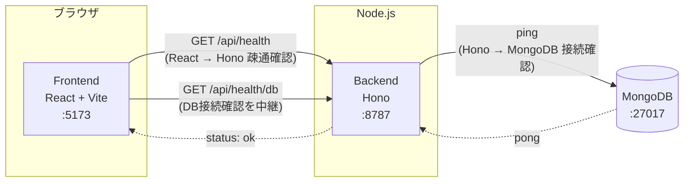

# Digger

Digger は「興味を持ったことを深掘りし、理解したことを蓄積して次の理解につなげる」ためのサービスです。
最初の入力手段としてニュースURLを想定していますが、ニュースに限定されない汎用的な「深掘り・蓄積」の仕組みを目指します。

MVPとして、記事URLを入力すると固定のモック解析結果を返す「掘る」機能を実装しています（記事取得・LLM連携・DB保存は未実装）。

## 構成

- `frontend/` — React + Vite + TypeScript
- `backend/` — Hono + TypeScript（Node.js ランタイム上で `@hono/node-server` を使用）
- MongoDB — Docker Compose で起動するコンテナ

```
digger/
├── docker-compose.yml
├── frontend/   # React + Vite + TypeScript
└── backend/    # Hono + TypeScript
```

## 疎通イメージ



- フロントエンドは `VITE_API_BASE_URL`（既定 `http://localhost:8787`）宛にブラウザから直接 `fetch` します。
- バックエンドは `FRONTEND_ORIGIN` を許可オリジンとした CORS 設定で応答します。
- `/api/health/db` はバックエンドが MongoDB に ping し、その結果をフロントエンドに返す構成です。

## 「掘る」機能（MVP）

トップ画面のURL入力欄に記事URLを入力して「掘る」を押すと、`POST /api/dig` が呼ばれ、解析結果（タイトル・要約・なぜ重要か・前提知識）が画面に表示されます。

バックエンドは入力されたURLに実際にアクセスしてHTMLを取得し、[Mozilla Readability](https://github.com/mozilla/readability)（Firefoxのリーダービューと同じ抽出エンジン）でnav/footer/広告などを除いた本文と`title`を抽出します。ニュースサイト専用のパースは行わず、一般的なWeb記事を対象にした構造です。**`summary` / `whyItMatters` / `backgroundKnowledge` はまだLLM連携前なので固定のモック値のままです。**

```
POST /api/dig
Content-Type: application/json

{ "url": "https://example.com/article" }
```

- URLが未指定・不正な形式・`http`/`https`以外のプロトコル・アクセスが許可されていないホスト（下記SSRF対策を参照）の場合は `400 { "error": "..." }` を返します。
- robots.txtにより取得が許可されていない場合は `403 { "error": "..." }` を返します。
- 記事取得・抽出に失敗した場合は `422`（本文抽出失敗・HTML以外のコンテンツ）または `502`（アクセス失敗・非2xxレスポンス・ホスト名解決失敗）で `{ "error": "..." }` を返します。詳細は [`backend/README.md`](backend/README.md) を参照してください。
- 成功時は以下の形のJSONを返します（`title`は実際に取得した値、`summary`以下は固定値）。

```json
{
  "source": { "type": "web_article", "url": "https://example.com/article", "title": "（取得した実際の記事タイトル）" },
  "summary": "この記事の要約です。",
  "whyItMatters": "なぜこの内容が重要なのかの説明です。",
  "backgroundKnowledge": [
    { "id": "knowledge-1", "title": "前提知識A", "summary": "..." },
    { "id": "knowledge-2", "title": "前提知識B", "summary": "..." }
  ]
}
```

記事本文そのものはレスポンスに含めていません（フロントエンドへ大量のテキストを返さないため）。前提知識はカード状のボタンとして表示されますが、クリックしても現時点では何も起きません（深掘り導線は未実装）。

### 記事取得ポリシー

Diggerが外部Webサイトへアクセスする際は、以下の方針を守ります。

- **robots.txtを尊重する**: リクエストされたURL（およびリダイレクト先の各URL）のオリジンから`/robots.txt`を取得し、Diggerの User-Agent（`Digger/...`）または`*`に対して対象パスが`Disallow`であれば取得を行わず、`403`エラーを返します。
- **robots.txtが取得できない場合は許可されているものとして扱います**（ネットワークエラー・タイムアウト・404など）。記事取得自体を過度に妨げないための実用上の判断です。
- **ログイン回避・paywall突破はしません**。認証やペイウォールを回避する実装は行わず、結果として本文抽出に失敗した場合はエラーを返します。
- **CAPTCHA回避はしません**。ボット判定・CAPTCHAが表示されるサイトはそのまま取得失敗として扱います。
- **取得した本文は現時点では永続保存しません**（MongoDBへの保存は未実装）。
- **原文全文をフロントエンドに返しません**。抽出した本文はサーバー内部でのみ保持し、レスポンスにはタイトルなど必要な情報のみを含めます。
- **SSRF対策**として、`localhost` / ループバック / プライベートIP / リンクローカル（クラウドのメタデータエンドポイントを含む）への直接アクセス、およびそれらへリダイレクトされるケースを拒否します。ホスト名はDNS解決した実IPまで検証し、DNSリバインディングにも対応しています。

## 起動方法（Docker Compose）

前提: Docker / Docker Compose がインストールされていること。

```bash
docker compose up --build
```

起動後、以下にアクセスできます。

- フロントエンド: http://localhost:5173
- バックエンドAPI: http://localhost:8787
  - `GET /api/health` — React → Hono の疎通確認
  - `GET /api/health/db` — Hono → MongoDB の接続確認
  - `POST /api/dig` — URLを受け取り、モック解析結果を返す（[「掘る」機能](#掘る機能mvp)を参照）
- MongoDB: `mongodb://localhost:27017`（ホストからも接続可能）

フロントエンドの画面 (http://localhost:5173) を開くと、URL入力欄と「掘る」ボタンが表示されます。記事URLを入力して「掘る」を押すと解析結果（モック）が表示されます。

停止する場合:

```bash
docker compose down
```

MongoDB のデータも含めて完全に削除する場合:

```bash
docker compose down -v
```

## 起動方法（Docker を使わないローカル開発）

Node.js 22 系、および MongoDB（ローカルまたはリモート）が必要です。

### 1. MongoDB を起動

Docker で MongoDB だけ起動する場合:

```bash
docker run -d --name digger-mongo -p 27017:27017 mongo:7
```

### 2. バックエンド

```bash
cd backend
cp .env.example .env
npm install
npm run dev
```

`http://localhost:8787/api/health` と `http://localhost:8787/api/health/db` にアクセスして動作確認できます。

### 3. フロントエンド

別ターミナルで:

```bash
cd frontend
cp .env.example .env
npm install
npm run dev
```

`http://localhost:5173` を開いて確認します。

## 環境変数

### backend/.env

| 変数名 | 説明 | デフォルト |
| --- | --- | --- |
| `PORT` | バックエンドの待受ポート | `8787` |
| `MONGODB_URI` | MongoDB接続文字列 | `mongodb://localhost:27017` |
| `MONGODB_DB_NAME` | 使用するDB名 | `digger` |
| `FRONTEND_ORIGIN` | CORSで許可するフロントエンドのオリジン | `http://localhost:5173` |

### frontend/.env

| 変数名 | 説明 | デフォルト |
| --- | --- | --- |
| `VITE_API_BASE_URL` | バックエンドAPIのベースURL | `http://localhost:8787` |

## 今後について

現状は `POST /api/dig` が固定のモック結果を返すのみです。以下は未実装・未設計です。

- 実際の記事取得（スクレイピング/OGP取得など）とLLMによる要約・解析
- 解析結果・深掘りメモのMongoDBへの永続化
- 前提知識カードをクリックした際の深掘り（関連トピックの掘り下げ）導線
- 認証・ユーザーごとのデータ分離

ニュースURLはあくまで最初の入力手段の一例であり、将来的には記事・動画・書籍・会話メモなど、さまざまな「興味の入口」を扱えるデータモデルにする想定です。設計は今後のイテレーションで詰めていきます。
