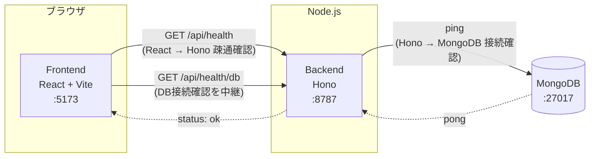

# Digger

Digger は「興味を持ったことを深掘りし、理解したことを蓄積して次の理解につなげる」ためのサービスです。
最初の入力手段としてニュースURLを想定していますが、ニュースに限定されない汎用的な「深掘り・蓄積」の仕組みを目指します。

MVPとして、記事URLを入力すると固定のモック解析結果を返す「掘る」機能を実装しています（記事取得・LLM連携・DB保存は未実装）。

## 構成

- `frontend/` — React + Vite + TypeScript
- `backend/` — Hono + TypeScript（Node.js ランタイム上で `@hono/node-server` を使用）
- MongoDB — Docker Compose で起動するコンテナ

```
digger/
├── docker-compose.yml
├── frontend/   # React + Vite + TypeScript
└── backend/    # Hono + TypeScript
```

## 疎通イメージ



- フロントエンドは `VITE_API_BASE_URL`（既定 `http://localhost:8787`）宛にブラウザから直接 `fetch` します。
- バックエンドは `FRONTEND_ORIGIN` を許可オリジンとした CORS 設定で応答します。
- `/api/health/db` はバックエンドが MongoDB に ping し、その結果をフロントエンドに返す構成です。

## 「掘る」機能（MVP）

トップ画面のURL入力欄に記事URLを入力して「掘る」を押すと、`POST /api/dig` が呼ばれ、解析結果（タイトル・要約・なぜ重要か・前提知識・関連トピック・深掘りの問い）が画面に表示されます。

バックエンドは入力されたURLに実際にアクセスしてHTMLを取得し、[Mozilla Readability](https://github.com/mozilla/readability)（Firefoxのリーダービューと同じ抽出エンジン）でnav/footer/広告などを除いた本文と`title`を抽出します。ニュースサイト専用のパースは行わず、一般的なWeb記事を対象にした構造です。

抽出した本文は「Article Analysis」というLLM処理（[`backend/README.md`](backend/README.md#llm処理article-analysis--personalized-analysis--knowledge-extraction--deep-dive)を参照）に渡され、要約・重要性・前提知識・関連人物や組織・関連トピック・深掘りの問いを生成します。環境変数`LLM_PROVIDER`で切り替え可能で、`mock`（デフォルト）なら固定のデモデータ（日銀の利上げに関するサンプル）、`vertex`ならGoogle Cloud Vertex AI Geminiが実際の記事内容を解析した結果を返します。

```
POST /api/dig
Content-Type: application/json

{ "url": "https://example.com/article" }
```

- URLが未指定・不正な形式・`http`/`https`以外のプロトコル・アクセスが許可されていないホスト（下記SSRF対策を参照）の場合は `400 { "error": "..." }` を返します。
- robots.txtにより取得が許可されていない場合は `403 { "error": "..." }` を返します。
- 記事取得・抽出に失敗した場合は `422`（本文抽出失敗・HTML以外のコンテンツ）または `502`（アクセス失敗・非2xxレスポンス・ホスト名解決失敗）で `{ "error": "..." }` を返します。詳細は [`backend/README.md`](backend/README.md) を参照してください。
- 成功時は以下の形のJSONを返します（`source.title`は実際に取得した値、`analysis`以下は現時点ではモックのサンプルデータ）。

```json
{
  "source": { "type": "web_article", "url": "https://example.com/article", "title": "（取得した実際の記事タイトル）" },
  "analysis": {
    "summary": "この記事では日本銀行が政策金利の引き上げを決定したことが報じられています。...",
    "whyItMatters": "金利の変化は物価・為替・家計や企業の資金繰りなど経済全体に波及するため...",
    "concepts": [
      { "id": "concept-policy-rate", "name": "政策金利", "description": "...", "importance": "required" }
    ],
    "entities": [
      { "name": "日本銀行", "type": "organization", "description": "..." }
    ],
    "connections": [
      { "topic": "円安", "relation": "金利差を通じて為替に影響する" }
    ],
    "deepDiveQuestions": ["なぜ利上げすると円高になりやすい？", "..."]
  }
}
```

記事本文そのものはレスポンスに含めていません（フロントエンドへ大量のテキストを返さないため）。前提知識（`concepts`）は表示のみで、深掘りの問い（`deepDiveQuestions`）は下記の「深掘り対話機能」から実際に質問できます。

画面はこの解析結果を並べた「情報カード中心」のUIではなく、**チャット中心**のUIです。記事を掘った直後に見えるのは、短い要約（`summary`の冒頭3文）・前提知識の名前だけを並べた一行・「気になることを聞いてみる」という自由入力欄のみで、AIが提示した`deepDiveQuestions`や`whyItMatters`/`connections`/`entities`の詳細は「ヒントを見る」「記事の背景を見る」を押した場合にのみ表示されます。ユーザーが最初の質問を送ると画面はチャット表示に切り替わり、記事情報のカード類は退いて会話に集中できるようにしています（詳細は[`frontend/README.md`](frontend/README.md)を参照）。

## 深掘り対話機能

解析結果の下に「他に気になることは？」という自由入力欄があり、`POST /api/deep-dive` を使ってその場でチャット形式の深掘りができます（ページ遷移なし）。

```
POST /api/deep-dive
Content-Type: application/json

{
  "articleAnalysis": { ... },
  "question": "なぜ利上げすると円高になりやすいの？",
  "conversationHistory": []
}
```

- 「次に掘るなら」の質問ボタンをクリックした場合も、自由入力欄に質問を入力した場合も、同じ`/api/deep-dive`が呼ばれます。
- 2回目以降の質問では、これまでの会話（`{ role: "user" | "assistant", content: string }[]`）を`conversationHistory`として送ります。
- 成功時のレスポンスは `{ answer, relatedConcepts, suggestedFollowUps }`。回答本文に加え、関連する前提知識と次の質問候補が返り、`suggestedFollowUps`も新たにクリック可能なボタンとして表示されます。
- **現時点ではLLM未接続のため、`answer`は固定のモック文言です**（`backend/src/llm/deepDive.mock.ts`）。`relatedConcepts`と`suggestedFollowUps`は記事の解析結果（`concepts`/`deepDiveQuestions`）から実際に組み立てています。
- 会話履歴はMongoDBにはまだ保存されません（ページをリロードすると消えます）。認証も不要です。

### 記事取得ポリシー

Diggerが外部Webサイトへアクセスする際は、以下の方針を守ります。

- **robots.txtを尊重する**: リクエストされたURL（およびリダイレクト先の各URL）のオリジンから`/robots.txt`を取得し、Diggerの User-Agent（`Digger/...`）または`*`に対して対象パスが`Disallow`であれば取得を行わず、`403`エラーを返します。
- **robots.txtが取得できない場合は許可されているものとして扱います**（ネットワークエラー・タイムアウト・404など）。記事取得自体を過度に妨げないための実用上の判断です。
- **ログイン回避・paywall突破はしません**。認証やペイウォールを回避する実装は行わず、結果として本文抽出に失敗した場合はエラーを返します。
- **CAPTCHA回避はしません**。ボット判定・CAPTCHAが表示されるサイトはそのまま取得失敗として扱います。
- **取得した本文は現時点では永続保存しません**（MongoDBへの保存は未実装）。
- **原文全文をフロントエンドに返しません**。抽出した本文はサーバー内部でのみ保持し、レスポンスにはタイトルなど必要な情報のみを含めます。
- **SSRF対策**として、`localhost` / ループバック / プライベートIP / リンクローカル（クラウドのメタデータエンドポイントを含む）への直接アクセス、およびそれらへリダイレクトされるケースを拒否します。ホスト名はDNS解決した実IPまで検証し、DNSリバインディングにも対応しています。

## 起動方法（Docker Compose）

前提: Docker / Docker Compose がインストールされていること。

```bash
docker compose up --build
```

起動後、以下にアクセスできます。

- フロントエンド: http://localhost:5173
- バックエンドAPI: http://localhost:8787
  - `GET /api/health` — React → Hono の疎通確認
  - `GET /api/health/db` — Hono → MongoDB の接続確認
  - `POST /api/dig` — URLを受け取り、記事解析結果を返す（[「掘る」機能](#掘る機能mvp)を参照）
  - `POST /api/deep-dive` — 解析結果と質問を受け取り、深掘りの回答を返す（[深掘り対話機能](#深掘り対話機能)を参照）
  - `POST /api/llm/test` — 開発用のLLM疎通確認API。詳細は [`backend/README.md`](backend/README.md#vertex-ai-gemini-のセットアップ) を参照
- MongoDB: `mongodb://localhost:27017`（ホストからも接続可能）

フロントエンドの画面 (http://localhost:5173) を開くと、URL入力欄と「掘る」ボタンが表示されます。記事URLを入力して「掘る」を押すと解析結果が表示され、その下から自由入力や質問候補のクリックで深掘りができます。

停止する場合:

```bash
docker compose down
```

MongoDB のデータも含めて完全に削除する場合:

```bash
docker compose down -v
```

## 起動方法（Docker を使わないローカル開発）

Node.js 22 系、および MongoDB（ローカルまたはリモート）が必要です。

### 1. MongoDB を起動

Docker で MongoDB だけ起動する場合:

```bash
docker run -d --name digger-mongo -p 27017:27017 mongo:7
```

### 2. バックエンド

```bash
cd backend
cp .env.example .env
npm install
npm run dev
```

`http://localhost:8787/api/health` と `http://localhost:8787/api/health/db` にアクセスして動作確認できます。

### 3. フロントエンド

別ターミナルで:

```bash
cd frontend
cp .env.example .env
npm install
npm run dev
```

`http://localhost:5173` を開いて確認します。

## 環境変数

### backend/.env

| 変数名 | 説明 | デフォルト |
| --- | --- | --- |
| `PORT` | バックエンドの待受ポート | `8787` |
| `MONGODB_URI` | MongoDB接続文字列 | `mongodb://localhost:27017` |
| `MONGODB_DB_NAME` | 使用するDB名 | `digger` |
| `FRONTEND_ORIGIN` | CORSで許可するフロントエンドのオリジン | `http://localhost:5173` |

### frontend/.env

| 変数名 | 説明 | デフォルト |
| --- | --- | --- |
| `VITE_API_BASE_URL` | バックエンドAPIのベースURL | `http://localhost:8787` |

## 今後について

記事の取得・本文抽出、およびArticle AnalysisのVertex AI（Gemini）実LLM化は実装済みですが、以下は未実装・未設計です。

- Deep Dive（`backend/src/llm/`）を、Article Analysisと同じパターンでVertex AI Geminiに実際に接続する
- Personalized Analysis（ユーザーの過去の理解と照合するLLM処理）を呼び出す導線と、ユーザーの理解履歴のデータモデル
- Knowledge Extraction（深掘り対話から学習候補を抽出するLLM処理）を実際の深掘り対話（`/api/deep-dive`）に接続する
- 解析結果・深掘りの会話履歴・ユーザーの理解履歴のMongoDBへの永続化
- 認証・ユーザーごとのデータ分離

ニュースURLはあくまで最初の入力手段の一例であり、将来的には記事・動画・書籍・会話メモなど、さまざまな「興味の入口」を扱えるデータモデルにする想定です。設計は今後のイテレーションで詰めていきます。
