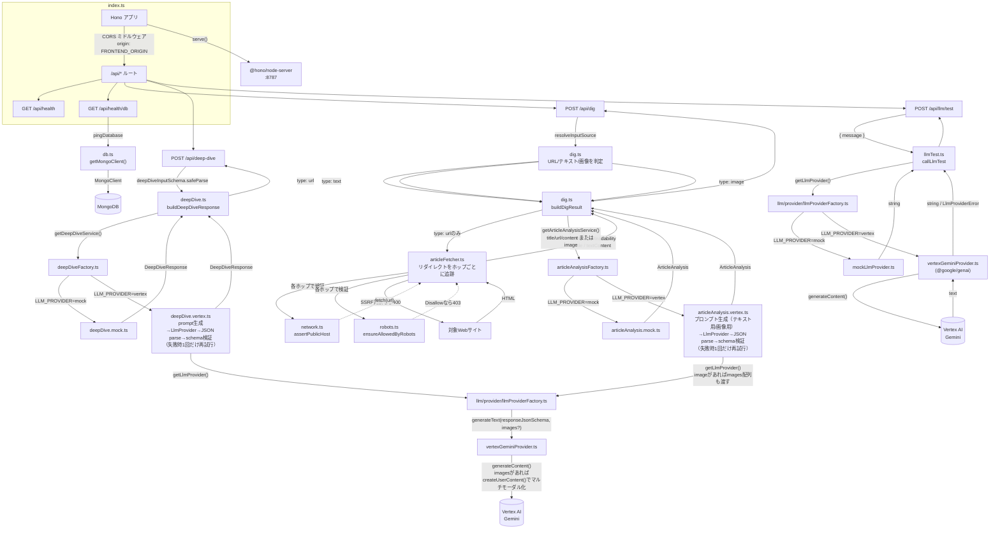
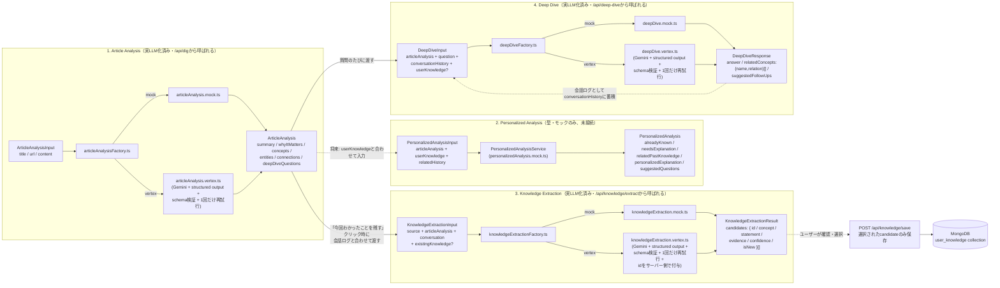

# digger-backend

Hono + TypeScript 製のAPIサーバー。`@hono/node-server` を使い、Node.js ランタイム上で動作します。

## ディレクトリ構成

```
backend/
├── src/
│   ├── index.ts                    # エントリーポイント。Honoアプリの定義とルーティング、サーバー起動
│   ├── db.ts                        # MongoDB接続クライアントの生成・pingヘルパー
│   ├── dig.ts                         # /api/dig のURLバリデーションと解析結果の組み立て
│   ├── deepDive.ts                     # /api/deep-dive のリクエスト検証と回答の組み立て
│   ├── deepDive.test.ts                 # deepDive.ts のユニットテスト（mock providerでの/api/deep-dive相当のフルパス確認）
│   ├── knowledgeApi.ts                   # /api/knowledge/extract・/api/knowledge/save・/api/knowledge・/api/understanding-map のリクエスト検証と組み立て（後方互換用、frontendは/api/memory/*へ移行済み）
│   ├── knowledge.ts                       # Knowledge（保存済みの理解）のMongoDB永続化と重複判定
│   ├── knowledge.test.ts                   # knowledge.ts のユニットテスト（正規化ロジックのみ、Mongo未使用）
│   ├── knowledgeApi.test.ts                 # knowledgeApi.ts のユニットテスト（リクエスト検証・confidenceフィルタ、Mongo未使用）
│   ├── memoryItem.ts                         # MemoryItem（knowledge以外のpreference/candidate/decision/open_question）のMongoDB永続化と、既存Knowledgeを統一表現に変換するadapter
│   ├── memoryItem.test.ts                     # memoryItem.ts のユニットテスト（schema・adapter、Mongo未使用）
│   ├── memoryApi.ts                            # /api/memory/extract・/api/memory/save・/api/memory のリクエスト検証と組み立て（frontendが実際に使うのはこちら）
│   ├── memoryApi.test.ts                        # memoryApi.ts のユニットテスト（リクエスト検証・confidenceフィルタ、Mongo未使用）
│   ├── topic.ts                              # Topic（俯瞰用の粗い分類）のMongoDB永続化と階層ロジック（userIdごとに可変）
│   ├── topic.test.ts                          # topic.ts のユニットテスト（深さ計算・循環検知等の純粋関数のみ、Mongo未使用）
│   ├── concept.ts                              # Concept（具体的な理解対象）のMongoDB永続化
│   ├── concept.test.ts                          # concept.ts のユニットテスト（名前正規化・schemaのみ、Mongo未使用）
│   ├── conceptRelation.ts                        # ConceptRelation（Concept間のedge）のMongoDB永続化
│   ├── conceptRelation.test.ts                    # conceptRelation.ts のユニットテスト（self-relation・重複判定等、Mongo未使用）
│   ├── understandingStructure.ts                   # KnowledgeとTopic/Conceptを橋渡しするオーケストレーション層（GET /api/understanding-mapの実体）
│   ├── understandingStructure.test.ts               # understandingStructure.ts のユニットテスト（relation type変換のみ、Mongo未使用）
│   ├── llmTest.ts                       # /api/llm/test（開発用のLLM疎通確認API）のロジック
│   ├── articleFetcher.ts                 # 記事HTMLの取得（リダイレクト追跡）とReadabilityによる本文/タイトル抽出
│   ├── network.ts                         # SSRF対策（private/loopback/link-localホストの拒否）
│   ├── robots.ts                           # robots.txtの取得・パース・許可判定
│   ├── errors.ts                             # ArticleFetchError（記事取得系エラーの共通型）
│   ├── types.ts                               # /api/dig のリクエスト/レスポンス型
│   ├── network.test.ts                         # network.ts のユニットテスト
│   ├── robots.test.ts                           # robots.ts のユニットテスト
│   ├── llmTest.test.ts                           # llmTest.ts のユニットテスト
│   └── llm/                                        # LLMを使う4処理の型・schema・interface・モック/実LLM実装
│       ├── conversation.ts                           # 会話ターンの共通型（Knowledge Extraction / Deep Diveで共用）
│       ├── articleAnalysis.ts                        # 型・zod schema・ArticleAnalysisService interface
│       ├── articleAnalysis.mock.ts                    # モック実装（固定のデモ用サンプルを返す）
│       ├── articleAnalysis.mock.test.ts                # モック実装のユニットテスト
│       ├── articleAnalysis.vertex.ts                     # 実LLM実装（Gemini呼び出し＋prompt生成＋schema検証＋1回だけ再試行）
│       ├── articleAnalysis.vertex.test.ts                 # 上記のユニットテスト（フェイクのLlmProviderを使用、ネットワーク未使用）
│       ├── articleAnalysisFactory.ts                        # LLM_PROVIDER環境変数によるArticleAnalysisService切り替え
│       ├── articleAnalysisFactory.test.ts                    # 上記のユニットテスト
│       ├── personalizedAnalysis.ts                       # 型・zod schema・PersonalizedAnalysisService interface
│       ├── personalizedAnalysis.mock.ts                   # モック実装（concept名の単純一致で既知/未知を判定）
│       ├── personalizedAnalysis.mock.test.ts               # モック実装のユニットテスト
│       ├── knowledgeExtraction.ts                            # 型・zod schema・KnowledgeExtractionService interface
│       ├── knowledgeExtraction.mock.ts                         # モック実装（固定の候補を1件返す）
│       ├── knowledgeExtraction.vertex.ts                        # 実LLM実装（Gemini呼び出し＋prompt生成＋schema検証＋1回だけ再試行、idはサーバー側で付与）
│       ├── knowledgeExtraction.vertex.test.ts                    # 上記のユニットテスト（フェイクのLlmProviderを使用、ネットワーク未使用）
│       ├── knowledgeExtractionFactory.ts                          # LLM_PROVIDER環境変数によるKnowledgeExtractionService切り替え
│       ├── memoryExtraction.ts                                     # 型・zod schema・MemoryExtractionService interface（knowledgeExtraction.tsを一般化）
│       ├── memoryExtraction.mock.ts                                 # モック実装（knowledge/preference/candidateを1件ずつ返す）
│       ├── memoryExtraction.vertex.ts                                # 実LLM実装（5種のtype区別・AIによる推測禁止を明示したprompt）
│       ├── memoryExtraction.vertex.test.ts                            # 上記のユニットテスト（フェイクのLlmProviderを使用、ネットワーク未使用）
│       ├── memoryExtractionFactory.ts                                  # LLM_PROVIDER環境変数によるMemoryExtractionService切り替え
│       ├── deepDive.ts                                           # 型・zod schema（relevantMemory含む）・DeepDiveService interface
│       ├── deepDive.mock.ts                                       # モック実装（記事の解析結果から応答を組み立てる）
│       ├── deepDive.mock.test.ts                                   # モック実装のユニットテスト
│       ├── deepDive.vertex.ts                                       # 実LLM実装（Gemini呼び出し＋prompt生成＋schema検証＋1回だけ再試行）
│       ├── deepDive.vertex.test.ts                                   # 上記のユニットテスト（フェイクのLlmProviderを使用、ネットワーク未使用）
│       ├── deepDiveFactory.ts                                         # LLM_PROVIDER環境変数によるDeepDiveService切り替え
│       ├── deepDiveFactory.test.ts                                     # 上記のユニットテスト
│       ├── knowledgeRetrieval.ts                                        # Relevant Knowledge Retrieval（Deep Diveへ渡すKnowledgeの絞り込み）
│       ├── knowledgeRetrieval.test.ts                                    # 上記のユニットテスト（フェイクのLlmProviderを使用、ネットワーク未使用）
│       ├── knowledgeTopic.ts                                              # 型・zod schema・KnowledgeTopicService interface（「自分の理解」ページのトピック分類）
│       ├── knowledgeTopic.mock.ts                                          # モック実装（conceptをそのまま単一階層のtopicにする）
│       ├── knowledgeTopic.mock.test.ts                                      # モック実装のユニットテスト
│       ├── knowledgeTopic.vertex.ts                                          # 実LLM実装（Gemini呼び出し＋prompt生成＋schema検証＋1回だけ再試行）
│       ├── knowledgeTopic.vertex.test.ts                                      # 上記のユニットテスト（フェイクのLlmProviderを使用、ネットワーク未使用）
│       ├── knowledgeTopicFactory.ts                                            # LLM_PROVIDER環境変数によるKnowledgeTopicService切り替え
│       ├── jsonExtraction.ts                                            # 実LLM実装間で共有するJSON抽出ヘルパー（markdownコードフェンス対応）
│       └── provider/                                                 # LLMプロバイダー抽象化層（Vertex AI/Geminiなど）
│           ├── llmProvider.ts                                          # LlmProvider interface（generateTextのみ）
│           ├── llmProviderError.ts                                      # LlmProviderError と安全なAPIレスポンスへの変換
│           ├── llmProviderError.test.ts                                  # 上記のユニットテスト
│           ├── mockLlmProvider.ts                                        # モック実装（固定文言を返す）
│           ├── vertexGeminiProvider.ts                                    # Vertex AI Gemini実装（@google/genai使用）
│           ├── vertexGeminiProvider.test.ts                                # エラー分類ロジック等のユニットテスト（ネットワーク未使用）
│           ├── llmProviderFactory.ts                                        # LLM_PROVIDER環境変数によるprovider切り替え
│           └── llmProviderFactory.test.ts                                    # 上記のユニットテスト
├── Dockerfile
├── tsconfig.json
└── package.json
```

## アーキテクチャ



- **`index.ts`**: Honoインスタンスを作成し、`/api/*` にCORSミドルウェアを適用した上でルートを定義しています。`serve()`（`@hono/node-server`）でNode.js上にHTTPサーバーとして起動します。
- **`db.ts`**: `MongoClient` をモジュールスコープでシングルトン管理し（`getMongoClient()`）、毎回の接続確立コストを避けています。`pingDatabase()` は `{ ping: 1 }` コマンドでDB疎通を確認するだけの軽量な関数です。
- **`articleFetcher.ts`**: `fetchArticle(url)` が本文取得の中心。
  1. リダイレクトは`redirect: "manual"`で自前追跡し（最大5ホップ）、**各ホップ**で `network.ts` の `assertPublicHost()` と `robots.ts` の `ensureAllowedByRobots()` を実行してから`fetch()`する。これによりリダイレクト先（最終URL）に対してもSSRF対策・robots.txt確認が適用される。
  2. `fetch()` はタイムアウト10秒、User-Agentは`Digger/0.1 (+https://github.com/kokiwaku/digger)`を明示的に送信（一般ブラウザへの偽装はしない）。ネットワークエラー・非2xxは `ArticleFetchError`（`502`）。
  3. `content-type` がHTML系でなければ `ArticleFetchError`（`422`）。
  4. `jsdom` でDOMを構築し、`@mozilla/readability`（Firefoxリーダービューと同じ抽出エンジン）で nav/footer/広告等を除いた `title` と `textContent` を抽出。抽出できた本文が短すぎる（200文字未満）場合は抽出失敗として `ArticleFetchError`（`422`）。
  - ニュースサイト固有のスクレイピングルールは持たず、一般的なHTML構造の記事ページを対象にした汎用実装です。
- **`network.ts`**: `assertPublicHost(url)` がSSRF対策を担当。ホスト名が`localhost`/`*.localhost`、またはIPリテラルでプライベート/ループバック/リンクローカル（`169.254.169.254`等のクラウドメタデータエンドポイントを含む）なら`ArticleFetchError`（`400`）。ホスト名の場合はDNS解決した実IPも同様にチェックし、DNSリバインディングを防ぐ。
- **`robots.ts`**: `ensureAllowedByRobots(url, userAgent)` がrobots.txtを取得・パースし、Diggerの User-Agent（`digger`）または`*`グループのルールと照合。`Disallow`に一致すれば`ArticleFetchError`（`403`）。robots.txt自体が取得できない（ネットワークエラー・非2xxなど）場合は許可されているものとして扱う。簡易パーサのため`Allow`/`Disallow`のみサポートし、`Crawl-delay`等は無視する。
- **`errors.ts`**: `ArticleFetchError`（`400`/`403`/`422`/`502`のいずれかのステータスを持つ）。記事取得パイプライン全体（URL検証・SSRF対策・robots確認・HTTP取得・本文抽出）で共通に使うエラー型。
- **`dig.ts`**: Diggerは「URLを入れること」自体を価値にしないため、URL・テキスト貼り付け・画像のいずれからも「掘れる」ようにしている。`resolveInputSource(body)` がリクエストボディ（`{ input?: string; url?: string; image?: { data, mimeType } }`）を共通の`InputSource`（`{type:"url",url} | {type:"text",text} | {type:"image",data,mimeType,caption?}`）へ正規化する。
  - **URL判定**: `image`が無く`input`（または後方互換の`url`）が空白を含まない文字列で`new URL()`がhttp/https既定で成功する場合だけ`type:"url"`とする。空白を含む文字列は「URLらしき文字列を含む自由なテキスト」の可能性が高いため、一律テキスト扱いにして誤判定を避ける。
  - **テキスト**: 前後trimし、`MAX_TEXT_INPUT_LENGTH`（50,000文字）を超えたら`DigInputError`（`400`）。それ以下はそのまま`type:"text"`として`ArticleAnalysisInput.content`に渡し、実際のLLMへの文字数制限（12,000文字）は既存の`articleAnalysis.vertex.ts`の`truncateContent()`に委ねる（二重に制限ロジックを持たない）。
  - **画像**: `data:image/xxx;base64,...`形式（`FileReader.readAsDataURL()`が返す形。prefixは`stripDataUrlPrefix()`で除去）または生base64のどちらでも受け付ける。`mimeType`は`image/jpeg`/`image/png`/`image/webp`のみ許可（`ALLOWED_IMAGE_MIME_TYPES`）、概算バイトサイズが`MAX_IMAGE_BYTES`（8MB）を超えたら`DigInputError`（`413`）。付随するテキスト（Composerの入力欄に書かれた自由文）は`caption`として画像解析の補足コンテキストに使う。
  - `buildDigResult(input: InputSource)` が入力種別ごとに分岐: `url`は従来通り`fetchArticle()`→`ArticleAnalysisService.analyze({title,url,content})`、`text`は`analyze({content: text})`、`image`は`analyze({image: {data,mimeType}, content: caption})`。いずれも最終的に同じ`DigResult`（`source` + `analysis`）へ収束するため、Deep Dive・Knowledge Extraction・Understanding Mapは入力形式を一切意識しない。`source.type`は`web_article`/`text`/`image`のいずれかになる（[Knowledgeのsource](#knowledgeモデル不変のメモではなく現在の理解状態)参照）。
  - 画像はMVPでは永続保存しない。Gemini呼び出しが完了したらメモリ上のbase64データは破棄され、DBにもファイルストレージにも残らない（frontend→backend→Gemini→破棄、という一時利用）。将来Knowledgeのsourceとして画像を再表示したくなった場合は、Cloud Storage等へ永続化する余地を`KnowledgeSource`のschema変更（`imageUrl`等の追加）で確保できる設計にしている。
- **`deepDive.ts`**: `parseDeepDiveInput()` がリクエストボディを `llm/deepDive.ts` の `deepDiveInputSchema` でそのまま検証（`articleAnalysis`/`question`/`conversationHistory`/`userKnowledge?`/`relevantMemory?`の形が正しいか）。`buildDeepDiveResponse()`（`createBuildDeepDiveResponse()`のデフォルトエクスポート）は、クライアントが`userKnowledge`を渡さなかった場合に`resolveUserKnowledge`（デフォルトは`defaultResolveUserKnowledge`）を、`relevantMemory`を渡さなかった場合に`resolveRelevantMemory`（デフォルトは`defaultResolveRelevantMemory`）をそれぞれ呼んで補い、`llm/deepDiveFactory.ts` の `getDeepDiveService()`（`LLM_PROVIDER`でmock/vertexを切り替え）へ渡します。両resolverとも`getProvider`と同様の理由（テストで実際のMongoDB接続を発生させないため）で注入可能にしており、`deepDive.test.ts`ではフェイクの関数を渡してテストしています。`defaultResolveUserKnowledge`の実装は`knowledge.ts`の`getKnowledgeForDeepDive()`（status: active/foundationalのみ）→`llm/knowledgeRetrieval.ts`の`hybridKnowledgeRetrievalService`という流れで、取得・選定に失敗しても例外を投げず`undefined`にフォールバックします（Deep Dive自体は従来通り継続）。`defaultResolveRelevantMemory`は`memoryItem.ts`の`getUserMemoryItems()`（knowledge以外、status: activeのみ、直近`MAX_RELEVANT_MEMORY_ITEMS`=10件）というより単純な実装です（詳細は[Deep Diveの役割制限を外す](#deep-diveの役割制限を外すuser意図への自然な追従)を参照）。
- **`types.ts`**: `/api/dig` のリクエスト型（`DigRequest`）とレスポンス型（`DigResult` / `DigSource`、および `llm/articleAnalysis.ts` の `ArticleAnalysis`）を定義。frontend側の `src/types.ts` と同じ形を手動で同期しています（共有パッケージ化はまだしていません）。`/api/deep-dive` は `llm/deepDive.ts` の型をそのままリクエスト/レスポンス型として使うため、`types.ts` に重複定義はありません。
- **`knowledgeSource.ts`**: `DigSource`/Knowledgeの`source`フィールドの唯一の定義（`knowledgeSourceSchema`、判別可能なユニオン）。以前は`llm/knowledgeExtraction.ts`・`knowledge.ts`（Mongoドキュメントschemaと`SaveKnowledgeInput`の2箇所）・`types.ts`にほぼ同じ`{type:"web_article",url,title}`という形が個別に重複定義されていたが、URL以外の入力（テキスト・画像）に対応するにあたって1箇所へ集約した。`web_article`は既存の形のまま（後方互換）、`text`/`image`は`url`を持たず`title`は任意（無ければfrontend側が「テキスト入力」「画像入力」とfallback表示する）。加えて、「自分の理解」画面のConcept/Topicを起点に再びDeep Diveしたセッションから保存されたKnowledge用に`{type:"concept_dig",conceptId,title?}`/`{type:"topic_dig",topicId,title?}`を追加した（外部からの入力ではなく、既に理解済みのConcept/Topicから「さらに掘る」循環に由来することを区別するため。詳細は[自分の理解から、さらに掘る（循環）](../README.md#自分の理解からさらに掘る循環)を参照）。`conceptId`/`topicId`は掘った時点の対象を指すが、後から削除・統合される可能性があるため、`title`にスナップショットを残し表示用のfallbackにしている。`llm/knowledgeExtraction.vertex.ts`の`formatSourceInfo()`はこの2種別も個別に判定し、`text`/`image`用のfallback文言に誤って混ざらないようにしている。
- **`llm/`**: LLMを使う4処理（後述）の型・schema・interface・モック実装、および`llm/provider/`（Vertex AI等のプロバイダー抽象化層。後述）。
- **`llmTest.ts`**: 開発用の疎通確認API `POST /api/llm/test` のロジック。リクエストの`message`をzodで検証し、`llm/provider/`の`getLlmProvider()`が返す`LlmProvider`（デフォルトはモック）の`generateText()`を、固定のsystem promptと一緒に呼ぶだけです。Diggerの業務ロジック（Article Analysis等）はまだ関与しません。
- 現時点でルートは8つ:
  - `GET /api/health` — プロセスが生きていることの確認（DBには触れない）
  - `GET /api/health/db` — `pingDatabase()` を呼び、成功なら `200 { status: "ok", db: "connected" }`、失敗なら `503 { status: "error", db: "disconnected", message }`
  - `POST /api/dig` — `{ input?: string; url?: string; image?: { data: string; mimeType: string } }`（`url`は旧クライアントとの後方互換用エイリアス）を受け取り、`resolveInputSource()`がURL/テキスト/画像を自動判定する。入力不正（空・URLとして不正・テキストが長すぎる・画像のmime/サイズ不正）は`DigInputError`により`400`（画像サイズ超過のみ`413`）。URL入力でSSRF対象ホストなら`400`、robots.txtにより不許可なら`403`。取得・解析に成功すれば`200`で`DigResult`（`source.type`は`web_article`/`text`/`image`）、それ以外の取得・抽出失敗は`422`（本文抽出失敗・非HTML、URL入力のみ）または`502`（アクセス失敗・非2xx・ホスト名解決失敗）で`{ error: string }`。ボディサイズは`hono/body-limit`ミドルウェアで15MBまでに制限（base64化した画像を想定した上限）。
  - `POST /api/deep-dive` — `{ articleAnalysis, question, conversationHistory, userKnowledge? }` を受け取り、schemaバリデーション失敗は `400`、成功すれば `200` で `DeepDiveResponse`（`answer`/`relatedConcepts: { name, relation }[]`/`suggestedFollowUps`）、LLMプロバイダー側のエラーは原因に応じて `500`/`502`/`504`、それ以外の失敗は `502` で `{ error: string }`。**`userKnowledge`をクライアントが渡さない場合、サーバー側で保存済みKnowledge（`status: active`/`foundational`のみ）から今回の質問・記事に関連しそうなものだけを自動的に選んでLLMへ渡す**（詳細は[Relevant Knowledge Retrieval](#relevant-knowledge-retrievalとknowledgeの再利用)を参照）
  - `POST /api/memory/extract` — `{ source, articleAnalysis, conversationHistory }` を受け取り、schemaバリデーション失敗は`400`。Memory Extractionを実行し`200`で`{ candidates: MemoryCandidate[] }`（`reinforces`判定のknowledgeとtype問わず`confidence: "low"`の候補は事前に除外）。LLMプロバイダー側のエラーは原因に応じて`500`/`502`/`504`、それ以外の失敗は`502`で`{ error: string }`。frontendが実際に呼ぶのはこちら（詳細は[Memory Extraction](#memory-extraction-保存対象をknowledgeから一般化するmemoryitemts--memoryapits--llmmemoryextraction)を参照）
  - `POST /api/memory/save` — `{ source, items: [{ id, type, title?, content, reason?, metadata?, confidence?, origin, relationToExisting? }] }`を受け取り、schemaバリデーション失敗は`400`。`type: "knowledge"`は既存のKnowledge保存パイプラインへ、他typeは`memory_items`コレクションへ保存し、`200`で`{ savedCount: number, skippedCount: number, byType: Record<string, number> }`、それ以外の失敗は`502`で`{ error: string }`
  - `GET /api/memory` — 既存Knowledgeと`memory_items`を統一した一覧を`createdAt`降順で`200`の`{ items: MemoryItem[] }`として返す。取得失敗時は`502`で`{ error: string }`
  - `POST /api/knowledge/extract` / `POST /api/knowledge/save` / `GET /api/knowledge` — 上記の一般化前のAPI。挙動は変更しておらず、後方互換のためそのまま残している（frontendはもう呼ばない）
  - `GET /api/understanding-map` — Topic/Concept/ConceptRelationモデル（[後述](#topic--concept--conceptrelationモデルtopicts--conceptts--conceptrelationts--understandingstructurets)）の**現在DBにある状態をそのまま**`200`で`{ topics: TopicDocument[], concepts: ConceptDocument[], relations: ConceptRelationDocument[] }`として返す、読み取り専用のエンドポイント。lazy migrationやLLM呼び出しなどの副作用は一切行わない。取得失敗時は`502`で`{ error: string }`
  - `POST /api/understanding-map/refresh` — 未移行のKnowledgeをConceptへ変換し、未分類のConceptをLLMでTopicへ分類してから、更新後の`{ topics, concepts, relations }`を`200`で返す。GETとは異なり明示的に重い処理（LLM呼び出しを含む）を実行するエンドポイント。取得失敗時は`502`で`{ error: string }`
  - `POST /api/llm/test` — 開発用のLLM疎通確認API（後述）。`{ message: string }` を受け取り、バリデーション失敗は `400`、成功すれば `200` で `{ response: string }`、LLMプロバイダー側のエラーは原因に応じて `500`/`502`/`504` で `{ error: string }`（安全な汎用メッセージのみ。詳細はサーバーログへ）

## LLM処理（Article Analysis / Personalized Analysis / Knowledge Extraction / Deep Dive）

Diggerのコア機能である「記事を深掘りして理解を蓄積する」部分は、4つの独立したLLM処理として実装します。**Article Analysis・Deep Dive・Knowledge Extractionは実LLM化済みで、`LLM_PROVIDER=vertex`のときVertex AI Geminiが実際に処理します。** Personalized Analysisはまだ`llm/personalizedAnalysis.mock.ts`の固定/簡易ロジックのみで、呼び出し導線自体も未実装です。



- **なぜ4つに分離するか**: それぞれ目的も入力も異なるため（記事の客観的な解析／ユーザー個人への最適化／対話からの知識抽出／その場のQ&A）。将来的に別々のプロンプト・別々のモデル（例: 安価なモデルで要約、高性能なモデルで個人化）に切り替えられるよう、最初から独立した`interface`にしています。候補ボタンのクリックと自由入力のどちらから来た質問も、同じ`question: string`として`DeepDiveService`に渡るため、呼び出し側で区別する必要がありません。
- **共通パターン**: 各処理は `xxx.ts`（型・zod schema・`XxxService` interfaceの3点セット）と `xxx.mock.ts`（そのinterfaceを実装するモック）に分かれています。本物のLLM実装を追加する際は、同じinterfaceを実装する `xxx.openai.ts` のような新しいファイルを作り、呼び出し側（`dig.ts`/`deepDive.ts`など）のimportを差し替えるだけで済む構造です。
- **runtime validation**: 型定義には[Zod](https://zod.dev/)を使い、`z.infer<typeof schema>` でTypeScript型をschemaから導出しています（型とバリデーションルールの二重管理を避けるため）。モック実装も生成したデータを`schema.parse(...)`に通してから返しており、本物のLLM実装でも「LLMのレスポンス(JSON)を`schema.parse(...)`で検証してから返す」という同じパターンを踏襲する想定です。LLMの出力は外部から来る信頼できないデータなので、ここでの検証は将来的に特に重要になります。`deepDive.ts`の`deepDiveInputSchema`はさらに、クライアントからのリクエストボディの検証にもそのまま使われています（`deepDive.ts`（backend直下）の`parseDeepDiveInput()`）。
- **共通型の再利用**: 会話ターンの型（`{ role: "user" | "assistant", content: string }`）は`llm/conversation.ts`に切り出し、Knowledge ExtractionとDeep Diveの両方から利用しています。ユーザーの過去の知識の型（`UserKnowledge`）は`llm/personalizedAnalysis.ts`からexportし、Deep Diveから再利用しています。
- **ユーザー知識・履歴の扱い**: Article Analysisにはユーザーの知識や履歴を一切渡しません（記事そのものの客観的な解析のため）。ユーザー個人への最適化はPersonalized Analysisの責務として分離しています。
- **1. Article Analysis**（`llm/articleAnalysis.ts` / `articleAnalysis.mock.ts` / `articleAnalysis.vertex.ts` / `articleAnalysisFactory.ts`）: 記事の`title`/`url`/`content`から、要約・重要性・前提知識（`concepts`）・関連する人物や組織（`entities`）・他テーマとの関連（`connections`）・深掘りの問い（`deepDiveQuestions`）を生成。`dig.ts`が`articleAnalysisFactory.ts`の`getArticleAnalysisService()`（`LLM_PROVIDER`で`articleAnalysis.mock.ts`/`articleAnalysis.vertex.ts`を切り替え）を呼び、結果は`/api/dig`のレスポンスに含まれます。実LLM実装の詳細は次項を参照。
- **2. Personalized Analysis**（`llm/personalizedAnalysis.ts` / `personalizedAnalysis.mock.ts`）: Article Analysisの結果とユーザーの過去の理解（`userKnowledge`）を照合し、「何を説明すべきか」を判定。モック実装はLLMを使わず、concept名の文字列一致だけで「既知/未知」を振り分ける簡易ロジックです。**まだどのルートからも呼ばれていません**（ユーザーの理解履歴を保存する仕組み自体が未実装のため）。
- **3. Knowledge Extraction**（`llm/knowledgeExtraction.ts` / `knowledgeExtraction.mock.ts` / `knowledgeExtraction.vertex.ts` / `knowledgeExtractionFactory.ts`）: 深掘り対話のログ（`conversation`）から、新しく理解したと思われる知識の"候補"（`KnowledgeCandidate`）を抽出。AIが理解を勝手に確定させないよう、あくまで候補を返すだけで、保存の可否はユーザーが決める設計です。既存Knowledge（`existingKnowledge`）との関係（`relationToExisting`: `new`/`reinforces`/`extends`/`supersedes`）も判定し、「Knowledgeを増やすだけでなく、理解状態として捉える」ための材料にします（詳細は[Knowledgeモデル](#knowledgeモデル-不変のメモではなく現在の理解状態)を参照）。`knowledgeApi.ts`（backend直下）が`knowledgeExtractionFactory.ts`の`getKnowledgeExtractionService()`を呼び、`POST /api/knowledge/extract`から利用されます。実LLM実装の詳細は次項を参照。
- **4. Deep Dive**（`llm/deepDive.ts` / `deepDive.mock.ts` / `deepDive.vertex.ts` / `deepDiveFactory.ts`）: Article Analysisの結果・質問（`question`）・これまでの会話（`conversationHistory`）から、その場の回答（`answer`）・関連する前提知識（`relatedConcepts: { name, relation }[]`。単なるキーワード列挙ではなく「今回の質問とどう関係するか」を含む）・次の質問候補（`suggestedFollowUps`）を生成。`backend/src/deepDive.ts`が`deepDiveFactory.ts`の`getDeepDiveService()`を呼び、`POST /api/deep-dive`のレスポンスになります。実LLM実装の詳細は次項を参照。

> **注記**: Personalized Analysisのみまだ`llm/provider/`（次項）を使っておらず、`personalizedAnalysis.mock.ts`が固定値/簡易ロジックを返すだけです。Article Analysis・Deep Dive・Knowledge Extractionは実際に`llm/provider/`経由でVertex AI Geminiを呼ぶ実装（`articleAnalysis.vertex.ts` / `deepDive.vertex.ts` / `knowledgeExtraction.vertex.ts`）を追加済みで、3つとも同じ構造（prompt生成→structured output→schema検証→1回だけ再試行）を踏襲しています。

### Article Analysisの実LLM化（`articleAnalysis.vertex.ts`）

`LLM_PROVIDER=vertex`のとき、`articleAnalysisFactory.ts`が`vertexArticleAnalysisService`を選択します。処理の流れ:

1. **入力サイズの制御**: 記事本文・貼り付けテキスト（`content`）が`MAX_CONTENT_LENGTH`（12,000文字）を超える場合は切り詰め、末尾に省略した旨を追記します。トークン数ではなく文字数での単純な制御です（Gemini 2.5 Flash等のコンテキストウィンドウ自体は十分大きいですが、コスト・レイテンシを抑えるための保守的な上限です）。
2. **prompt生成（入力形式で分岐）**: `input.image`の有無で`buildTextPrompt()`（URL記事・貼り付けテキスト共通。urlが無ければその行を省く）と`buildImagePrompt()`（画像専用）を使い分けます。出力ルール（`summary`/`whyItMatters`/`concepts`/`entities`/`connections`/`deepDiveQuestions`の各フィールドのルール）は`OUTPUT_RULES`として1箇所にまとめ、両方のprompt builderが共有しています。**frontendのProgressive Disclosure UI（詳細は[`frontend/README.md`](../frontend/README.md)）に合わせ、`summary`/`whyItMatters`は最大3文、`concept.description`は1〜2文、`deepDiveQuestions`は最大4件（最初の1件が最も優先度の高い問いになるよう指示）に絞るようpromptで制約しています。schema自体（フィールド構成）は入力形式に関わらず共通で、変更していません**。frontend側でも`firstSentences()`（文末記号での単純な冒頭N文抽出）により、想定より長い応答が来た場合の安全弁として表示文字数を制御しています。
   - `buildImagePrompt()`は、画像がグラフ・SNSスクリーンショット・新聞紙面・写真中の文章など何であるかをまず判断させ、種類に応じた読み取り方（グラフなら軸・傾向・変化・重要なポイント、SNSなら投稿内容・文脈・主張、新聞なら見出し・本文・図表）を指示します。単純なOCR（文字起こし）だけでなく画像そのものの意味を理解させることが狙いで、専用のOCRパイプラインは別途作っていません（Geminiのマルチモーダル理解にそのまま委ねる）。「画像から読み取れない内容を推測で事実として扱わない」ことも明記しています。Composerで画像に添えたテキスト（`caption`）があれば「ユーザーからの補足」としてpromptに追加します。
3. **structured output**: `articleAnalysisSchema`を[Zod 4の`z.toJSONSchema()`](https://zod.dev/json-schema)（追加ライブラリ不要）でJSON Schemaに変換し、`LlmProvider.generateText()`の`responseJsonSchema`として渡します。`vertexGeminiProvider.ts`はこれを`responseMimeType: "application/json"` + `responseJsonSchema`として`@google/genai`の`generateContent()`に渡し、Geminiのnative構造化出力機能でJSON形式の出力を強制します。
4. **runtime validation**: 返ってきたテキストを`JSON.parse()`し（万一markdownのコードフェンスで囲まれていても対応）、`articleAnalysisSchema.safeParse()`で検証します。**LLMが返した値は無条件に信用しません。**
5. **再試行**: JSON parse失敗・schema validation失敗（必須フィールド欠落・不正なenum値・空レスポンス等）の場合、「前回の出力がschemaに適合しなかったため、指定schemaに厳密に従って再生成してください」という指示を追加して**1回だけ**再試行します。それでも失敗すれば`LlmProviderError`（`empty_response`）を投げ、`index.ts`が`502`として返します。複雑な自動修復は行いません。
6. **ログ**: `[ArticleAnalysis] start`（provider/model/url）→（失敗時）`[ArticleAnalysis] validation failed, retrying once`→`[ArticleAnalysis] success`または`failed after retry`（provider/model/処理時間ms/retriedの有無）をサーバーログに出力します。記事本文全文やcredentialは出力しません。トークン使用量（`promptTokens`/`candidatesTokens`/`totalTokens`）は`vertexGeminiProvider.ts`側で`[VertexGeminiProvider] token usage`として出力します（`@google/genai`のレスポンスに含まれる`usageMetadata`をそのまま使うだけで、追加の実装は行っていません）。
7. **timeout**: `llm/provider/vertexGeminiProvider.ts`が持つ既存の30秒タイムアウト（`AbortController`）をそのまま利用します。再試行時も同じタイムアウトが個別に適用されるため、最悪ケースでも無限待ちにはなりません（1回の呼び出しごとに最大30秒、再試行込みで最大2回）。
8. **テスト容易性**: `createVertexArticleAnalysisService(getProvider)`という形でproviderの解決を関数として注入できるようにしており、テストではフェイクの`LlmProvider`を渡すことで、実際のVertex AI呼び出しなしに正常系・JSON parse失敗・schema validation失敗・再試行成功・再試行後も失敗・LLM呼び出しエラー（再試行しないこと）を検証しています（`articleAnalysis.vertex.test.ts`）。

> markdownコードフェンス対応のJSON抽出処理（`extractJsonText()`）は`llm/jsonExtraction.ts`に切り出し、Article Analysis・Deep Dive・Knowledge Extractionの3つの実LLM実装で共有しています（再試行のオーケストレーションやログ出力は各サービス固有のロジックのため共通化せず、あえて別々のまま残しています）。

### Deep Diveの実LLM化（`deepDive.vertex.ts`）

Article Analysisと同じ構造・パターンを踏襲しています。差分のみ記載します。

1. **コンテキストの組み立て**: 記事本文を毎回再送するのではなく、`ArticleAnalysis`の結果（`summary`/`whyItMatters`/`concepts`/`entities`/`connections`）を`formatArticleContext()`で読みやすいテキストに整形してコンテキストとして使います。
2. **会話履歴の制御**: `conversationHistory`は直近`MAX_HISTORY_MESSAGES`（20件）のみを使用し、古い発言から落とす単純な上限制御です（要約による圧縮はまだ行いません）。`userKnowledge`が渡されていればプロンプトに含め、`undefined`/空でも問題なく動作します。
3. **役割設定**: `buildDeepDiveSystemPrompt()`が返すシステムプロンプトで役割を指示します。以前は「今読んでいる記事・テーマを理解するための専用家庭教師」という、概念理解のみを想起させる役割定義だったため、ユーザーが具体的な候補・比較・おすすめを求めるとLLMが「Diggerは製品推薦をするサービスではありません」という趣旨で拒否するケースがありました（詳細は[Deep Diveの役割制限を外す](#deep-diveの役割制限を外すuser意図への自然な追従)を参照）。現在は「ユーザーが選んだ対象について、ユーザー自身が知りたい方向へ掘り下げることを支援する」という役割に修正し、候補探し・比較・推薦を含むあらゆる掘り方を許可しています。回答方針自体（まず結論を簡潔に答える→今回質問された範囲に集中し周辺知識まで無理に広げない→会話履歴で既出の内容を繰り返さない→ユーザーが既に理解している知識・保存済みMemoryを前提に一段先を説明する→断定を避ける→自分から話を広げすぎず次の疑問が生まれる余白を残す）は変更していません。**Diggerは1回の回答でテーマ全体を説明し切るのではなく、会話の往復を通じて理解を深めるサービスであることを明示しています。**
4. **回答の長さ**: `answer`の出力ルールで「まず結論を簡潔に述べてから、必要な分だけ補足する」「目安として300〜500文字程度、3〜5段落以内（候補・比較・推薦の質問は前置きを長くせずまず候補を提示）」「不要な背景説明や周辺知識まで広げすぎない」「『さらに詳しく言うと〜』のように自分から話を広げすぎない（ユーザーが詳細を求めてきた場合のみ詳しく説明する）」と明示しています。ただし「短さを優先しつつ、質問への直接的な回答に必要な情報は省略しないこと」も併記しており、文字数を機械的に強制するものではありません（実際に`LLM_PROVIDER=vertex`で検証したところ、397文字・446文字程度の、結論から入る3〜4段落の回答になることを確認しています）。`suggestedFollowUps`（質問提案）のUIは復活させておらず、短さはprompt自体の指示のみで実現しています。
5. **`relatedConcepts`のschema変更**: `string[]`（概念名の羅列）ではなく`{ name: string, relation: string }[]`にすることで、「今回の質問となぜ関係するのか」をLLMに明示させます。`deepDive.mock.ts`もこの形（`relation`は記事の`concept.description`から組み立て）に追従済みです。
6. **structured output / 検証 / 再試行 / ログ / timeout**: Article Analysisと全く同じパターン（`z.toJSONSchema()`でJSON Schema化、`safeParse`で検証、1回だけ再試行、`[DeepDive] ...`のログ。質問文や会話全文はログに出さず、provider/model/処理時間/`conversationLength`のみ出力）。

### Deep Diveの役割制限を外す（User意図への自然な追従）

「Diggerにおける『掘る』は、概念について詳しく説明することだけではない。ユーザーが対象について知りたい方向へ自由に掘り進められること」という考え方のもと、以前の役割定義が生んでいた過度な制限を取り除きました。

- **問題の原因**: 旧システムプロンプトの「今読んでいる記事・テーマを理解するための専用家庭教師」という役割定義自体には明示的な「推薦禁止」ルールは書かれていませんでしたが、この枠組みが暗黙に「概念理解のための対話」というスコープを想起させ、ユーザーが「人気の車種を5台出して」「AirとProどっちがいい？」のような候補探し・比較を求めた際に、LLMが自発的に「Diggerは具体的な製品推薦をするサービスではありません」という趣旨で拒否する挙動が起きていました。
- **修正内容**: `buildDeepDiveSystemPrompt()`で、Diggerの「掘る」が仕組みの理解・歴史・具体例・候補探し・比較・メリデメ整理・判断材料の整理・意思決定支援・未解決の疑問の確認まで含む、ユーザー主導の自由な行為であることを明示し、「ユーザーが具体的な候補・比較・おすすめ・ランキングを求めた場合は、それを拒否せず直接答えてください」「Digger側の役割を理由にした回答拒否はしないでください」と明文化しました。これはConcept/Topicのカテゴリ（車・ガジェット・旅行先・金融商品等）によっても変わりません。
- **区別は維持**: 拒否はしない一方で、「客観情報」「一般的傾向（個人差が大きい内容は断定しすぎない）」「ユーザー条件（Preference等）からの推奨」「不確実な推測」の4つは区別するよう明示しています。安全性・法律等の一般的なAIとしての制限は維持しています。
- **最新情報の扱い（将来のWeb Search拡張への布石）**: 車種ランキング・価格・現在販売中の製品・最新ニュース等、鮮度が重要な質問については、DiggerがまだWeb検索機能を持たないことを踏まえ、「学習済みの知識だけを最新の事実であるかのように断定しない」「一般的に知られている代表的な候補は挙げてよいが、鮮度に関する留保を短く添える」よう指示しています。今回Web Search自体は実装していませんが、`DeepDiveInput`/`buildPrompt()`の構造はfield追加だけで拡張できる形（`ArticleAnalysis`と同じ「合成コンテキストを差し込む」パターン）にしてあるため、将来Web検索結果を別セクションとして追加するような拡張が既存構造を壊さずに行えます。
- **`buildDeepDiveSystemPrompt()`という命名**: 通常のURL/テキスト/画像Dig、Concept Dig、Topic Digはいずれも同じ`/api/deep-dive`・同じ`vertexDeepDiveService`を呼んでおり、prompt自体はもともと分散していませんでした。関数名を明示的にしたのは、「入口によって回答できる範囲が変わらない、単一の共有方針である」ことをコード上でも分かりやすくするためです。
- **保存済みMemory（Preference/Candidate/Decision/Open Question）の活用**: `deepDive.ts`の`defaultResolveRelevantMemory()`が、`GET /api/memory`と同じ`getUserMemoryItems()`（knowledge以外、`status: active`のみ）から直近`MAX_RELEVANT_MEMORY_ITEMS`（10件）を取得し、`DeepDiveInput.relevantMemory`としてクライアントが明示的に渡さない限り自動的に補います（`userKnowledge`と全く同じDIパターン。`resolveUserKnowledge`/`resolveRelevantMemory`はいずれもテストでは`createBuildDeepDiveResponse()`にフェイクを注入して実DBアクセスを避けます）。Knowledgeのような文字列一致スコアリング（`knowledgeRetrieval.ts`）はまだ行わず、直近作成順という単純な基準にとどめています（Preference/Candidate等はKnowledgeよりずっと母数が小さく、「今まさに検討中の対象」であることが多いため、単純な基準でも十分実用的）。`deepDive.vertex.ts`の`formatRelevantMemorySection()`が`formatUserKnowledgeSection()`と同じ方針（存在する場合のみ差し込む、言及を強制しない）でpromptへ追加します。実Vertex AI環境で、保存済みPreference（国産車優先・子供の車酔い重視）とCandidate（RAV4）がある状態で「SUVを5台候補にして」と聞いたところ、それらを自然に踏まえた（かつ「あなたは以前〜」という明示的な言及はしない）候補が返ることを確認しています。
7. **テスト容易性**: フェイクの`LlmProvider`を注入して、正常系・JSON parse失敗/schema validation失敗からの再試行成功・再試行後も失敗・LLM呼び出しエラー（再試行しないこと）・`conversationHistory`が実際にpromptへ渡ること・上限超過時に古い発言が落ちること・`userKnowledge`未指定でも動作すること・簡潔さ/段落数のガイドラインがpromptに含まれること・質問の範囲に集中し余白を残す旨の指示が含まれることを検証しています（`deepDive.vertex.test.ts`）。

### Knowledge Extractionの実LLM化（`knowledgeExtraction.vertex.ts`）

Article Analysisと同じ構造・パターンを踏襲しています。差分のみ記載します。

1. **入力**: `KnowledgeExtractionInput`は`source`（記事のtype/url/title）・`articleAnalysis`・`conversation`（深掘り対話ログ）・`existingKnowledge?`（保存済みKnowledge。`knowledgeApi.ts`がMongoDBから取得して渡す。取得に失敗しても抽出自体は続行し、空配列で進めます）の4つ。会話が長くなりすぎた場合は直近`MAX_CONVERSATION_TURNS`（30件）だけに切り詰めます（Article Analysisの`MAX_CONTENT_LENGTH`と同じ考え方）。
2. **prompt生成**: システムプロンプトで「AIが理解を勝手に確定してはいけない、あくまで候補」「記事本文に書いてあるだけの内容や、ユーザーが質問しただけの内容は理解済み扱いしない」「ユーザーの言い換え・確認・関連づけを理解の根拠として重視する」という制約を明示。ユーザープロンプトには記事のtitle/url/summary/前提知識、会話ログ、そして**既存Knowledgeの一覧（`[id] concept: statement`の形でidを含めて渡す）**を渡します。
3. **relationToExistingの判定**: システムプロンプトに、新しいcandidateが既存Knowledgeと意味的に関係する場合は`relationToExisting`（`type`/`knowledgeId`/`reason`）を判定するよう指示しています。`reinforces`（表現違いレベルの再確認）/`extends`（既存を前提にさらに広がっている）/`supersedes`（既存が不正確・古く置き換えるべき）のいずれかに該当する場合は既存Knowledgeの`[id]`を`knowledgeId`に設定して`isNew`をfalseに、関連がなければ`relationToExisting`自体を省略して`isNew`をtrueにするよう指示しています。**無理に既存Knowledgeへ紐付けないこと**も明記しています。今回はこの関係を判定・保持するところまでで、**`merged`/`outdated`への自動変更・既存Knowledgeのstatement書き換え・自動統合は一切行いません**（次のステップの設計課題）。実際に`LLM_PROVIDER=vertex`で確認したところ、`new`/`extends`は狙って発生させやすい一方、`supersedes`は意図的に発生させるのが難しいことが分かりました。Deep Dive自体がユーザーの誤解をその場で訂正する（SYSTEM_PROMPTの「不明なことを断定しない」等の方針）ため、明確に誤った内容がKnowledgeとして確定的に保存される状況自体が起きにくいためです。`supersedes`のマッピング・UI表示ロジックは`extends`と全く同じコードパス（`toDisplayCategory()`のswitch文の別分岐）なのでユニットテストで検証していますが、実LLM出力での確認は`new`/`extends`/`reinforces`の3種類のみ行っています。
4. **idの扱い**: `KnowledgeCandidate`の`id`はLLMには生成させません（一意性をLLMの出力に依存させないため）。LLMには`concept`/`statement`/`evidence`/`confidence`/`isNew`/`relationToExisting?`だけを含む"draft" schema（`knowledgeExtractionDraftSchema`）で構造化出力させ、schema検証に成功した後で`randomUUID()`により`id`をサーバー側で付与します（`withGeneratedIds()`）。`relationToExisting.knowledgeId`はLLMが既存Knowledgeの`id`をそのまま返す値なので、こちらはサーバー側で書き換えません。
5. **structured output / 検証 / 再試行 / ログ / timeout**: Article Analysisと全く同じパターン（`z.toJSONSchema()`でJSON Schema化、`safeParse`で検証、1回だけ再試行、`[KnowledgeExtraction] ...`のログ、既存の30秒タイムアウトをそのまま利用）。`relationToExisting.type`に不正な値（enum外）が返ってきた場合もschema validation failureとして扱われ、他のフィールドの不備と同様に1回だけ再試行されます。
6. **confidenceのフィルタリングはこの層では行いません**: `knowledgeExtraction.vertex.ts`はLLMが判定した`confidence`（`low`/`medium`/`high`）をそのまま返します。「確認UIには`low`を出さない」というUX判断は、呼び出し側の`knowledgeApi.ts`（`filterForConfirmationUi()`）で行っています（MVPとしてシンプルにするための判断で、必要なら将来的にUI側の設定に変更できます）。
7. **テスト容易性**: Article Analysisと同じくフェイクの`LlmProvider`を注入して、正常系（idが生成されること）・`conversationHistory`の内容が実際にpromptに含まれること・`existingKnowledge`が空/未指定でも動作すること・`existingKnowledge`のid付き内容がpromptに含まれること・`relationToExisting`の4種類（`new`/`reinforces`/`extends`/`supersedes`）が受理されること・不正な`relationToExisting.type`が再試行されること・再試行成功/失敗・LLM呼び出しエラー（再試行しないこと）・markdownフェンス付きJSON・空配列の候補、を検証しています（`knowledgeExtraction.vertex.test.ts`）。

## Knowledgeモデル: 「不変のメモ」ではなく「現在の理解状態」

Diggerのゴールは「Knowledgeを増やすこと」ではなく「ユーザーの理解状態を表現し、更新していくこと」です。これを支えるため、Knowledgeには`status`と`relationToExisting`という2つの概念を導入しています（今回はどちらも**判定・記録するところまで**で、自動的な統合や書き換えは行いません）。

- **`status`**（`knowledge.ts`の`knowledgeStatusSchema`）: `active`（現在の理解として利用する）/ `foundational`（十分理解され暗黙の前提として扱える）/ `merged`（より上位のKnowledgeへ統合された）/ `outdated`（後から得た理解で置き換えられた）の4値。新規保存されるKnowledgeは常に`active`です。`foundational`/`merged`/`outdated`への遷移や自動昇格は**今回は一切実装していません**（`status`フィールドと、それをUIの表示・Deep Diveでの利用対象から除外する読み取りロジックだけを用意した状態です）。既存ドキュメントに`status`が無い場合は`getEffectiveStatus()`が`"active"`として扱うため、後方互換性は保たれます。
- **`relationToExisting`**（Knowledge Extraction時にLLMが判定。`llm/knowledgeExtraction.ts`の`knowledgeRelationSchema`）: 新しいcandidateが既存Knowledgeに対してどう関係するかを`new`（既存にはない新しい理解）/ `reinforces`（別の文脈での再確認・強化。表現違いレベル）/ `extends`（既存を前提にさらに理解が広がっている）/ `supersedes`（既存が不正確・古く、今回の理解で置き換えるべき）の4種類で判定します。`{ type, knowledgeId?, reason? }`という形で、対応する既存Knowledgeの`id`と短い理由も保持できます。

## Knowledge保存とMongoDB（`knowledge.ts` / `knowledgeApi.ts`）

Deep Dive会話から抽出された候補（`KnowledgeCandidate`）のうち、**ユーザーが確認して選択したものだけ**をMongoDBへ永続化します。「AIが勝手に理解を確定・保存しない」という方針を、抽出（LLM）と保存（ユーザー操作起点のAPI呼び出し）を別のリクエストに分けることで担保しています。

- **認証は未実装（MVP）**: すべてのKnowledgeは固定の`userId: "local-user"`（`knowledge.ts`の`FIXED_USER_ID`）に紐づきます。複数ユーザーの分離は将来の認証実装時に対応します。
- **コレクション**: `user_knowledge`（DBは`MONGODB_DB_NAME`環境変数、既定`digger`）。ドキュメント形は`{ _id, userId, concept, statement, evidence, confidence, status, source: { type, url, title }, relatedKnowledgeIds?, relationsOut?, topicPath?, createdAt, updatedAt }`。`status`/`relatedKnowledgeIds`/`relationsOut`/`topicPath`はすべて`optional`のzod schemaにしており、これらが無い既存ドキュメントもそのまま`knowledgeDocumentSchema.parse()`に通ります（`relationsOut`/`topicPath`は「自分の理解」ページ用に今回追加。詳細は後述）。MVPのため、インデックス定義やスキーマバリデーション（MongoDB側の`$jsonSchema`等）は行わず、アプリケーション側のzod schemaでのみ形を保証しています。
- **重複判定・関係に基づく保存の扱い**: `saveMultipleKnowledge()`は各candidateについて上から順に次を評価します。①`relationToExisting.type === "reinforces"`なら無条件にスキップ（`shouldSkipAsReinforcement()`）。②同じ`userId`+`concept`完全一致のドキュメントの中に、`statement`を正規化（`normalizeForDedup()`）した上で完全一致するものがあればスキップ（`isDuplicateKnowledge()`）。③どちらにも該当しなければ（`new`/`extends`/`supersedes`はここに来る）、`status: "active"`の新しいドキュメントとして保存し、`relationToExisting.knowledgeId`があれば`relatedKnowledgeIds`にそのidを記録します（`buildRelatedKnowledgeIds()`）。**`supersedes`の場合でも、今回は参照元の既存Knowledgeを自動で`outdated`へ変更しません**（次のステップの設計課題）。スキップされた件数は`POST /api/knowledge/save`のレスポンス（`skippedCount`）でフロントエンドに伝わり、「N件は既に保存済みのためスキップしました」という控えめなフィードバックに使われます。
- **`knowledgeApi.ts`**: `POST /api/knowledge/extract`と`POST /api/knowledge/save`のリクエスト検証（zod）・組み立てロジック。`extractKnowledgeRequestSchema`は`articleAnalysisSchema`（`llm/articleAnalysis.ts`）をそのまま使ってバリデーションするため、`articleAnalysis`の形が不正なリクエストは`400`になります。`saveKnowledgeRequestSchema`は`knowledgeCandidateSchema`（`id`・`relationToExisting?`を含む）をそのまま使うため、フロントエンドは`/api/knowledge/extract`のレスポンスに含まれる候補をそのまま（ユーザーが選んだものだけ）送り返すだけで済みます。
- **確認UI向けの変換（`knowledgeApi.ts`）**: DiggerはKnowledge Candidateを「保存する知識一覧」ではなく「今回の会話で理解がどう変化したか」として見せたいため、LLMの生の`relationToExisting`をそのままUIに渡さず、`/api/knowledge/extract`のレスポンス時点で変換しています。
  - `toDisplayCategory(candidate)`: `relationToExisting.type`を表示用の`displayCategory`（`new`/`deepened`/`updated`）に変換（`extends`→`deepened`、`supersedes`→`updated`、それ以外（`new`または未設定）→`new`）。
  - `shouldShowForConfirmation(candidate)`: `reinforces`と判定された候補を確認UIの一覧からそもそも除外する（`filterForConfirmationUi()`内で適用）。「既に理解しているのに、なぜ確認・保存を求められるのか」がユーザーから見て分かりにくいための判断で、除外するだけで`reinforceCount`等のDB更新はまだ行いません。
  - `attachRelatedKnowledge(candidates, existingKnowledge)`: `relationToExisting.knowledgeId`が指す既存Knowledgeの`concept`/`statement`を`relatedKnowledge`として付与する。frontendはこれを使って「以前の『◯◯』から理解が深まりました」（`deepened`）や、「以前の理解 / 今回の理解」の比較（`updated`）を表示できる。
  - この変換は`filterForConfirmationUi(result)`→`attachRelatedKnowledge(...)`という2段階のパイプラインで、`buildKnowledgeExtractionResponse()`から呼ばれます（`ConfirmationResult` / `ConfirmationCandidate`型）。

## Memory Extraction: 保存対象をKnowledgeから一般化する（`memoryItem.ts` / `memoryApi.ts` / `llm/memoryExtraction.*`）

Diggerは「AIがKnowledgeを記録するサービス」ではなく「ユーザーが理解・判断・検討を育てていくサービス」という方針のもと、上記のKnowledge Extraction/保存パイプラインを壊さずに、保存対象をより一般的な`MemoryItem`（`knowledge`/`preference`/`candidate`/`decision`/`open_question`）へ広げました。frontendは`/api/knowledge/*`から`/api/memory/*`へ移行済みで、`/api/knowledge/*`はAPIとして後方互換のためだけに残っています。

- **`memoryItem.ts`のtype**: `knowledge`（理解した事実・概念）/ `preference`（ユーザー自身の条件・好み）/ `candidate`（検討対象。`metadata: { reasons?, concerns?, status? }`を持てる）/ `decision`（決めたこと）/ `open_question`（未解決の疑問）の5種類（`memoryItemTypeSchema`）。
- **保存先はtypeで分岐します**: `knowledge`型は既存の`user_knowledge`コレクション・`saveMultipleKnowledge()`・`linkConceptsForSavedKnowledge()`（Concept/Topicモデルへの反映を含む）へそのまま委ね、他の4 typeは新しい`memory_items`コレクション（`saveMultipleMemoryItems()`）へ保存します。「Knowledgeだけが特別扱いされた構造を無理に引き伸ばさない」という要件を、Knowledge固有のフィールド（`evidence`/`relationsOut`/`conceptIds`等）を持たない別コレクションに分けることで満たしつつ、Map/Concept連携という既存の複雑なロジックは一切複製していません。
- **既存Knowledgeのadapter（`knowledgeDocumentToMemoryItem()`）**: 既存Knowledgeドキュメントを、migrationせずその場で`type: "knowledge"`の`MemoryItem`（`title`=`concept`、`content`=`statement`、`origin`は常に`"ai_extracted"`）に変換します。`GET /api/memory`は、この変換結果と`memory_items`コレクションを合わせて1つの一覧として返します（`fetchMemoryItems()`）。
- **origin（AIが一方的に保存内容を決めないことをデータで表現する）**: `ai_extracted`（AI候補を編集せずそのまま保存）/ `user_edited`（AI候補を編集してから保存）/ `user_created`（「自分で追加」から作成）の3種類。判定はfrontend側の責務で、保存リクエストにoriginをそのまま含めてもらう形にしています（backend側で編集有無を再判定する仕組みは持たない）。
- **`llm/memoryExtraction.ts` / `.mock.ts` / `.vertex.ts` / `Factory.ts`**: `knowledgeExtraction.*`と全く同じ構造（prompt生成→structured output→schema検証→1回だけ再試行→idをサーバー側で付与）を踏襲した並行実装です。`memoryCandidateDraftSchema`は`type`/`title?`/`content`/`reason?`/`metadata?`/`confidence`/`relationToExisting?`を持ち、`relationToExisting`は`knowledge`型でのみ意味を持ちます（他typeでは省略される想定で、backend側もその前提でtoDisplayCategory等を実装）。system promptでは以下を明示しています。
  - knowledge/preference/candidate/decision/open_questionの5種類の区別基準と具体例。
  - **preference/candidate/decisionはAIが勝手に推測しない**: 「AIがRAV4がおすすめと回答しただけ」ではcandidateとして抽出せず、ユーザー自身が「RAV4良さそう」「候補に入れたい」のように実際に発言した場合にのみ抽出する（`memoryExtraction.vertex.test.ts`の「passes the conversation and instructs the LLM not to fabricate preference/candidate/decision」でsystem promptにこの文言が含まれることを確認）。
  - **candidateのreasons/concernsを捏造しない**: 会話中で実際に挙がった理由・懸念のみを使う。
  - knowledgeとpreferenceの混同を避ける（例:「国産SUVはアフターサービス面で安心感がある」はknowledge、「自分は国産SUVを優先したい」はpreference）。
- **`memoryApi.ts`**: `POST /api/memory/extract`/`POST /api/memory/save`/`GET /api/memory`のリクエスト検証・組み立て。`shouldShowForConfirmation()`は`reinforces`判定（knowledge限定）に加えて、**type問わず`confidence: "low"`の候補を確認UIから除外**します（candidateに限定せず一律にしているのは、UXを単純に保つという既存Knowledge Extractionの方針をそのまま踏襲したもの）。`toDisplayCategory()`は`knowledge`型のみカテゴリ（`new`/`deepened`/`updated`）を返し、他typeは`undefined`（UI側はtypeそのものでグルーピングするため）。`saveMemoryItems()`は`knowledge`型を`SaveKnowledgeInput`（`evidence`は候補の`reason`をそのまま使う）に変換して既存パイプラインへ渡し、他typeを`SaveMemoryItemInput`に変換して`memory_items`へ保存した後、`{ savedCount, skippedCount, byType }`を返します（`byType`はtype別の保存件数内訳で、frontendの保存後フィードバックに使われます）。
- **重複判定**: `memory_items`側も既存Knowledgeと同じ「同一userId・同一type・content正規化後一致」という単純な判定（`isDuplicateMemoryItem()`）で、Embedding等はスコープ外のまま踏襲しています。
- **今回やっていないこと**: preference/candidate/decision/open_questionをDeep DiveのContextとして自動的に取得・活用する仕組み（Knowledgeの[Relevant Knowledge Retrieval](#relevant-knowledge-retrievalとknowledgeの再利用)に相当するもの）は今回未実装です。`candidate.metadata.status`（`candidate`/`shortlisted`/`selected`/`rejected`）も型のみで、比較・ステータス管理UIは作っていません。

## Relevant Knowledge Retrievalと、Deep DiveでのKnowledgeの再利用（`llm/knowledgeRetrieval.ts`）

保存済みKnowledgeを次のDeep Diveで活かすための処理です。「毎回全KnowledgeをLLMへ無条件に送る」ことを避けるため、質問・記事内容に関連しそうなものだけを3〜5件程度に絞り込む、独立した責務として`KnowledgeRetrievalService`インターフェース（`{ question, articleAnalysis, knowledge } → UserKnowledge[]`）を切り出しています。

- **呼び出し元**: `deepDive.ts`（backend直下）の`createBuildDeepDiveResponse()`。クライアントが`userKnowledge`を渡さなかった場合のみ、`defaultResolveUserKnowledge()`が①`knowledge.ts`の`getKnowledgeForDeepDive()`（`status: active`/`foundational`のみ。`isEligibleForDeepDive()`でフィルタ）でMongoDBから取得し、②`hybridKnowledgeRetrievalService`で絞り込んでから、Deep Diveへ渡します。取得・絞り込みのどちらかが失敗しても例外を投げず`undefined`にフォールバックするため、Deep Dive自体は常に従来通り動作します（Knowledge 0件の場合も同様）。
- **`keywordKnowledgeRetrievalService`**（1段目、LLM不要で高速）: concept文字列がquestionに部分一致するか（+3点）、articleAnalysis.conceptsの名前・説明と一致するか（+1〜2点）、questionとstatementの単純なトークン一致（+1点/token）でスコアリングし、スコア0（無関係）を除外した上で上位`MAX_RELEVANT_KNOWLEDGE`（5件）だけを返します。
- **`hybridKnowledgeRetrievalService`**（2段目、`createHybridKnowledgeRetrievalService(getProvider)`）: まず`keywordKnowledgeRetrievalService`を試し、1件でもヒットすればそれをそのまま採用します（LLM呼び出しなし）。**キーワード一致が0件だった場合のみ**、Geminiに候補一覧（`[id] concept: statement`）・質問・記事要約を渡し、関連するidを選ばせる軽量なフォールバック呼び出しを1回だけ行います。これは「利上げ」⇔「政策金利」のような、キーワード一致だけでは拾えない言い換えを補うためです（実際に`LLM_PROVIDER=vertex`で検証し、キーワード一致だけでは拾えなかったこのケースをLLMフォールバックが正しく拾うことを確認しました）。この呼び出しは構造化出力＋zod検証は行いますが、**再試行はしません**（失敗時は例外を投げず空配列にフォールバックするだけで十分なため）。`getProvider`の遅延解決・注入は他の実LLM実装と同じパターンで、テストではフェイクの`LlmProvider`を注入しています。
- **Deep Diveプロンプトへの反映**（`llm/deepDive.vertex.ts`）: 選定されたKnowledgeが1件以上ある場合のみ、「ユーザーが過去の会話で理解したと確認済みの内容」というセクションをプロンプトに追加します（0件なら**セクションごと省略**）。文面は「同じ内容を初歩から繰り返し説明する必要はない」「関連性が高い場合は自然につながりを示してよいが、毎回答で無理に言及する必要はない」という、言及を強制しないガイドとして書いており、`deepDive.vertex.test.ts`でこのガイド文言の有無・過去理解の内容がプロンプトに実際に含まれることをテストしています。
- **将来Embedding/Vector Searchへ差し替える場合**: `KnowledgeRetrievalService`interfaceを実装する新しいファイルを追加し、`deepDive.ts`の`hybridKnowledgeRetrievalService`への依存を差し替えるだけで済む構造にしています。

## 「自分の理解」ページとKnowledge Topic分類（`llm/knowledgeTopic.ts`）

frontendの「自分の理解」ページ（最近／トピック／マップの3ビュー）は、既存の`GET /api/knowledge`をそのまま再利用しています。このAPIのためだけの大規模なbackend変更は行わず、追加したのは「トピックビュー用にKnowledgeへ`topicPath`を付与する」処理と、「マップビュー用に関係の種別（`extends`/`supersedes`）を保持する」フィールドだけです。

- **トピック分類（`llm/knowledgeTopic.ts` / `.mock.ts` / `.vertex.ts` / `knowledgeTopicFactory.ts`）**: 正規化されたTopicコレクション（`KnowledgeTopic { id, name, parentId? }`のような形）は作らず、各Knowledgeドキュメントに`topicPath: string[]`（例:`["経済","金融政策","政策金利"]`、最大3階層）を直接持たせるだけの単純な構造にしました。理由は、現状のデータ量・要件では正規化されたコレクション（孤立ノードの掃除やid管理が必要になる）を導入するほどの複雑さが正当化できないためです。frontend側で`topicPath`が共通する接頭辞ごとにグルーピングして木構造を組み立てます（`UnderstandingPage.tsx`の`buildTopicTree()`）。
- **分類方針（俯瞰しやすさ優先、トップレベルは粗く）**: `knowledgeTopic.vertex.ts`のプロンプトでは、学術的に厳密な分類よりも「自分の理解を俯瞰したときのまとまりやすさ」を優先するよう明示しています。「情報活動」「情報機関」「諜報活動」のように意味領域が近い概念のために似たトップレベルトピックを乱立させず、「情報・インテリジェンス」のような粗いトップレベルトピック1つにまとめ、細かい違いは第2階層（サブトピック）側で表現するよう指示しています。既存のトピックパス一覧（1階層目）と意味的に近いものがあれば新設せずその下に寄せること、同じ意味領域を指す既存トップレベルトピックが複数あれば代表的な1つの名前に統合することもプロンプトで指示しており、LLM呼び出しのたびにトップレベルトピックが増殖しないようにしています。
- **分類のタイミング（毎回全KnowledgeをLLMへ送らない）**: `knowledge.ts`の`assignTopicsToUnclassified()`が、`topicPath`未設定のKnowledgeが1件でもあれば、それらだけをまとめて1回のLLM呼び出しで分類し、結果をDBへ書き戻します（既存の`topicPath`一覧も参考情報として渡し、同じテーマに毎回違う名前が付かないよう配慮）。一度分類されたKnowledgeは次回以降このLLM呼び出し自体が発生しません。`GET /api/knowledge`（`knowledgeApi.ts`の`fetchUserKnowledge()`）は`getUserKnowledgeWithTopics()`を呼ぶことで、一覧取得のたびに未分類分だけを遅延分類してから返します。分類に失敗しても例外を投げず、該当Knowledgeは「未分類」のまま一覧取得自体は継続します。
- **マップビューの辺（`relationsOut`）**: 既存の`relatedKnowledgeIds`（idのみの配列）に加えて、`relationsOut: { knowledgeId, type: "extends" | "supersedes" }[]`を新設しました。`relatedKnowledgeIds`はこれまで書き込むだけで読み出す処理が無かったため、後方互換を保ったまま関係の種別も保持できるよう追加した形です（`knowledge.ts`の`buildRelationsOut()`。`new`/`reinforces`は対象Knowledgeを持たない、または保存自体されないため辺を作りません）。frontendはこの`relationsOut`をそのままReact Flowの辺として描画します。
- **既存データとの後方互換性**: `topicPath`・`relationsOut`はどちらも`knowledgeDocumentSchema`でoptionalにしており、これらのフィールドが無い既存ドキュメントも問題なく読み書きできます（`knowledge.test.ts`で検証）。

## Topic / Concept / ConceptRelationモデル（`topic.ts` / `concept.ts` / `conceptRelation.ts` / `understandingStructure.ts`）

上記の`Knowledge.topicPath`は「KnowledgeにLLMが直接トピック文字列を付与するだけ」の単純な仕組みで、「自分の理解」ページの現行UIをそのまま動かし続けるために**今回は一切変更していません**。一方で、Diggerが目指す「Knowledge Map = ユーザーの現時点の理解状態」を表現するには、Topic（俯瞰用の粗い分類）・Concept（MI6や政策金利のような具体的な理解対象）・Knowledge（Conceptについての具体的な理解内容）を別のentityとして分離し、あとから構造を組み替えられるようにする必要があります。そのための土台として、既存の仕組みとは**独立に並存する**新しいモデルを追加しました。既存の`GET /api/knowledge`・「自分の理解」ページのUI・既存testへの影響はありません。

- **Topic（`topic.ts`）**: ユーザーごとに持つ可変の俯瞰用分類。グローバル固定マスタにはしていません。`{ userId, name, parentId, status: active/merged/archived }`で、`parentId`により最大3階層（`MAX_TOPIC_DEPTH`）の親子関係を持てます。`setTopicParent()`は循環（`wouldCreateCycle()`）や深さ超過（`wouldExceedMaxDepth()`）になる変更を拒否し、`mergeTopics()`は子TopicのparentIdを付け替えたうえでsourceを`merged`にします（削除はしません）。`findOrCreateTopicPath(userId, path)`は、同じ`userId`・`parentId`・`name`の既存active Topicがあれば再利用し、無ければ作成します。
- **Concept（`concept.ts`）**: 「MI6」「政策金利」のような具体的な理解対象。`{ userId, name, topicIds: string[], status }`で、1つのConceptが複数Topicに属せます（例:「ハイブリッド戦争」が「情報・インテリジェンス」と「安全保障」の両方に関連するケース）。`findOrCreateConcept(userId, name)`が、名前の正規化（`normalizeConceptName()`: NFKC正規化＋trim+lowercase）で既存Conceptを再利用するか新規作成するかを判断する唯一の入口です（NFKCにより「ＳＵＶ」「SUV」のような全角/半角の表記揺れも同一視します。Embedding等の意味的な類似度判定は引き続きスコープ外）。
- **ConceptRelation（`conceptRelation.ts`）**: Map上のedgeを表現するConcept間の関係。typeは`related/prerequisite/part_of/causes/contrasts/extends`の6種類に絞っています。`createConceptRelation()`はself-relation（`isSelfRelation()`）と存在しないConceptへの関係を拒否し、同じ`from/to/type`の重複（`isDuplicateRelation()`）は新規作成せず既存のものを返します。
- **KnowledgeとConceptの紐付け**: 既存の`concept: string`フィールドは変更せず、`conceptIds: string[]`を追加しました（1つのKnowledgeが複数Conceptに関係してもよい形ですが、現状の書き込みロジックは`concept`文字列1つにつきConcept 1件を紐付けるだけです）。
- **保存時の「軽量更新」（`knowledgeApi.ts`の`saveCandidatesAsKnowledge()`）**: Knowledgeを新規保存した直後、`understandingStructure.ts`の`linkConceptsForSavedKnowledge()`が、`concept`文字列からConceptをfind-or-createして`conceptIds`をセットし、`relationsOut`（`extends`/`supersedes`）があればそれぞれ対応するConceptRelationを作成します。`supersedes`（既存の理解を置き換える）は`contrasts`（対比・対立）とは意味が異なるため、情報を失わないよう`ConceptRelationType`にも`supersedes`をそのまま残しています（`mapKnowledgeRelationTypeToConceptRelationType()`は恒等変換）。DB書き込みのみで完結する軽い処理なので、Knowledge保存と同じリクエスト内で同期的に行い、失敗してもtry/catchでKnowledge本体の保存結果には影響させません。
- **Concept/Topic Dig起点のKnowledgeは、Topic分類のLLM呼び出しをその場でスキップします**: `source.type`が`concept_dig`/`topic_dig`の場合、起点のConceptId/TopicIdを`SavedKnowledgeOriginHint`として`linkConceptsForSavedKnowledge()`に渡します。この会話から新しく作られた（＝`topicIds`がまだ空の）Conceptについては、「起点Conceptと同じTopic」（concept_dig）または「起点Topicそのもの」（topic_dig）を`resolveOriginTopicIds()`が解決し、`addTopicToConcept()`で直接付与します。これは、Concept/Topicを起点に掘って生まれた新しいConceptがどのTopicに属すかは、LLMに聞かなくても起点から自明であるため、下記の`assignTopicsToUnclassifiedConcepts()`（全未分類Concept＋全既存Topicパスをまとめて送るLLM呼び出し）を待たずに、保存直後からMapへ正しく反映させるための最適化です。すでにTopic分類済みのConcept（`topicIds`が空でない場合、典型的には保存されたKnowledgeの`concept`が起点Concept自身と同じ名前で`findOrCreateConcept()`が既存Conceptを返すケース）には何もしません。起点Concept自身がまだ未分類の場合は継承元が無いため、従来通りlazy classification任せになります。
- **通常の掘る（URL/テキスト/画像）でも、既存Knowledgeとの関係が明確な場合はTopic分類のLLM呼び出しを省略します**: `syncConceptRelationsFromKnowledge()`が新規Knowledgeの`relationsOut`（`extends`/`supersedes`）からConceptRelationを作成する際、関係先の既存Concept（`toConcept`）が既にTopic分類済みなら、新しいConcept（`fromConcept`）がまだ未分類（`topicIds`が空）である場合に限りそのTopicをそのまま継承します。「このKnowledgeは既存の理解と明確に関係がある」という判定自体はKnowledge Extraction（LLM）が既に行っているため、Topic分類のためにもう一度LLMを呼ぶ必要はない、という考え方です（`concept_dig`/`topic_dig`の起点ヒントと同じ思想を、より一般のsource種別にも広げたもの）。`reinforces`（既存と同一Conceptの再確認）は`findOrCreateConcept()`が同じConceptを返すため、そもそもこの分岐を経由せずとも`topicIds`を引き継いでいます。他の既存Knowledgeと関連がない完全に新規なConceptには適用できないため、その場合は引き続き`assignTopicsToUnclassifiedConcepts()`（`POST /api/understanding-map/refresh`）に委ねます。`linkConceptsForSavedKnowledge()`内では、この関係ベースの推定が先に走った後の状態を`getConceptById()`で読み直してから`originHint`によるフォールバックを判定するため、二重に矛盾したTopicを付与することもありません。
- **読み取り（GET）と副作用の分離**: `GET /api/understanding-map`は「開いただけで重い処理が走る」ことを避けるため、DBの現在の状態をそのまま返すだけの純粋な読み取りにしています（`understandingStructure.ts`の`getUnderstandingMap()`）。lazy migrationとLLMによるTopic分類は`POST /api/understanding-map/refresh`（`refreshUnderstandingMap()`）に分離しており、これを明示的に呼んだときだけ実行されます。Conceptが増えるほどTopic分類のLLM呼び出しは重くなり（実測でも25件程度でVertex AIの30秒タイムアウトに達したことがあります）、それをGETの副作用にしてしまうと一覧を見るだけの操作が不安定になるため、書き込みを伴う処理は明示的なエンドポイントに切り出しています。
- **既存Knowledgeのmigration**: 専用のmigrationスクリプトは作らず、`topicPath`の遅延分類と同じ「lazy migration」パターンを踏襲しています。`understandingStructure.ts`の`ensureConceptsForKnowledge()`が、`POST /api/understanding-map/refresh`が呼ばれるたびに、`conceptIds`未設定のKnowledgeをConceptへ変換し、`relationsOut`を持つKnowledge（新規保存時の同期を経ていない既存データを含む）についてもConceptRelationを同期します（`isDuplicateRelation`のおかげで何度呼んでも重複しません）。
- **Concept単位のTopic分類（「深い再構成」に相当）**: `topicIds`が空のConceptをまとめて分類する`assignTopicsToUnclassifiedConcepts()`も、Knowledge保存時やGETのタイミングではなく`POST /api/understanding-map/refresh`が呼ばれたときにだけ遅延実行します。LLM呼び出しは既存の`llm/knowledgeTopic.*`（interface/mock/vertex/factory）をそのまま共用しており、Knowledge向けの`assignTopicsToUnclassified()`とConcept向けの`assignTopicsToUnclassifiedConcepts()`の両方から同じprompt/serviceを呼び出します（呼び出し側と永続化先が異なるだけです）。
- **Topic分類promptの方針強化**: `knowledgeTopic.vertex.ts`のprompt文言に、「新しいTopicを増やすこと自体を目的にしない」「一般的に正しい分類ではなく、このユーザーの現時点の理解を俯瞰しやすくすることが目的」「将来Topic構造が再編される前提で、今の情報から無理なく導ける分類を答える」という方針を明示的に追加しました。分類対象がKnowledge由来（既存）でもConcept由来（新規）でも同じprompt文言で扱えるよう、文言も「Knowledge」から「項目（KnowledgeまたはConcept）」という表現に一般化しています。
- **`GET /api/understanding-map` / `POST /api/understanding-map/refresh`（新設）**: 前者は`getUnderstandingMap()`（純粋な読み取り）、後者は`refreshUnderstandingMap()`（`ensureConceptsForKnowledge()`→`assignTopicsToUnclassifiedConcepts()`を実行してから読み取り）を呼びます。既存の`GET /api/knowledge`はKnowledge detail取得用として残しており、frontendは`Knowledge.conceptIds`経由で両者を突き合わせられます（今回のPRではfrontend側はこのAPIをまだ利用しません。次回のMap UI刷新PRで本格的に使う想定）。
- **今回UIは変更していません**: `frontend/src/types.ts`の`SavedKnowledge`に`conceptIds?: string[]`という型だけ先行して追加していますが、`UnderstandingPage.tsx`の表示ロジックは一切変更していません。

### Understanding Mapの再設計: 「地図」としての骨格とつながり（frontend中心、backendはConcept名正規化のみ）

初期のMap UI（Topic hierarchyをdagreでそのまま描画）には、「Knowledge nodeがノイズになる」「Conceptが複数箇所に重複表示される」「Tree構造が強すぎて業務フロー図に見える」という指摘があり、以下の方針で調整しました。バックエンド側の変更は`concept.ts`の名前正規化のみで、残りはすべてfrontendのレイアウト/レンダリングロジックです。

- **重複調査の結果**: 実データを調査したところ、**同一名のConcept entityが複数保存されているケースは見つかりませんでした**。一方で、**同一名（「SUV」）のTopic entityが異なる親（「自動車」と「自動車 > 車種選択」）の下にそれぞれ独立して存在する**ケースを発見しました。これはKnowledge Topic分類（`assignTopicsToUnclassifiedConcepts()`が呼ぶLLM分類）が、バッチや会話ごとに微妙に異なるTopicパスを組み立てたことによるもので、`findOrCreateTopicPath()`は`userId`＋`parentId`＋`name`が完全一致する場合のみ再利用するため、親が違えば別のTopicとして正しく（仕様通りに）作成されます。
- **同名Topicの統合（`mergeDuplicateTopicsByName()`、`understandingStructure.ts`）**: Conceptは`topicIds: string[]`により複数のTopicに属せる設計ですが、Topicは1つの親しか持てない設計（Mapの背骨として厳密なtreeであることを優先しているため）です。そのため「同じ名前のTopicが複数箇所に見える」問題は、Concept側のように複数の親からedgeを収束させることでは解決できず、**重複したTopic entityそのものを統合する**必要があります。`POST /api/understanding-map/refresh`が呼ばれるたびに、`topic.ts`の`groupDuplicateTopicsByName()`（正規化後の名前が完全一致するactive Topicをグループ化する純粋関数。NFKC正規化により全角/半角の表記揺れも同一視。高度なsemantic dedupはスコープ外）でグループを見つけ、各グループのうち最も早く作成されたものを正本として残し、それ以外を`mergeTopics()`（既存関数。子Topicの付け替え・sourceを`status: "merged"`に）で統合したうえで、統合されたTopicを参照していたConceptの`topicIds`も`replaceTopicIdOnConcepts()`（新規、`concept.ts`）で正本のidへ付け替えます。`ensureConceptsForKnowledge()`の直後・`assignTopicsToUnclassifiedConcepts()`（LLM呼び出し）の前に実行するため、Topic統合自体にLLM呼び出しは発生しません。実データで検証済み: 「SUV」という同名Topicが2つ（「自動車 > 車種選択 > SUV」と「自動車 > SUV」）存在していたケースで、後者が前者へ統合され、後者の子Topic「快適性」も前者の子へ正しく付け替えられ、Knowledge/Concept件数に変化が無いことを確認しました。
- **`normalizeConceptName()`にNFKC正規化を追加**: 上記調査で実際の重複は見つからなかったものの、`findOrCreateConcept()`の同一性判定（`trim`+`lowercase`のみ）は全角/半角の表記揺れ（「ＳＵＶ」と「SUV」等）を同一視できていなかったため、`String.prototype.normalize("NFKC")`を追加しました。意味的な類似度判定（Embedding等）はこれまで通りスコープ外です。
- **Map nodeの種類をRoot Topic/Subtopic/Conceptの3種類に削減**: KnowledgeはMap上のnodeとして表示せず、Conceptをクリックした右Detail Panelの中身（既存の「自分が理解していること」セクション）としてのみ表示します。`KnowledgeNode.tsx`は削除し、`mapLayout.ts`の`MapNodeKind`からも`"knowledge"`を除きました。
- **Conceptの複数親対応（重複表示の防止）**: 以前は`concept.topicIds[0]`（最初のTopicのみ）からhierarchy edgeを1本引いていましたが、`topicIds`に含まれる**すべての関連Topic**からedgeを引くように変更しました（`UnderstandingMapView.tsx`の`recomputeLayout()`）。dagreは厳密なtreeを要求しないDAGレイアウトのため、1つのConcept nodeが複数の親から辺を受け取ってもレイアウトが破綻しません。Concept nodeのidは常に`concept._id`（表示名ではない）なので、同名Conceptがあっても混同しません。
- **Node sizeの3段階整理**（`mapLayout.ts`）: Root Topic 68〜76px／Subtopic 52〜60px／Concept 36〜44pxの3段階を主基準にし、同一階層内の補助調整（childCount/knowledgeCount）は最大6〜8pxに抑えました。ConceptRelationの本数（edge数）はサイズに一切関与させません（「つながりが多い＝理解が深い」ではないため。中心に配置されedgeが多く集まることで十分表現できるという考え方）。
- **Detail Panel**: `ConceptDetailPanel`のKnowledge一覧は、Map上に対応するnodeが無くなったためクリック不可の地の文表示に変更しました（`KnowledgeDetailPanel`コンポーネント自体を削除）。Concept名・Topicパンくず・Knowledge一覧・関連Concept・「このConceptを掘る」は従来通り表示します。
- **検索**: Knowledgeの検索結果は、対応するMap nodeが存在しないため、クリック時に**そのKnowledgeが属するConcept**（`conceptIds[0]`）へフォーカスするよう変更しました（`conceptIds`が無い古いデータは検索結果に出しません）。Topic/Conceptの検索結果は従来通りです。
- **今回やっていないこと**: 同名一致を超えた意味的なTopic再編（例:「自動車」と「車」のような別名の統合）、Graph DB/Embedding/Vector Searchによる意味的な重複統合、force-directedなど大規模なlayoutアルゴリズムの刷新（dagreベースの階層レイアウトは維持し、多親対応のみ追加）。同名一致によるTopic統合自体は上記の通り実装済みです。

## LLMプロバイダー層（`llm/provider/`）

Article Analysis等の各LLM処理が「どのAIベンダーを使うか」を意識しないで済むよう、生成AI呼び出しそのものを抽象化する薄いレイヤーです。Article Analysisが最初にこの層を実際に使う処理になりました。

```ts
// llm/provider/llmProvider.ts
export type GenerateTextImageInput = {
  data: string; // base64エンコードされた画像データ（data URLのprefixは含まない）
  mimeType: string;
};

export type GenerateTextInput = {
  systemPrompt?: string;
  prompt: string;
  // 構造化出力(JSON)を要求する場合の標準JSON Schema。対応していないproviderは無視してよい。
  responseJsonSchema?: Record<string, unknown>;
  // マルチモーダル入力（画像）。対応していないprovider（MockLlmProvider等）は無視してよい。
  images?: GenerateTextImageInput[];
};

export interface LlmProvider {
  generateText(input: GenerateTextInput): Promise<string>;
}
```

- **`llmProvider.ts`**: 上記の`LlmProvider` interfaceのみを定義。`ArticleAnalysisService`等の既存interfaceとは別レイヤー（既存interfaceは「記事を解析して構造化データを返す」というDigger固有の処理、`LlmProvider`は「テキストを1回生成する」という汎用的な処理）なので、新設しても既存interfaceの乱立にはあたりません。`images`は画像入力（Understanding Mapの入力方式拡張）に対応するために追加したフィールドで、「base64画像1枚」だけを表現する最小限の形にとどめています（将来pdf/audio/video等を追加する場合はこの型を判別可能なユニオンへ拡張する余地があります）。
- **`mockLlmProvider.ts`**: `MockLlmProvider`。受け取った`prompt`を埋め込んだ固定文言を返すだけで、外部通信は一切行いません。`images`は無視します（interfaceのコメント通り、対応しないproviderの標準的な振る舞い）。
- **`vertexGeminiProvider.ts`**: `VertexGeminiProvider`。[`@google/genai`](https://www.npmjs.com/package/@google/genai)（Googleの統一Gen AI SDK。Vertex AIとGemini Developer APIの両方に対応し、旧来の`@google-cloud/vertexai`はGemini 2.0以降の新機能を受け取らないため今回は不採用）を使い、`GCP_PROJECT_ID`/`GCP_LOCATION`/`GEMINI_MODEL`（すべて環境変数、コードにモデル名はハードコードしない）でVertex AI上のGeminiを呼び出します。認証は明示的なAPIキーではなくApplication Default Credentials（ADC）任せにしています（後述）。タイムアウトは`AbortController`で30秒に設定（`REQUEST_TIMEOUT_MS`）。`images`が指定された場合は、SDKが提供する`createUserContent()`/`createPartFromBase64()`（`@google/genai`固有の型・関数はこのファイルに閉じ込め、他レイヤーには一切漏らさない）でプロンプト文字列と画像パートをまとめたマルチモーダルコンテンツを組み立てて`generateContent()`に渡します。`images`が無ければ従来通りプロンプト文字列をそのまま渡すため、既存の呼び出し（Deep Dive・Knowledge Extraction等）の挙動は変わりません。
  - `responseJsonSchema`が渡された場合は`responseMimeType: "application/json"`と合わせて`generateContent()`のconfigに設定し、Geminiのnative構造化出力機能を使う。未指定の場合は通常のテキスト応答（`/api/llm/test`はこちらの経路）。
  - レスポンスの`usageMetadata`（`promptTokenCount`/`candidatesTokenCount`/`totalTokenCount`）を`console.log`でそのまま出力するだけの軽量なトークン使用量ロギングを行う（本文全文やcredentialは出力しない）。
  - `classifyVertexError()`という純粋関数でエラーを分類しています（ネットワークを使わないので単体テスト可能）: `AbortError`→`timeout`、HTTP `401`/`403`→`auth_failed`、HTTP `404`→`invalid_model`、ADC関連のエラーメッセージ→`auth_failed`、それ以外→`api_error`。呼び出し自体は成功したがテキストが空の場合は`empty_response`。
- **`llmProviderError.ts`**: `LlmProviderError`（`config_missing`/`auth_failed`/`invalid_model`/`timeout`/`api_error`/`empty_response`のいずれかの`code`を持つ）と、それを安全なHTTPレスポンス（ステータスコード＋汎用メッセージ）に変換する`toSafeApiResponse()`。**ユーザー向けレスポンスには元のエラーメッセージ（credentialや内部情報を含み得る）を含めず**、詳細はサーバーログにのみ出力します（`index.ts`の`console.error`）。
- **`llmProviderFactory.ts`**: `getLlmProvider()`が環境変数`LLM_PROVIDER`（`mock` | `vertex`、デフォルト`mock`）を見て、対応する`LlmProvider`実装を返すだけの単純なswitch文です。DIコンテナ等は導入していません。

## Vertex AI (Gemini) のセットアップ

`LLM_PROVIDER=vertex`で実際にGoogle Cloud Vertex AI上のGeminiを呼び出す場合に必要な手順です。`LLM_PROVIDER=mock`（デフォルト）のままであれば、この節の作業は不要です。

### 1. GCPプロジェクトを選択

Vertex AIを使うGoogle Cloudプロジェクトを用意し、プロジェクトIDを控えます（`gcloud projects list`または[Cloud Console](https://console.cloud.google.com/)で確認できます）。課金が有効なプロジェクトである必要があります。

### 2. Vertex AI APIを有効化

```bash
gcloud config set project <YOUR_PROJECT_ID>
gcloud services enable aiplatform.googleapis.com
```

（Cloud Consoleの場合は「Vertex AI API」を検索して有効化）

### 3. ローカル開発用のApplication Default Credentials設定

サービスアカウントキーJSONはリポジトリは元よりローカルにも保存せず、`gcloud` CLIが発行するApplication Default Credentials（ADC）を使います。

```bash
gcloud auth application-default login
```

ブラウザでの認証後、認証情報が`~/.config/gcloud/application_default_credentials.json`（macOS/Linux）に保存されます。このファイルは`.gitignore`済みの場所にあり、リポジトリには含まれません。`@google/genai`は`vertexai: true`で初期化するとこのADCを自動的に見つけて使うため、コード側でキーファイルのパスを指定する必要はありません。

自分のユーザーに`roles/aiplatform.user`相当の権限（Vertex AI呼び出し権限）が付与されている必要があります。権限がない場合はプロジェクトの管理者に付与を依頼してください。

### 4. 必要な環境変数

`backend/.env.example`にある以下をコピーして設定します（`cp .env.example .env`）。

| 変数名 | 説明 | 例 |
| --- | --- | --- |
| `LLM_PROVIDER` | `mock`（デフォルト）または `vertex` | `vertex` |
| `GCP_PROJECT_ID` | Vertex AIを使うGCPプロジェクトID | `digger-508713` |
| `GCP_LOCATION` | Vertex AIのリージョン（または`global`。後述） | `asia-northeast1` |
| `GEMINI_MODEL` | 使用するGeminiのモデルID | `gemini-2.5-flash`（コストと速度優先の実運用確認済み設定） |

モデルIDはコードにハードコードしていないため、新しいモデルが出た場合も環境変数の変更だけで切り替えられます。

**モデルの利用可否はリージョンごとに異なります。** 実際に`digger-508713`プロジェクトで検証した結果は以下の通りです（あくまで検証時点のスナップショットで、モデルの提供状況は変わります）。

| モデルID | `asia-northeast1` | `us-central1` | `global` |
| --- | --- | --- | --- |
| `gemini-2.5-flash` | ✅ | ✅ | ✅ |
| `gemini-2.5-flash-lite` | ❌ (404) | ✅ | 未検証 |
| `gemini-flash-latest` | ❌ (404) | ❌ (404) | ✅ |
| `gemini-3.5-flash-lite` | ❌ (404) | ❌ (404) | ✅ |

`GCP_LOCATION=global`という特別な値を指定すると、Vertex AIが利用可能なリージョンへ自動的にルーティングします。**新しいモデルほど、まず`global`でのみ提供され、その後個別リージョンに展開される傾向があります**（上表の`gemini-flash-latest`/`gemini-3.5-flash-lite`はこのパターン）。一方で`global`は「どの地理的リージョンで処理されるか」を自分で制御できないため、データレジデンシー要件がある場合は特定リージョンを指定してください。Diggerは現状そうした要件がないため、`asia-northeast1` + `gemini-2.5-flash`（両リージョン・`global`いずれでも動作確認済み）をひとまずの既定値としています。新しいモデルを試したい場合は`GEMINI_MODEL`（および必要なら`GCP_LOCATION=global`）を変更するだけで切り替えられます。

### 5. Docker環境から認証する場合の注意

ADCの認証情報ファイル（`~/.config/gcloud/`以下）はホストマシンにあるため、コンテナ内のプロセスからは何もしなければ見えません。Docker Composeで`LLM_PROVIDER=vertex`を試す場合は、このディレクトリをコンテナへ**読み取り専用でマウント**する必要があります。

```yaml
# docker-compose.yml の backend サービスに追加する例
services:
  backend:
    volumes:
      - ./backend:/app
      - backend_node_modules:/app/node_modules
      - ~/.config/gcloud:/root/.config/gcloud:ro # ADCをコンテナへ渡す（読み取り専用）
```

このリポジトリの`docker-compose.yml`にはデフォルトでこのマウントを含めていません（`gcloud`未導入の環境で`docker compose up`しても空ディレクトリが作られないようにするため）。Vertex AIをDocker経由で試す場合のみ、上記のように自分の環境で追記してください。またリポジトリ直下の`.env.example`を`.env`にコピーすると、`docker compose`が`LLM_PROVIDER`/`GCP_PROJECT_ID`/`GCP_LOCATION`/`GEMINI_MODEL`を読み込みます（`backend/.env`とは別ファイルです。Docker Composeの変数展開はプロジェクト直下の`.env`からのみ行われるため）。

コンテナ内のホームディレクトリがマウント先と一致している必要があります（このリポジトリの`backend/Dockerfile`は`node:22-slim`をベースにしており、`USER`指定がないためroot実行＝`HOME=/root`です。上記の`/root/.config/gcloud`はそれに合わせています）。

## 環境変数（`.env`）

`.env.example` をコピーして使用します。

| 変数名 | 説明 | デフォルト |
| --- | --- | --- |
| `PORT` | 待受ポート | `8787` |
| `MONGODB_URI` | MongoDB接続文字列 | `mongodb://localhost:27017` |
| `MONGODB_DB_NAME` | 使用するDB名 | `digger` |
| `FRONTEND_ORIGIN` | CORSで許可するオリジン（フロントエンドのURL） | `http://localhost:5173` |
| `LLM_PROVIDER` | 使用するLLMプロバイダー（`mock` または `vertex`） | `mock` |
| `GCP_PROJECT_ID` | Vertex AIを使うGCPプロジェクトID（`LLM_PROVIDER=vertex`時のみ必須） | 未設定 |
| `GCP_LOCATION` | Vertex AIのリージョン（`LLM_PROVIDER=vertex`時のみ必須） | 未設定 |
| `GEMINI_MODEL` | 使用するGeminiのモデルID（`LLM_PROVIDER=vertex`時のみ必須） | 未設定 |

いずれも `process.env` から直接読み込んでおり（`dotenv`等は未使用）、`npm run dev`（`tsx watch`）実行時にOS/シェル側で環境変数が読み込まれている前提です。Docker Compose経由の場合は `docker-compose.yml` の `environment` で注入されます（Vertex AI関連の変数は[前述](#vertex-ai-gemini-のセットアップ)の通りプロジェクト直下の`.env`から読み込まれます）。

## スクリプト

| コマンド | 内容 |
| --- | --- |
| `npm run dev` | `tsx watch src/index.ts` — ソース変更を検知して自動再起動する開発サーバー |
| `npm run build` | `tsc -p tsconfig.json` — `dist/` にコンパイル（`*.test.ts` は除外） |
| `npm start` | `node dist/index.js` — ビルド済みファイルを実行（本番想定） |
| `npm test` | `tsx --test src/*.test.ts src/llm/*.test.ts src/llm/provider/*.test.ts` — Node.js標準の`node:test`ランナーでユニットテストを実行。**Vertex AIへの実際の通信は行わない**（`classifyVertexError`等の純粋関数のみテスト） |
| `npm run seed:demo` | `scripts/seedDemoKnowledge.ts` — 「自分の理解」ページ（最近／トピック／マップ）を、実際に何十件も記事を掘らずにそれらしいボリュームで確認するための開発用シードスクリプト。詳細は下記。 |

### `npm run seed:demo`（開発用デモKnowledgeの投入）

気候変動・宇宙・脳科学・AI・半導体・歴史・経済など複数分野にまたがる18件のKnowledgeを`user_knowledge`コレクションへ直接投入します（実際のdig→深掘り→Knowledge Extractionのフローは通しません）。

```bash
# Docker Compose環境なら、backendコンテナ内で実行
docker compose exec backend npm run seed:demo

# 既存のKnowledgeを全部消してから入れ直したい場合
docker compose exec backend sh -c "RESET_DEMO_KNOWLEDGE=1 npm run seed:demo"
```

- **何度でも安全に再実行できます**: 各itemは連番から決定的に生成した`_id`を持つため、再実行しても重複せず（`updateOne(..., { upsert: true })`）、`createdAt`が実行時点からの相対日数で更新されるだけです。
- **`topicPath`は意図的に付与しません**。既存の遅延分類の仕組み（`assignTopicsToUnclassified()`）にそのまま乗せるため、投入後にfrontendで「自分の理解」を開く（または`GET /api/knowledge`を叩く）と、未分類分がまとめて1回のLLM呼び出しで分類されます。
- 一部のitemには`relationsOut`（`extends`）を持たせてあり、マップビューで辺のあるKnowledgeとないKnowledgeの両方を確認できます。
- 本番運用や認証実装後に誤って使われないよう、`FIXED_USER_ID`（`local-user`）にのみ投入する開発用スクリプトです。

## 依存関係

- `hono` — ルーティング・ミドルウェア（CORS）を提供するWebフレームワーク本体
- `@hono/node-server` — HonoのfetchハンドラをNode.jsの`http`サーバー上で動かすアダプター
- `mongodb` — MongoDB公式Node.jsドライバ
- `jsdom` — 取得したHTMLをパースしてDOMを構築するライブラリ（Node.js上でDOM APIを再現）
- `@mozilla/readability` — `jsdom`で構築したDOMから記事本文・タイトルを抽出するライブラリ（Firefoxリーダービューと同じエンジン）
- `@google/genai` — Google Cloudの統一Gen AI SDK。Vertex AI上のGeminiを`llm/provider/vertexGeminiProvider.ts`から呼び出すために使用（採用理由は[LLMプロバイダー層](#llmプロバイダー層llmprovider)を参照）
- `zod` — LLM入出力の型定義とruntime validationに使用（`llm/`配下）。Zod 4の`z.toJSONSchema()`（追加ライブラリ不要）で`articleAnalysisSchema`をJSON Schemaに変換し、Geminiのstructured output機能にそのまま渡している。テストは追加ライブラリなしでNode.js標準の`node:test`を使用
- `tsx` — TypeScriptをトランスパイルなしで直接実行する開発用ランナー（ウォッチモード対応）

`jsdom` はNode.js 22系を要求するため、ローカルで直接実行する場合もNode 22系が必要です（[ローカル起動](#ローカル起動)参照）。

## ローカル起動

```bash
cp .env.example .env
npm install
npm run dev
```

`http://localhost:8787/api/health` と `http://localhost:8787/api/health/db` で確認できます（MongoDBが別途起動している必要があります）。

LLMの疎通確認（`LLM_PROVIDER=mock`のままでも、`vertex`に設定してVertex AIの実際の応答を試す場合でも）は以下で行えます。

```bash
curl -X POST http://localhost:8787/api/llm/test \
  -H "Content-Type: application/json" \
  -d '{"message": "日本の中央銀行は何ですか？"}'
# => {"response":"..."}
```

## 記事取得が対応できないケース

- **JavaScriptレンダリングが必須のSPA**: 素の`fetch`でHTMLを取得するだけなので、クライアントサイドでDOMを組み立てるサイトは本文が空になり抽出失敗（`422`）になります（ヘッドレスブラウザ未導入）。
- **ボット/クローラーブロック**: 固定のUser-Agent（`Digger/0.1 ...`、一般ブラウザへの偽装はしない）のみで、Cookie・JS実行・CAPTCHA回避などは行いません。403等で弾かれるサイトは`502`になります。
- **robots.txtで許可されていないページ**: `Disallow`に一致する場合は取得自体を行わず`403`を返します（[記事取得ポリシー](../README.md#記事取得ポリシー)参照）。
- **ログイン必須・有料会員限定コンテンツ**: 認証やペイウォール回避を行わないため、要約だけが取得され本文抽出に失敗する場合があります。
- **極端に短い記事・非文章系ページ**（本文200文字未満）: 抽出失敗として扱われます（閾値は`articleFetcher.ts`の`MIN_TEXT_LENGTH`）。
- **PDF・画像などHTML以外のドキュメント**: `content-type`チェックで`422`を返します。
- **localhost/private IP/link-local（クラウドメタデータ含む）を指すURL**: SSRF対策として`400`で拒否します。リダイレクトで内部ネットワークへ誘導しようとするケースも各ホップで検証するため防げます。

## 今後の拡張ポイント（未実装）

- **入力方式のさらなる拡張（pdf/audio/video）**: `InputSource`（`dig.ts`）と`GenerateTextInput.images`（`llm/provider/llmProvider.ts`）はどちらも判別可能なユニオン/専用フィールドとして設計してあるため、`InputSource`に`{type:"pdf",...}`等を追加し、`GenerateTextInput`に`documents`/`audio`等の新フィールドを足せば既存のurl/text/imageの扱いを壊さずに拡張できる。Gemini自体はPDF・音声・動画の入力にも対応しているため、`vertexGeminiProvider.ts`の`generateContent()`呼び出しに新しいpartの種類を足すだけで済む見込み（`createPartFromBase64`は画像に限らずmimeTypeに応じた汎用的なpart生成に使える）。ただし音声・動画は画像よりファイルサイズが大きくなりやすいため、`MAX_IMAGE_BYTES`相当の上限値やbody-limitの見直しが必要になる。
- `POST /api/llm/test`は開発用の疎通確認APIのため、他の処理の実LLM化が進んだら削除を検討する
- Deep Diveの会話履歴を要約してからpromptに含める（現状は直近`MAX_HISTORY_MESSAGES`（20件）を単純に切り詰めるだけで、それ以前の文脈は完全に失われる）
- 記事本文の切り詰め（`MAX_CONTENT_LENGTH`、現状12,000文字の単純な文字数カット）を、文の区切りを考慮した切り詰めや要約前処理に改善する
- Personalized Analysisを呼び出す導線（ユーザーの理解履歴のデータモデルが前提。`llm/personalizedAnalysis.ts`の型自体は`user_knowledge`コレクションと親和性があるので、実装自体は大きくないはず）
- JavaScriptレンダリングが必要なサイトへの対応（ヘッドレスブラウザの導入）
- `defaultResolveRelevantMemory()`の関連度判定を、Knowledgeの[Relevant Knowledge Retrieval](#relevant-knowledge-retrievalとknowledgeの再利用)相当の文字列一致スコアリング（またはLLMベースの選定）へ強化する（現状は直近作成順の単純な上位N件）
- Deep Dive + Web Search（現在Web検索機能は無く、鮮度が重要な質問にはprompt側の留保指示のみで対応。`DeepDiveInput`/`buildPrompt()`はfield追加で拡張できる構造にしてある）
- `memory_items`の重複判定をEmbedding/Vector Searchベースの意味的な類似度判定に強化する（現状は`knowledge`と同じ文字列正規化一致のみ）
- `candidate.metadata.status`（`candidate`/`shortlisted`/`selected`/`rejected`）を使った比較・ステータス管理UI・専用のCandidate比較画面
- Knowledge Detailからの「この理解をさらに掘る」（`digOrigin.ts`のConcept/Topic Dig起点と同じパターンをKnowledgeにも広げる）
- 保存済みKnowledgeのきちんとした一覧UI（現状は動作確認用の暫定的なテスト表示のみ。詳細は[`frontend/README.md`](../frontend/README.md)を参照）
- Knowledge Extractionの重複判定をEmbedding/Vector Searchベースの意味的な類似度判定に強化する（現状は文字列の正規化一致のみで、言い回しが変わると重複として検出できない）
- Knowledge ExtractionをArticle Analysisの深掘りだけでなく、記事を読んだだけ（Deep Diveなし）のケースにも広げるかどうかの検討（現状は会話ログが前提）
- **Knowledgeの自動統合**: `relationToExisting`（`extends`/`supersedes`）を判定・保持するところまでは実装済みだが、それを使って実際に既存Knowledgeを`merged`/`outdated`へ自動遷移させたり、statementを書き換えたりする処理は未実装（意図的にスコープ外とした。ユーザーに見せずに理解状態を書き換えることの是非を含め、次のステップで設計する必要がある）
- **reinforcesの活用**: 現状は確認UIから除外するだけで終わっており、`reinforceCount`（再確認された回数）・`lastReinforcedAt`・`confidence`の自動補強といったフィールド/ロジックは未実装（MongoDBのschema・保存ロジックともに変更なし）
- **`active`→`foundational`への自動昇格**: 「何度も正しく利用された」「複数の理解の前提になった」等の基準でKnowledgeを`foundational`へ昇格する仕組み（`status`フィールド自体は用意済み）
- **Relevant Knowledge Retrievalの精度向上**: 現状はキーワード一致→（0件のときのみ）LLMフォールバックという2段構え。LLMフォールバックは言い換えを拾えるが、質問のたびに追加のLLM呼び出しが発生し得るコスト・レイテンシ増を伴う。Embedding/Vector Searchへの置き換えは`KnowledgeRetrievalService`interfaceを実装する新しいファイルを追加するだけで済む構造にしている
- Knowledge一覧の`GET /api/knowledge`に`status`でのフィルタ（例: `foundational`以上だけ表示等）を追加する
- ルーティングが増えた場合の分割（現状は `index.ts` に直書き）
- リクエストバリデーションの共通化（Honoの `@hono/zod-validator` 等。`llm/`ではすでにzodを導入済み）
- MongoDBのインデックス定義（`user_knowledge`の`{ userId, concept }`や`{ userId, createdAt }`など。現状は件数が少ない前提でインデックス未設定）
- エラーハンドリングの共通化（現状は各ルートでtry/catch）
- frontend/backend間で重複しているリクエスト/レスポンス型の共有化
- `robots.ts`のパーサはAllow/Disallowのみ対応。ワイルドカード（`*`, `$`）や`Crawl-delay`など、より厳密なrobots.txt仕様への対応
- **`UnderstandingStructureService`への発展**: 現状の`understandingStructure.ts`は「lazy migration + lazy classification」のみ。将来的にはTopic統合・分割・parent変更・ConceptのTopic間移動・merged/archived判定を提案/実行するserviceへ発展させる余地がある
- **Map/Topic再構成の更新頻度の階層化**: 現状は「Knowledge保存直後の軽量更新（Concept紐付け・ConceptRelation生成、DB書き込みのみ）」と「`POST /api/understanding-map/refresh`呼び出し時の深い再構成（LLMによるConceptのTopic分類）」の2段階のみで、後者はfrontendから明示的に呼ぶ必要があります（自動では走りません）。将来的には「1日1回の自動的な通常再構成」「定期的なより深い再構成」といった中間層や、schedulerからの自動呼び出しを追加する余地がある（scheduler自体は今回未実装）
- **理解構造の変更履歴**: 現状はTopic/Concept/ConceptRelationの「現在の状態」のみを保持しており、変更履歴は残らない。将来「1か月前の理解マップ」と「現在の理解マップ」を比較する機能を作る場合、`TopicRelationHistory`のような変更履歴コレクションの追加を検討する
- Topic/ConceptのMongoDBインデックス定義（`user_topics`の`{ userId, parentId, name }`、`user_concepts`の`{ userId, name }`など。現状は件数が少ない前提でインデックス未設定）
- 手動でのTopic/Concept編集UI（統合・parent変更・archiveのAPI自体は用意したが、UIからの操作導線は未実装）
