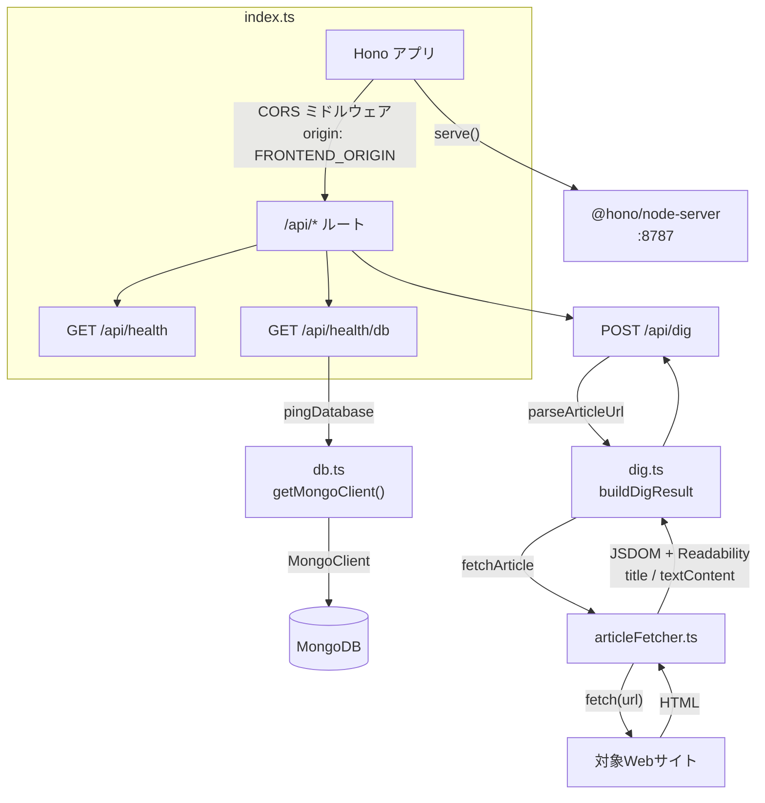

# digger-backend

Hono + TypeScript 製のAPIサーバー。`@hono/node-server` を使い、Node.js ランタイム上で動作します。

## ディレクトリ構成

```
backend/
├── src/
│   ├── index.ts        # エントリーポイント。Honoアプリの定義とルーティング、サーバー起動
│   ├── db.ts            # MongoDB接続クライアントの生成・pingヘルパー
│   ├── dig.ts             # /api/dig のURLバリデーションと解析結果の組み立て
│   ├── articleFetcher.ts   # 記事HTMLの取得とReadabilityによる本文/タイトル抽出
│   └── types.ts            # /api/dig のリクエスト/レスポンス型
├── Dockerfile
├── tsconfig.json
└── package.json
```

## アーキテクチャ



- **`index.ts`**: Honoインスタンスを作成し、`/api/*` にCORSミドルウェアを適用した上でルートを定義しています。`serve()`（`@hono/node-server`）でNode.js上にHTTPサーバーとして起動します。
- **`db.ts`**: `MongoClient` をモジュールスコープでシングルトン管理し（`getMongoClient()`）、毎回の接続確立コストを避けています。`pingDatabase()` は `{ ping: 1 }` コマンドでDB疎通を確認するだけの軽量な関数です。
- **`articleFetcher.ts`**: `fetchArticle(url)` が本文取得の中心。
  1. `fetch()` でHTMLを取得（タイムアウト10秒、UA偽装ヘッダー付き、リダイレクト追従）。ネットワークエラー・非2xxは `ArticleFetchError`（`502`）。
  2. `content-type` がHTML系でなければ `ArticleFetchError`（`422`）。
  3. `jsdom` でDOMを構築し、`@mozilla/readability`（Firefoxリーダービューと同じ抽出エンジン）で nav/footer/広告等を除いた `title` と `textContent` を抽出。抽出できた本文が短すぎる（200文字未満）場合は抽出失敗として `ArticleFetchError`（`422`）。
  - ニュースサイト固有のスクレイピングルールは持たず、一般的なHTML構造の記事ページを対象にした汎用実装です。
- **`dig.ts`**: `parseArticleUrl()` がリクエストの `url` を検証（未指定・不正な形式・http/https以外のプロトコルはエラー）。`buildDigResult()` が `fetchArticle()` で取得した実際の `title` と、まだ固定値の `summary`/`whyItMatters`/`backgroundKnowledge` を組み合わせて `DigResult` を返します。
- **`types.ts`**: `/api/dig` のリクエスト型（`DigRequest`）とレスポンス型（`DigResult` / `DigSource` / `BackgroundKnowledge`）を定義。frontend側の `src/types.ts` と同じ形を手動で同期しています（共有パッケージ化はまだしていません）。
- 現時点でルートは3つ:
  - `GET /api/health` — プロセスが生きていることの確認（DBには触れない）
  - `GET /api/health/db` — `pingDatabase()` を呼び、成功なら `200 { status: "ok", db: "connected" }`、失敗なら `503 { status: "error", db: "disconnected", message }`
  - `POST /api/dig` — `{ url: string }` を受け取り、URLバリデーション失敗は `400`、記事取得・抽出に成功すれば `200` で `DigResult`、失敗時は `422`（本文抽出失敗・非HTML）または `502`（アクセス失敗・非2xx）で `{ error: string }`

## 環境変数（`.env`）

`.env.example` をコピーして使用します。

| 変数名 | 説明 | デフォルト |
| --- | --- | --- |
| `PORT` | 待受ポート | `8787` |
| `MONGODB_URI` | MongoDB接続文字列 | `mongodb://localhost:27017` |
| `MONGODB_DB_NAME` | 使用するDB名 | `digger` |
| `FRONTEND_ORIGIN` | CORSで許可するオリジン（フロントエンドのURL） | `http://localhost:5173` |

いずれも `process.env` から直接読み込んでおり（`dotenv`等は未使用）、`npm run dev`（`tsx watch`）実行時にOS/シェル側で環境変数が読み込まれている前提です。Docker Compose経由の場合は `docker-compose.yml` の `environment` で注入されます。

## スクリプト

| コマンド | 内容 |
| --- | --- |
| `npm run dev` | `tsx watch src/index.ts` — ソース変更を検知して自動再起動する開発サーバー |
| `npm run build` | `tsc -p tsconfig.json` — `dist/` にコンパイル |
| `npm start` | `node dist/index.js` — ビルド済みファイルを実行（本番想定） |

## 依存関係

- `hono` — ルーティング・ミドルウェア（CORS）を提供するWebフレームワーク本体
- `@hono/node-server` — HonoのfetchハンドラをNode.jsの`http`サーバー上で動かすアダプター
- `mongodb` — MongoDB公式Node.jsドライバ
- `jsdom` — 取得したHTMLをパースしてDOMを構築するライブラリ（Node.js上でDOM APIを再現）
- `@mozilla/readability` — `jsdom`で構築したDOMから記事本文・タイトルを抽出するライブラリ（Firefoxリーダービューと同じエンジン）
- `tsx` — TypeScriptをトランスパイルなしで直接実行する開発用ランナー（ウォッチモード対応）

`jsdom` はNode.js 22系を要求するため、ローカルで直接実行する場合もNode 22系が必要です（[ローカル起動](#ローカル起動)参照）。

## ローカル起動

```bash
cp .env.example .env
npm install
npm run dev
```

`http://localhost:8787/api/health` と `http://localhost:8787/api/health/db` で確認できます（MongoDBが別途起動している必要があります）。

## `articleFetcher.ts` が対応できないケース

- **JavaScriptレンダリングが必須のSPA**: 素の`fetch`でHTMLを取得するだけなので、クライアントサイドでDOMを組み立てるサイトは本文が空になり抽出失敗（`422`）になります（ヘッドレスブラウザ未導入）。
- **ボット/クローラーブロック**: 固定のUser-Agentのみで、Cookie・JS実行・CAPTCHA回避などは行いません。403等で弾かれるサイトは`502`になります。
- **ログイン必須・有料会員限定コンテンツ**: 認証を行わないため、ペイウォールの要約だけが取得され本文抽出に失敗する場合があります。
- **極端に短い記事・非文章系ページ**（本文200文字未満）: 抽出失敗として扱われます（閾値は`articleFetcher.ts`の`MIN_TEXT_LENGTH`）。
- **PDF・画像などHTML以外のドキュメント**: `content-type`チェックで`422`を返します。

## 今後の拡張ポイント（未実装）

- `/api/dig` で取得した`textContent`をLLMに渡した`summary`/`whyItMatters`/`backgroundKnowledge`の生成（現状は`dig.ts`内の固定値）
- JavaScriptレンダリングが必要なサイトへの対応（ヘッドレスブラウザの導入）
- 解析結果のMongoDBへの永続化
- ルーティングが増えた場合の分割（現状は `index.ts` に直書き）
- リクエストバリデーションの共通化（Honoの `@hono/zod-validator` 等）
- MongoDBのコレクション/スキーマ定義（現状は接続確認のみで、業務データは未設計）
- エラーハンドリングの共通化（現状は各ルートでtry/catch）
- frontend/backend間で重複しているリクエスト/レスポンス型の共有化
