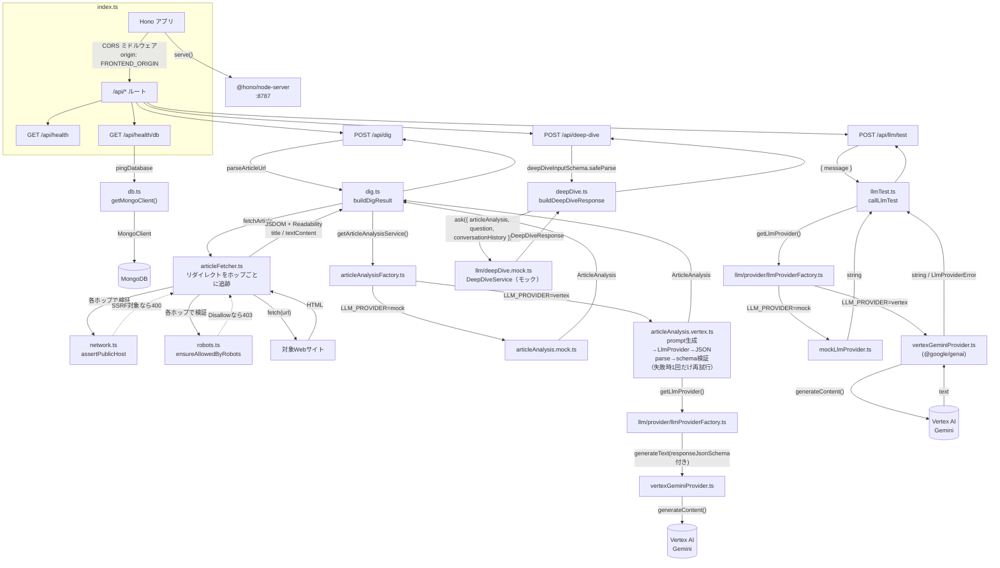
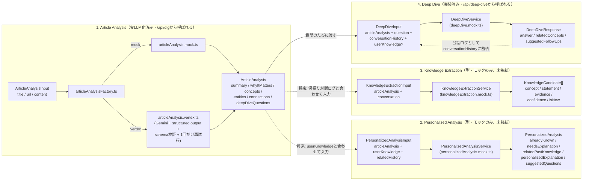

# digger-backend

Hono + TypeScript 製のAPIサーバー。`@hono/node-server` を使い、Node.js ランタイム上で動作します。

## ディレクトリ構成

```
backend/
├── src/
│   ├── index.ts                    # エントリーポイント。Honoアプリの定義とルーティング、サーバー起動
│   ├── db.ts                        # MongoDB接続クライアントの生成・pingヘルパー
│   ├── dig.ts                         # /api/dig のURLバリデーションと解析結果の組み立て
│   ├── deepDive.ts                     # /api/deep-dive のリクエスト検証と回答の組み立て
│   ├── llmTest.ts                       # /api/llm/test（開発用のLLM疎通確認API）のロジック
│   ├── articleFetcher.ts                 # 記事HTMLの取得（リダイレクト追跡）とReadabilityによる本文/タイトル抽出
│   ├── network.ts                         # SSRF対策（private/loopback/link-localホストの拒否）
│   ├── robots.ts                           # robots.txtの取得・パース・許可判定
│   ├── errors.ts                             # ArticleFetchError（記事取得系エラーの共通型）
│   ├── types.ts                               # /api/dig のリクエスト/レスポンス型
│   ├── network.test.ts                         # network.ts のユニットテスト
│   ├── robots.test.ts                           # robots.ts のユニットテスト
│   ├── llmTest.test.ts                           # llmTest.ts のユニットテスト
│   └── llm/                                        # LLMを使う4処理の型・schema・interface・モック/実LLM実装
│       ├── conversation.ts                           # 会話ターンの共通型（Knowledge Extraction / Deep Diveで共用）
│       ├── articleAnalysis.ts                        # 型・zod schema・ArticleAnalysisService interface
│       ├── articleAnalysis.mock.ts                    # モック実装（固定のデモ用サンプルを返す）
│       ├── articleAnalysis.mock.test.ts                # モック実装のユニットテスト
│       ├── articleAnalysis.vertex.ts                     # 実LLM実装（Gemini呼び出し＋prompt生成＋schema検証＋1回だけ再試行）
│       ├── articleAnalysis.vertex.test.ts                 # 上記のユニットテスト（フェイクのLlmProviderを使用、ネットワーク未使用）
│       ├── articleAnalysisFactory.ts                        # LLM_PROVIDER環境変数によるArticleAnalysisService切り替え
│       ├── articleAnalysisFactory.test.ts                    # 上記のユニットテスト
│       ├── personalizedAnalysis.ts                       # 型・zod schema・PersonalizedAnalysisService interface
│       ├── personalizedAnalysis.mock.ts                   # モック実装（concept名の単純一致で既知/未知を判定）
│       ├── personalizedAnalysis.mock.test.ts               # モック実装のユニットテスト
│       ├── knowledgeExtraction.ts                            # 型・zod schema・KnowledgeExtractionService interface
│       ├── knowledgeExtraction.mock.ts                         # モック実装（固定の候補を1件返す）
│       ├── deepDive.ts                                           # 型・zod schema・DeepDiveService interface
│       ├── deepDive.mock.ts                                       # モック実装（記事の解析結果から応答を組み立てる）
│       ├── deepDive.mock.test.ts                                   # モック実装のユニットテスト
│       └── provider/                                                 # LLMプロバイダー抽象化層（Vertex AI/Geminiなど）
│           ├── llmProvider.ts                                          # LlmProvider interface（generateTextのみ）
│           ├── llmProviderError.ts                                      # LlmProviderError と安全なAPIレスポンスへの変換
│           ├── llmProviderError.test.ts                                  # 上記のユニットテスト
│           ├── mockLlmProvider.ts                                        # モック実装（固定文言を返す）
│           ├── vertexGeminiProvider.ts                                    # Vertex AI Gemini実装（@google/genai使用）
│           ├── vertexGeminiProvider.test.ts                                # エラー分類ロジック等のユニットテスト（ネットワーク未使用）
│           ├── llmProviderFactory.ts                                        # LLM_PROVIDER環境変数によるprovider切り替え
│           └── llmProviderFactory.test.ts                                    # 上記のユニットテスト
├── Dockerfile
├── tsconfig.json
└── package.json
```

## アーキテクチャ



- **`index.ts`**: Honoインスタンスを作成し、`/api/*` にCORSミドルウェアを適用した上でルートを定義しています。`serve()`（`@hono/node-server`）でNode.js上にHTTPサーバーとして起動します。
- **`db.ts`**: `MongoClient` をモジュールスコープでシングルトン管理し（`getMongoClient()`）、毎回の接続確立コストを避けています。`pingDatabase()` は `{ ping: 1 }` コマンドでDB疎通を確認するだけの軽量な関数です。
- **`articleFetcher.ts`**: `fetchArticle(url)` が本文取得の中心。
  1. リダイレクトは`redirect: "manual"`で自前追跡し（最大5ホップ）、**各ホップ**で `network.ts` の `assertPublicHost()` と `robots.ts` の `ensureAllowedByRobots()` を実行してから`fetch()`する。これによりリダイレクト先（最終URL）に対してもSSRF対策・robots.txt確認が適用される。
  2. `fetch()` はタイムアウト10秒、User-Agentは`Digger/0.1 (+https://github.com/kokiwaku/digger)`を明示的に送信（一般ブラウザへの偽装はしない）。ネットワークエラー・非2xxは `ArticleFetchError`（`502`）。
  3. `content-type` がHTML系でなければ `ArticleFetchError`（`422`）。
  4. `jsdom` でDOMを構築し、`@mozilla/readability`（Firefoxリーダービューと同じ抽出エンジン）で nav/footer/広告等を除いた `title` と `textContent` を抽出。抽出できた本文が短すぎる（200文字未満）場合は抽出失敗として `ArticleFetchError`（`422`）。
  - ニュースサイト固有のスクレイピングルールは持たず、一般的なHTML構造の記事ページを対象にした汎用実装です。
- **`network.ts`**: `assertPublicHost(url)` がSSRF対策を担当。ホスト名が`localhost`/`*.localhost`、またはIPリテラルでプライベート/ループバック/リンクローカル（`169.254.169.254`等のクラウドメタデータエンドポイントを含む）なら`ArticleFetchError`（`400`）。ホスト名の場合はDNS解決した実IPも同様にチェックし、DNSリバインディングを防ぐ。
- **`robots.ts`**: `ensureAllowedByRobots(url, userAgent)` がrobots.txtを取得・パースし、Diggerの User-Agent（`digger`）または`*`グループのルールと照合。`Disallow`に一致すれば`ArticleFetchError`（`403`）。robots.txt自体が取得できない（ネットワークエラー・非2xxなど）場合は許可されているものとして扱う。簡易パーサのため`Allow`/`Disallow`のみサポートし、`Crawl-delay`等は無視する。
- **`errors.ts`**: `ArticleFetchError`（`400`/`403`/`422`/`502`のいずれかのステータスを持つ）。記事取得パイプライン全体（URL検証・SSRF対策・robots確認・HTTP取得・本文抽出）で共通に使うエラー型。
- **`dig.ts`**: `parseArticleUrl()` がリクエストの `url` を検証（未指定・不正な形式・http/https以外のプロトコルはエラー）。`buildDigResult()` が `fetchArticle()` で取得した実際の `title`/`textContent` を `llm/articleAnalysisFactory.ts` の `getArticleAnalysisService()`（`LLM_PROVIDER`に応じてmock/vertexを切り替え）に渡し、その結果と組み合わせて `DigResult` を返します。`LlmProviderError`は`index.ts`側で捕捉し、`toSafeApiResponse()`で安全なレスポンスに変換します。
- **`deepDive.ts`**: `parseDeepDiveInput()` がリクエストボディを `llm/deepDive.ts` の `deepDiveInputSchema` でそのまま検証（`articleAnalysis`/`question`/`conversationHistory`/`userKnowledge?`の形が正しいか）。`buildDeepDiveResponse()` が `llm/deepDive.mock.ts` の `DeepDiveService` を呼び出すだけの薄いラッパーです。
- **`types.ts`**: `/api/dig` のリクエスト型（`DigRequest`）とレスポンス型（`DigResult` / `DigSource`、および `llm/articleAnalysis.ts` の `ArticleAnalysis`）を定義。frontend側の `src/types.ts` と同じ形を手動で同期しています（共有パッケージ化はまだしていません）。`/api/deep-dive` は `llm/deepDive.ts` の型をそのままリクエスト/レスポンス型として使うため、`types.ts` に重複定義はありません。
- **`llm/`**: LLMを使う4処理（後述）の型・schema・interface・モック実装、および`llm/provider/`（Vertex AI等のプロバイダー抽象化層。後述）。
- **`llmTest.ts`**: 開発用の疎通確認API `POST /api/llm/test` のロジック。リクエストの`message`をzodで検証し、`llm/provider/`の`getLlmProvider()`が返す`LlmProvider`（デフォルトはモック）の`generateText()`を、固定のsystem promptと一緒に呼ぶだけです。Diggerの業務ロジック（Article Analysis等）はまだ関与しません。
- 現時点でルートは5つ:
  - `GET /api/health` — プロセスが生きていることの確認（DBには触れない）
  - `GET /api/health/db` — `pingDatabase()` を呼び、成功なら `200 { status: "ok", db: "connected" }`、失敗なら `503 { status: "error", db: "disconnected", message }`
  - `POST /api/dig` — `{ url: string }` を受け取り、URLバリデーション失敗またはSSRF対象ホストは `400`、robots.txtにより不許可なら `403`、記事取得・抽出・Article Analysisに成功すれば `200` で `DigResult`、それ以外の取得・抽出失敗は `422`（本文抽出失敗・非HTML）または `502`（アクセス失敗・非2xx・ホスト名解決失敗）で `{ error: string }`
  - `POST /api/deep-dive` — `{ articleAnalysis, question, conversationHistory, userKnowledge? }` を受け取り、schemaバリデーション失敗は `400`、成功すれば `200` で `DeepDiveResponse`（`answer`/`relatedConcepts`/`suggestedFollowUps`）、それ以外の失敗は `502` で `{ error: string }`
  - `POST /api/llm/test` — 開発用のLLM疎通確認API（後述）。`{ message: string }` を受け取り、バリデーション失敗は `400`、成功すれば `200` で `{ response: string }`、LLMプロバイダー側のエラーは原因に応じて `500`/`502`/`504` で `{ error: string }`（安全な汎用メッセージのみ。詳細はサーバーログへ）

## LLM処理（Article Analysis / Personalized Analysis / Knowledge Extraction / Deep Dive）

Diggerのコア機能である「記事を深掘りして理解を蓄積する」部分は、4つの独立したLLM処理として実装します。**Article Analysisは実LLM化済みで、`LLM_PROVIDER=vertex`のときVertex AI Geminiが実際に記事内容を解析します。** Deep Dive・Personalized Analysis・Knowledge Extractionはまだ`llm/*.mock.ts`の固定/簡易ロジックのみです。



- **なぜ4つに分離するか**: それぞれ目的も入力も異なるため（記事の客観的な解析／ユーザー個人への最適化／対話からの知識抽出／その場のQ&A）。将来的に別々のプロンプト・別々のモデル（例: 安価なモデルで要約、高性能なモデルで個人化）に切り替えられるよう、最初から独立した`interface`にしています。候補ボタンのクリックと自由入力のどちらから来た質問も、同じ`question: string`として`DeepDiveService`に渡るため、呼び出し側で区別する必要がありません。
- **共通パターン**: 各処理は `xxx.ts`（型・zod schema・`XxxService` interfaceの3点セット）と `xxx.mock.ts`（そのinterfaceを実装するモック）に分かれています。本物のLLM実装を追加する際は、同じinterfaceを実装する `xxx.openai.ts` のような新しいファイルを作り、呼び出し側（`dig.ts`/`deepDive.ts`など）のimportを差し替えるだけで済む構造です。
- **runtime validation**: 型定義には[Zod](https://zod.dev/)を使い、`z.infer<typeof schema>` でTypeScript型をschemaから導出しています（型とバリデーションルールの二重管理を避けるため）。モック実装も生成したデータを`schema.parse(...)`に通してから返しており、本物のLLM実装でも「LLMのレスポンス(JSON)を`schema.parse(...)`で検証してから返す」という同じパターンを踏襲する想定です。LLMの出力は外部から来る信頼できないデータなので、ここでの検証は将来的に特に重要になります。`deepDive.ts`の`deepDiveInputSchema`はさらに、クライアントからのリクエストボディの検証にもそのまま使われています（`deepDive.ts`（backend直下）の`parseDeepDiveInput()`）。
- **共通型の再利用**: 会話ターンの型（`{ role: "user" | "assistant", content: string }`）は`llm/conversation.ts`に切り出し、Knowledge ExtractionとDeep Diveの両方から利用しています。ユーザーの過去の知識の型（`UserKnowledge`）は`llm/personalizedAnalysis.ts`からexportし、Deep Diveから再利用しています。
- **ユーザー知識・履歴の扱い**: Article Analysisにはユーザーの知識や履歴を一切渡しません（記事そのものの客観的な解析のため）。ユーザー個人への最適化はPersonalized Analysisの責務として分離しています。
- **1. Article Analysis**（`llm/articleAnalysis.ts` / `articleAnalysis.mock.ts` / `articleAnalysis.vertex.ts` / `articleAnalysisFactory.ts`）: 記事の`title`/`url`/`content`から、要約・重要性・前提知識（`concepts`）・関連する人物や組織（`entities`）・他テーマとの関連（`connections`）・深掘りの問い（`deepDiveQuestions`）を生成。`dig.ts`が`articleAnalysisFactory.ts`の`getArticleAnalysisService()`（`LLM_PROVIDER`で`articleAnalysis.mock.ts`/`articleAnalysis.vertex.ts`を切り替え）を呼び、結果は`/api/dig`のレスポンスに含まれます。実LLM実装の詳細は次項を参照。
- **2. Personalized Analysis**（`llm/personalizedAnalysis.ts` / `personalizedAnalysis.mock.ts`）: Article Analysisの結果とユーザーの過去の理解（`userKnowledge`）を照合し、「何を説明すべきか」を判定。モック実装はLLMを使わず、concept名の文字列一致だけで「既知/未知」を振り分ける簡易ロジックです。**まだどのルートからも呼ばれていません**（ユーザーの理解履歴を保存する仕組み自体が未実装のため）。
- **3. Knowledge Extraction**（`llm/knowledgeExtraction.ts` / `knowledgeExtraction.mock.ts`）: 深掘り対話のログ（`conversation`）から、新しく理解したと思われる知識の"候補"（`KnowledgeCandidate`）を抽出。AIが理解を勝手に確定させないよう、あくまで候補を返すだけで、保存の可否はユーザーが決める設計です。**まだどのルートからも呼ばれていません**（今回`/api/deep-dive`は実装しましたが、そこでの対話ログをKnowledge Extractionに渡す導線はまだ未実装です）。
- **4. Deep Dive**（`llm/deepDive.ts` / `deepDive.mock.ts`）: Article Analysisの結果・質問（`question`）・これまでの会話（`conversationHistory`）から、その場の回答（`answer`）・関連する前提知識（`relatedConcepts`）・次の質問候補（`suggestedFollowUps`）を生成。`backend/src/deepDive.ts`から呼ばれ、`POST /api/deep-dive`のレスポンスになります。モック実装は、`relatedConcepts`をArticle Analysisの`concepts`から、`suggestedFollowUps`を`deepDiveQuestions`（今回の質問を除く）から実際に組み立てており、`answer`のみ固定文言です。

> **注記**: Personalized Analysis・Knowledge Extraction・Deep Diveはまだ`llm/provider/`（次項）を使っておらず、それぞれの`*.mock.ts`が固定値/簡易ロジックを返すだけです。Article Analysisは実際に`llm/provider/`経由でVertex AI Geminiを呼ぶ実装（`articleAnalysis.vertex.ts`）を追加済みなので、他の処理を実LLM化する際の実例として参照してください。

### Article Analysisの実LLM化（`articleAnalysis.vertex.ts`）

`LLM_PROVIDER=vertex`のとき、`articleAnalysisFactory.ts`が`vertexArticleAnalysisService`を選択します。処理の流れ:

1. **入力サイズの制御**: 記事本文（`content`）が`MAX_CONTENT_LENGTH`（12,000文字）を超える場合は切り詰め、末尾に省略した旨を追記します。トークン数ではなく文字数での単純な制御です（Gemini 2.5 Flash等のコンテキストウィンドウ自体は十分大きいですが、コスト・レイテンシを抑えるための保守的な上限です）。
2. **prompt生成**: システムプロンプトでDiggerのArticle Analysisエンジンとしての役割（何が起きたか／なぜ重要か／前提知識／関連テーマ／深掘りの問いを整理する。単なる要約ではない）を指示し、ユーザープロンプトで記事のtitle/url/本文と、各フィールド（`summary`/`whyItMatters`/`concepts`/`entities`/`connections`/`deepDiveQuestions`）ごとの具体的な出力ルール（良い例/悪い例を含む）を渡します。**frontendのProgressive Disclosure UI（詳細は[`frontend/README.md`](../frontend/README.md)）に合わせ、`summary`/`whyItMatters`は最大3文、`concept.description`は1〜2文、`deepDiveQuestions`は最大4件（最初の1件が最も優先度の高い問いになるよう指示）に絞るようpromptで制約しています。schema自体（フィールド構成）は変更していません**。frontend側でも`firstSentences()`（文末記号での単純な冒頭N文抽出）により、想定より長い応答が来た場合の安全弁として表示文字数を制御しています。
3. **structured output**: `articleAnalysisSchema`を[Zod 4の`z.toJSONSchema()`](https://zod.dev/json-schema)（追加ライブラリ不要）でJSON Schemaに変換し、`LlmProvider.generateText()`の`responseJsonSchema`として渡します。`vertexGeminiProvider.ts`はこれを`responseMimeType: "application/json"` + `responseJsonSchema`として`@google/genai`の`generateContent()`に渡し、Geminiのnative構造化出力機能でJSON形式の出力を強制します。
4. **runtime validation**: 返ってきたテキストを`JSON.parse()`し（万一markdownのコードフェンスで囲まれていても対応）、`articleAnalysisSchema.safeParse()`で検証します。**LLMが返した値は無条件に信用しません。**
5. **再試行**: JSON parse失敗・schema validation失敗（必須フィールド欠落・不正なenum値・空レスポンス等）の場合、「前回の出力がschemaに適合しなかったため、指定schemaに厳密に従って再生成してください」という指示を追加して**1回だけ**再試行します。それでも失敗すれば`LlmProviderError`（`empty_response`）を投げ、`index.ts`が`502`として返します。複雑な自動修復は行いません。
6. **ログ**: `[ArticleAnalysis] start`（provider/model/url）→（失敗時）`[ArticleAnalysis] validation failed, retrying once`→`[ArticleAnalysis] success`または`failed after retry`（provider/model/処理時間ms/retriedの有無）をサーバーログに出力します。記事本文全文やcredentialは出力しません。トークン使用量（`promptTokens`/`candidatesTokens`/`totalTokens`）は`vertexGeminiProvider.ts`側で`[VertexGeminiProvider] token usage`として出力します（`@google/genai`のレスポンスに含まれる`usageMetadata`をそのまま使うだけで、追加の実装は行っていません）。
7. **timeout**: `llm/provider/vertexGeminiProvider.ts`が持つ既存の30秒タイムアウト（`AbortController`）をそのまま利用します。再試行時も同じタイムアウトが個別に適用されるため、最悪ケースでも無限待ちにはなりません（1回の呼び出しごとに最大30秒、再試行込みで最大2回）。
8. **テスト容易性**: `createVertexArticleAnalysisService(getProvider)`という形でproviderの解決を関数として注入できるようにしており、テストではフェイクの`LlmProvider`を渡すことで、実際のVertex AI呼び出しなしに正常系・JSON parse失敗・schema validation失敗・再試行成功・再試行後も失敗・LLM呼び出しエラー（再試行しないこと）を検証しています（`articleAnalysis.vertex.test.ts`）。

## LLMプロバイダー層（`llm/provider/`）

Article Analysis等の各LLM処理が「どのAIベンダーを使うか」を意識しないで済むよう、生成AI呼び出しそのものを抽象化する薄いレイヤーです。Article Analysisが最初にこの層を実際に使う処理になりました。

```ts
// llm/provider/llmProvider.ts
export type GenerateTextInput = {
  systemPrompt?: string;
  prompt: string;
  // 構造化出力(JSON)を要求する場合の標準JSON Schema。対応していないproviderは無視してよい。
  responseJsonSchema?: Record<string, unknown>;
};

export interface LlmProvider {
  generateText(input: GenerateTextInput): Promise<string>;
}
```

- **`llmProvider.ts`**: 上記の`LlmProvider` interfaceのみを定義。`ArticleAnalysisService`等の既存interfaceとは別レイヤー（既存interfaceは「記事を解析して構造化データを返す」というDigger固有の処理、`LlmProvider`は「テキストを1回生成する」という汎用的な処理）なので、新設しても既存interfaceの乱立にはあたりません。
- **`mockLlmProvider.ts`**: `MockLlmProvider`。受け取った`prompt`を埋め込んだ固定文言を返すだけで、外部通信は一切行いません。
- **`vertexGeminiProvider.ts`**: `VertexGeminiProvider`。[`@google/genai`](https://www.npmjs.com/package/@google/genai)（Googleの統一Gen AI SDK。Vertex AIとGemini Developer APIの両方に対応し、旧来の`@google-cloud/vertexai`はGemini 2.0以降の新機能を受け取らないため今回は不採用）を使い、`GCP_PROJECT_ID`/`GCP_LOCATION`/`GEMINI_MODEL`（すべて環境変数、コードにモデル名はハードコードしない）でVertex AI上のGeminiを呼び出します。認証は明示的なAPIキーではなくApplication Default Credentials（ADC）任せにしています（後述）。タイムアウトは`AbortController`で30秒に設定（`REQUEST_TIMEOUT_MS`）。
  - `responseJsonSchema`が渡された場合は`responseMimeType: "application/json"`と合わせて`generateContent()`のconfigに設定し、Geminiのnative構造化出力機能を使う。未指定の場合は通常のテキスト応答（`/api/llm/test`はこちらの経路）。
  - レスポンスの`usageMetadata`（`promptTokenCount`/`candidatesTokenCount`/`totalTokenCount`）を`console.log`でそのまま出力するだけの軽量なトークン使用量ロギングを行う（本文全文やcredentialは出力しない）。
  - `classifyVertexError()`という純粋関数でエラーを分類しています（ネットワークを使わないので単体テスト可能）: `AbortError`→`timeout`、HTTP `401`/`403`→`auth_failed`、HTTP `404`→`invalid_model`、ADC関連のエラーメッセージ→`auth_failed`、それ以外→`api_error`。呼び出し自体は成功したがテキストが空の場合は`empty_response`。
- **`llmProviderError.ts`**: `LlmProviderError`（`config_missing`/`auth_failed`/`invalid_model`/`timeout`/`api_error`/`empty_response`のいずれかの`code`を持つ）と、それを安全なHTTPレスポンス（ステータスコード＋汎用メッセージ）に変換する`toSafeApiResponse()`。**ユーザー向けレスポンスには元のエラーメッセージ（credentialや内部情報を含み得る）を含めず**、詳細はサーバーログにのみ出力します（`index.ts`の`console.error`）。
- **`llmProviderFactory.ts`**: `getLlmProvider()`が環境変数`LLM_PROVIDER`（`mock` | `vertex`、デフォルト`mock`）を見て、対応する`LlmProvider`実装を返すだけの単純なswitch文です。DIコンテナ等は導入していません。

## Vertex AI (Gemini) のセットアップ

`LLM_PROVIDER=vertex`で実際にGoogle Cloud Vertex AI上のGeminiを呼び出す場合に必要な手順です。`LLM_PROVIDER=mock`（デフォルト）のままであれば、この節の作業は不要です。

### 1. GCPプロジェクトを選択

Vertex AIを使うGoogle Cloudプロジェクトを用意し、プロジェクトIDを控えます（`gcloud projects list`または[Cloud Console](https://console.cloud.google.com/)で確認できます）。課金が有効なプロジェクトである必要があります。

### 2. Vertex AI APIを有効化

```bash
gcloud config set project <YOUR_PROJECT_ID>
gcloud services enable aiplatform.googleapis.com
```

（Cloud Consoleの場合は「Vertex AI API」を検索して有効化）

### 3. ローカル開発用のApplication Default Credentials設定

サービスアカウントキーJSONはリポジトリは元よりローカルにも保存せず、`gcloud` CLIが発行するApplication Default Credentials（ADC）を使います。

```bash
gcloud auth application-default login
```

ブラウザでの認証後、認証情報が`~/.config/gcloud/application_default_credentials.json`（macOS/Linux）に保存されます。このファイルは`.gitignore`済みの場所にあり、リポジトリには含まれません。`@google/genai`は`vertexai: true`で初期化するとこのADCを自動的に見つけて使うため、コード側でキーファイルのパスを指定する必要はありません。

自分のユーザーに`roles/aiplatform.user`相当の権限（Vertex AI呼び出し権限）が付与されている必要があります。権限がない場合はプロジェクトの管理者に付与を依頼してください。

### 4. 必要な環境変数

`backend/.env.example`にある以下をコピーして設定します（`cp .env.example .env`）。

| 変数名 | 説明 | 例 |
| --- | --- | --- |
| `LLM_PROVIDER` | `mock`（デフォルト）または `vertex` | `vertex` |
| `GCP_PROJECT_ID` | Vertex AIを使うGCPプロジェクトID | `digger-508713` |
| `GCP_LOCATION` | Vertex AIのリージョン（または`global`。後述） | `asia-northeast1` |
| `GEMINI_MODEL` | 使用するGeminiのモデルID | `gemini-2.5-flash`（コストと速度優先の実運用確認済み設定） |

モデルIDはコードにハードコードしていないため、新しいモデルが出た場合も環境変数の変更だけで切り替えられます。

**モデルの利用可否はリージョンごとに異なります。** 実際に`digger-508713`プロジェクトで検証した結果は以下の通りです（あくまで検証時点のスナップショットで、モデルの提供状況は変わります）。

| モデルID | `asia-northeast1` | `us-central1` | `global` |
| --- | --- | --- | --- |
| `gemini-2.5-flash` | ✅ | ✅ | ✅ |
| `gemini-2.5-flash-lite` | ❌ (404) | ✅ | 未検証 |
| `gemini-flash-latest` | ❌ (404) | ❌ (404) | ✅ |
| `gemini-3.5-flash-lite` | ❌ (404) | ❌ (404) | ✅ |

`GCP_LOCATION=global`という特別な値を指定すると、Vertex AIが利用可能なリージョンへ自動的にルーティングします。**新しいモデルほど、まず`global`でのみ提供され、その後個別リージョンに展開される傾向があります**（上表の`gemini-flash-latest`/`gemini-3.5-flash-lite`はこのパターン）。一方で`global`は「どの地理的リージョンで処理されるか」を自分で制御できないため、データレジデンシー要件がある場合は特定リージョンを指定してください。Diggerは現状そうした要件がないため、`asia-northeast1` + `gemini-2.5-flash`（両リージョン・`global`いずれでも動作確認済み）をひとまずの既定値としています。新しいモデルを試したい場合は`GEMINI_MODEL`（および必要なら`GCP_LOCATION=global`）を変更するだけで切り替えられます。

### 5. Docker環境から認証する場合の注意

ADCの認証情報ファイル（`~/.config/gcloud/`以下）はホストマシンにあるため、コンテナ内のプロセスからは何もしなければ見えません。Docker Composeで`LLM_PROVIDER=vertex`を試す場合は、このディレクトリをコンテナへ**読み取り専用でマウント**する必要があります。

```yaml
# docker-compose.yml の backend サービスに追加する例
services:
  backend:
    volumes:
      - ./backend:/app
      - backend_node_modules:/app/node_modules
      - ~/.config/gcloud:/root/.config/gcloud:ro # ADCをコンテナへ渡す（読み取り専用）
```

このリポジトリの`docker-compose.yml`にはデフォルトでこのマウントを含めていません（`gcloud`未導入の環境で`docker compose up`しても空ディレクトリが作られないようにするため）。Vertex AIをDocker経由で試す場合のみ、上記のように自分の環境で追記してください。またリポジトリ直下の`.env.example`を`.env`にコピーすると、`docker compose`が`LLM_PROVIDER`/`GCP_PROJECT_ID`/`GCP_LOCATION`/`GEMINI_MODEL`を読み込みます（`backend/.env`とは別ファイルです。Docker Composeの変数展開はプロジェクト直下の`.env`からのみ行われるため）。

コンテナ内のホームディレクトリがマウント先と一致している必要があります（このリポジトリの`backend/Dockerfile`は`node:22-slim`をベースにしており、`USER`指定がないためroot実行＝`HOME=/root`です。上記の`/root/.config/gcloud`はそれに合わせています）。

## 環境変数（`.env`）

`.env.example` をコピーして使用します。

| 変数名 | 説明 | デフォルト |
| --- | --- | --- |
| `PORT` | 待受ポート | `8787` |
| `MONGODB_URI` | MongoDB接続文字列 | `mongodb://localhost:27017` |
| `MONGODB_DB_NAME` | 使用するDB名 | `digger` |
| `FRONTEND_ORIGIN` | CORSで許可するオリジン（フロントエンドのURL） | `http://localhost:5173` |
| `LLM_PROVIDER` | 使用するLLMプロバイダー（`mock` または `vertex`） | `mock` |
| `GCP_PROJECT_ID` | Vertex AIを使うGCPプロジェクトID（`LLM_PROVIDER=vertex`時のみ必須） | 未設定 |
| `GCP_LOCATION` | Vertex AIのリージョン（`LLM_PROVIDER=vertex`時のみ必須） | 未設定 |
| `GEMINI_MODEL` | 使用するGeminiのモデルID（`LLM_PROVIDER=vertex`時のみ必須） | 未設定 |

いずれも `process.env` から直接読み込んでおり（`dotenv`等は未使用）、`npm run dev`（`tsx watch`）実行時にOS/シェル側で環境変数が読み込まれている前提です。Docker Compose経由の場合は `docker-compose.yml` の `environment` で注入されます（Vertex AI関連の変数は[前述](#vertex-ai-gemini-のセットアップ)の通りプロジェクト直下の`.env`から読み込まれます）。

## スクリプト

| コマンド | 内容 |
| --- | --- |
| `npm run dev` | `tsx watch src/index.ts` — ソース変更を検知して自動再起動する開発サーバー |
| `npm run build` | `tsc -p tsconfig.json` — `dist/` にコンパイル（`*.test.ts` は除外） |
| `npm start` | `node dist/index.js` — ビルド済みファイルを実行（本番想定） |
| `npm test` | `tsx --test src/*.test.ts src/llm/*.test.ts src/llm/provider/*.test.ts` — Node.js標準の`node:test`ランナーでユニットテストを実行。**Vertex AIへの実際の通信は行わない**（`classifyVertexError`等の純粋関数のみテスト） |

## 依存関係

- `hono` — ルーティング・ミドルウェア（CORS）を提供するWebフレームワーク本体
- `@hono/node-server` — HonoのfetchハンドラをNode.jsの`http`サーバー上で動かすアダプター
- `mongodb` — MongoDB公式Node.jsドライバ
- `jsdom` — 取得したHTMLをパースしてDOMを構築するライブラリ（Node.js上でDOM APIを再現）
- `@mozilla/readability` — `jsdom`で構築したDOMから記事本文・タイトルを抽出するライブラリ（Firefoxリーダービューと同じエンジン）
- `@google/genai` — Google Cloudの統一Gen AI SDK。Vertex AI上のGeminiを`llm/provider/vertexGeminiProvider.ts`から呼び出すために使用（採用理由は[LLMプロバイダー層](#llmプロバイダー層llmprovider)を参照）
- `zod` — LLM入出力の型定義とruntime validationに使用（`llm/`配下）。Zod 4の`z.toJSONSchema()`（追加ライブラリ不要）で`articleAnalysisSchema`をJSON Schemaに変換し、Geminiのstructured output機能にそのまま渡している。テストは追加ライブラリなしでNode.js標準の`node:test`を使用
- `tsx` — TypeScriptをトランスパイルなしで直接実行する開発用ランナー（ウォッチモード対応）

`jsdom` はNode.js 22系を要求するため、ローカルで直接実行する場合もNode 22系が必要です（[ローカル起動](#ローカル起動)参照）。

## ローカル起動

```bash
cp .env.example .env
npm install
npm run dev
```

`http://localhost:8787/api/health` と `http://localhost:8787/api/health/db` で確認できます（MongoDBが別途起動している必要があります）。

LLMの疎通確認（`LLM_PROVIDER=mock`のままでも、`vertex`に設定してVertex AIの実際の応答を試す場合でも）は以下で行えます。

```bash
curl -X POST http://localhost:8787/api/llm/test \
  -H "Content-Type: application/json" \
  -d '{"message": "日本の中央銀行は何ですか？"}'
# => {"response":"..."}
```

## 記事取得が対応できないケース

- **JavaScriptレンダリングが必須のSPA**: 素の`fetch`でHTMLを取得するだけなので、クライアントサイドでDOMを組み立てるサイトは本文が空になり抽出失敗（`422`）になります（ヘッドレスブラウザ未導入）。
- **ボット/クローラーブロック**: 固定のUser-Agent（`Digger/0.1 ...`、一般ブラウザへの偽装はしない）のみで、Cookie・JS実行・CAPTCHA回避などは行いません。403等で弾かれるサイトは`502`になります。
- **robots.txtで許可されていないページ**: `Disallow`に一致する場合は取得自体を行わず`403`を返します（[記事取得ポリシー](../README.md#記事取得ポリシー)参照）。
- **ログイン必須・有料会員限定コンテンツ**: 認証やペイウォール回避を行わないため、要約だけが取得され本文抽出に失敗する場合があります。
- **極端に短い記事・非文章系ページ**（本文200文字未満）: 抽出失敗として扱われます（閾値は`articleFetcher.ts`の`MIN_TEXT_LENGTH`）。
- **PDF・画像などHTML以外のドキュメント**: `content-type`チェックで`422`を返します。
- **localhost/private IP/link-local（クラウドメタデータ含む）を指すURL**: SSRF対策として`400`で拒否します。リダイレクトで内部ネットワークへ誘導しようとするケースも各ホップで検証するため防げます。

## 今後の拡張ポイント（未実装）

- `llm/deepDive.mock.ts` を、Article Analysis（`articleAnalysis.vertex.ts`）と同じパターンで実LLM化する（`deepDive.vertex.ts`を追加し、`articleAnalysisFactory.ts`と同様のfactoryを`deepDive.ts`（backend直下）に組み込む）
- `POST /api/llm/test`は開発用の疎通確認APIのため、他の処理の実LLM化が進んだら削除を検討する
- 記事本文の切り詰め（`MAX_CONTENT_LENGTH`、現状12,000文字の単純な文字数カット）を、文の区切りを考慮した切り詰めや要約前処理に改善する
- `POST /api/deep-dive`の対話ログをKnowledge Extractionに渡す導線（「理解したことを抽出・保存」の仕組み）
- Personalized Analysisを呼び出す導線（ユーザーの理解履歴のデータモデルが前提）
- JavaScriptレンダリングが必要なサイトへの対応（ヘッドレスブラウザの導入）
- 解析結果・深掘りの会話履歴・ユーザーの理解履歴のMongoDBへの永続化
- ルーティングが増えた場合の分割（現状は `index.ts` に直書き）
- リクエストバリデーションの共通化（Honoの `@hono/zod-validator` 等。`llm/`ではすでにzodを導入済み）
- MongoDBのコレクション/スキーマ定義（現状は接続確認のみで、業務データは未設計）
- エラーハンドリングの共通化（現状は各ルートでtry/catch）
- frontend/backend間で重複しているリクエスト/レスポンス型の共有化
- `robots.ts`のパーサはAllow/Disallowのみ対応。ワイルドカード（`*`, `$`）や`Crawl-delay`など、より厳密なrobots.txt仕様への対応
