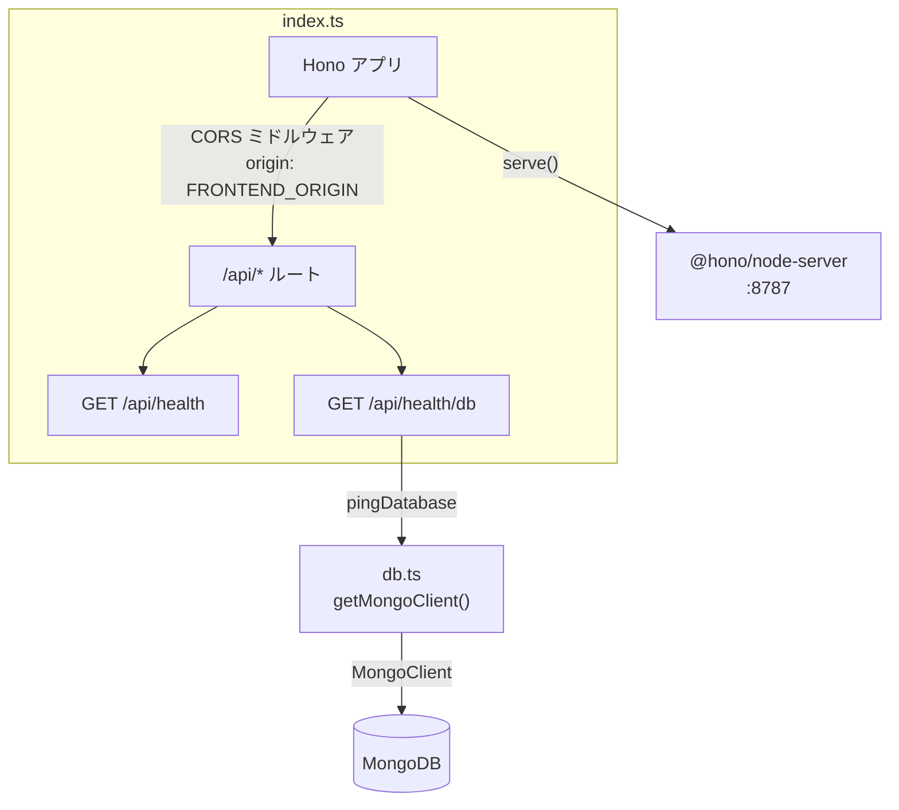

# digger-backend

Hono + TypeScript 製のAPIサーバー。`@hono/node-server` を使い、Node.js ランタイム上で動作します。

## ディレクトリ構成

```
backend/
├── src/
│   ├── index.ts   # エントリーポイント。Honoアプリの定義とルーティング、サーバー起動
│   └── db.ts       # MongoDB接続クライアントの生成・pingヘルパー
├── Dockerfile
├── tsconfig.json
└── package.json
```

## アーキテクチャ



- **`index.ts`**: Honoインスタンスを作成し、`/api/*` にCORSミドルウェアを適用した上でルートを定義しています。`serve()`（`@hono/node-server`）でNode.js上にHTTPサーバーとして起動します。
- **`db.ts`**: `MongoClient` をモジュールスコープでシングルトン管理し（`getMongoClient()`）、毎回の接続確立コストを避けています。`pingDatabase()` は `{ ping: 1 }` コマンドでDB疎通を確認するだけの軽量な関数です。
- 現時点でルートは2つのみ:
  - `GET /api/health` — プロセスが生きていることの確認（DBには触れない）
  - `GET /api/health/db` — `pingDatabase()` を呼び、成功なら `200 { status: "ok", db: "connected" }`、失敗なら `503 { status: "error", db: "disconnected", message }`

## 環境変数（`.env`）

`.env.example` をコピーして使用します。

| 変数名 | 説明 | デフォルト |
| --- | --- | --- |
| `PORT` | 待受ポート | `8787` |
| `MONGODB_URI` | MongoDB接続文字列 | `mongodb://localhost:27017` |
| `MONGODB_DB_NAME` | 使用するDB名 | `digger` |
| `FRONTEND_ORIGIN` | CORSで許可するオリジン（フロントエンドのURL） | `http://localhost:5173` |

いずれも `process.env` から直接読み込んでおり（`dotenv`等は未使用）、`npm run dev`（`tsx watch`）実行時にOS/シェル側で環境変数が読み込まれている前提です。Docker Compose経由の場合は `docker-compose.yml` の `environment` で注入されます。

## スクリプト

| コマンド | 内容 |
| --- | --- |
| `npm run dev` | `tsx watch src/index.ts` — ソース変更を検知して自動再起動する開発サーバー |
| `npm run build` | `tsc -p tsconfig.json` — `dist/` にコンパイル |
| `npm start` | `node dist/index.js` — ビルド済みファイルを実行（本番想定） |

## 依存関係

- `hono` — ルーティング・ミドルウェア（CORS）を提供するWebフレームワーク本体
- `@hono/node-server` — HonoのfetchハンドラをNode.jsの`http`サーバー上で動かすアダプター
- `mongodb` — MongoDB公式Node.jsドライバ
- `tsx` — TypeScriptをトランスパイルなしで直接実行する開発用ランナー（ウォッチモード対応）

## ローカル起動

```bash
cp .env.example .env
npm install
npm run dev
```

`http://localhost:8787/api/health` と `http://localhost:8787/api/health/db` で確認できます（MongoDBが別途起動している必要があります）。

## 今後の拡張ポイント（未実装）

- ルーティングが増えた場合の分割（現状は `index.ts` に直書き）
- リクエストバリデーション（Honoの `@hono/zod-validator` 等）
- MongoDBのコレクション/スキーマ定義（現状は接続確認のみで、業務データは未設計）
- エラーハンドリングの共通化（現状は各ルートでtry/catch）
