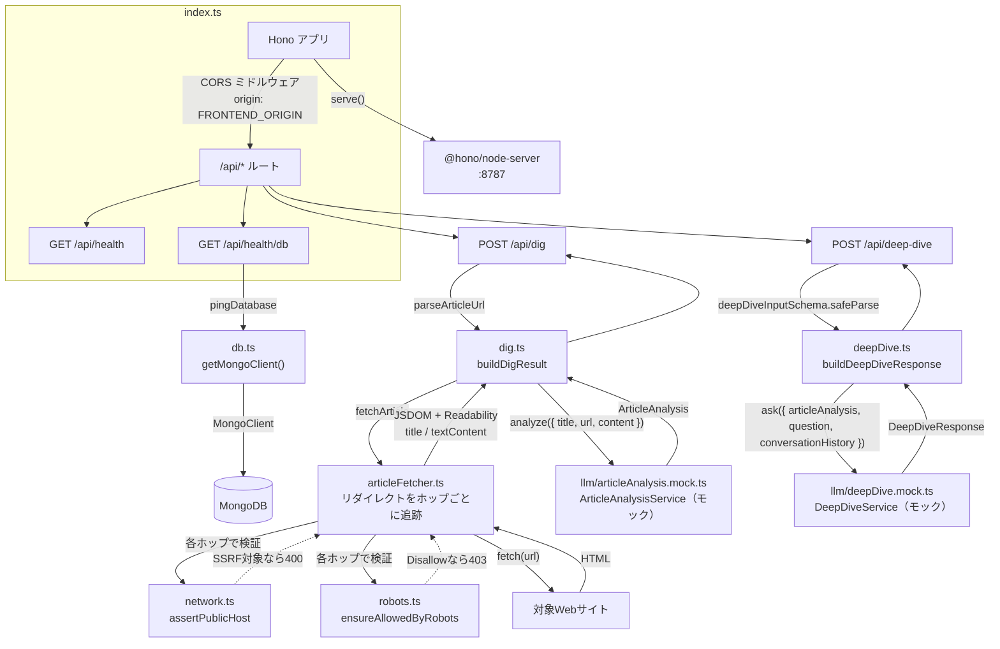
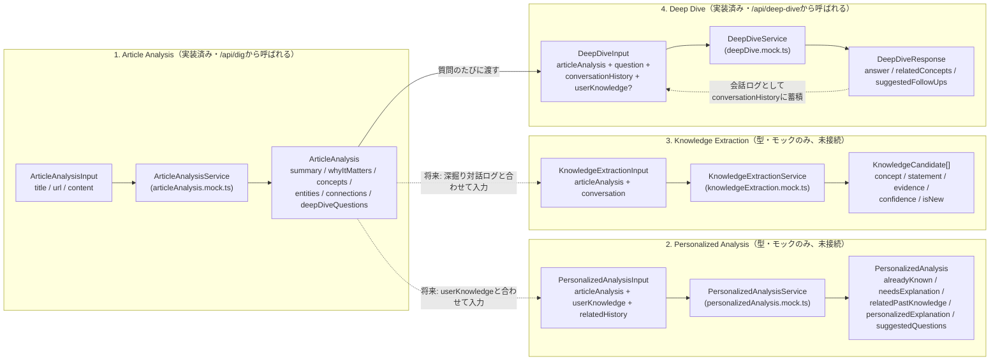

# digger-backend

Hono + TypeScript 製のAPIサーバー。`@hono/node-server` を使い、Node.js ランタイム上で動作します。

## ディレクトリ構成

```
backend/
├── src/
│   ├── index.ts                    # エントリーポイント。Honoアプリの定義とルーティング、サーバー起動
│   ├── db.ts                        # MongoDB接続クライアントの生成・pingヘルパー
│   ├── dig.ts                         # /api/dig のURLバリデーションと解析結果の組み立て
│   ├── deepDive.ts                     # /api/deep-dive のリクエスト検証と回答の組み立て
│   ├── articleFetcher.ts               # 記事HTMLの取得（リダイレクト追跡）とReadabilityによる本文/タイトル抽出
│   ├── network.ts                       # SSRF対策（private/loopback/link-localホストの拒否）
│   ├── robots.ts                         # robots.txtの取得・パース・許可判定
│   ├── errors.ts                           # ArticleFetchError（記事取得系エラーの共通型）
│   ├── types.ts                             # /api/dig のリクエスト/レスポンス型
│   ├── network.test.ts                       # network.ts のユニットテスト
│   ├── robots.test.ts                         # robots.ts のユニットテスト
│   └── llm/                                    # LLMを使う4処理の型・schema・interface・モック実装
│       ├── conversation.ts                       # 会話ターンの共通型（Knowledge Extraction / Deep Diveで共用）
│       ├── articleAnalysis.ts                    # 型・zod schema・ArticleAnalysisService interface
│       ├── articleAnalysis.mock.ts                # モック実装（固定のデモ用サンプルを返す）
│       ├── articleAnalysis.mock.test.ts            # モック実装のユニットテスト
│       ├── personalizedAnalysis.ts                   # 型・zod schema・PersonalizedAnalysisService interface
│       ├── personalizedAnalysis.mock.ts               # モック実装（concept名の単純一致で既知/未知を判定）
│       ├── personalizedAnalysis.mock.test.ts           # モック実装のユニットテスト
│       ├── knowledgeExtraction.ts                        # 型・zod schema・KnowledgeExtractionService interface
│       ├── knowledgeExtraction.mock.ts                     # モック実装（固定の候補を1件返す）
│       ├── deepDive.ts                                       # 型・zod schema・DeepDiveService interface
│       ├── deepDive.mock.ts                                   # モック実装（記事の解析結果から応答を組み立てる）
│       └── deepDive.mock.test.ts                               # モック実装のユニットテスト
├── Dockerfile
├── tsconfig.json
└── package.json
```

## アーキテクチャ



- **`index.ts`**: Honoインスタンスを作成し、`/api/*` にCORSミドルウェアを適用した上でルートを定義しています。`serve()`（`@hono/node-server`）でNode.js上にHTTPサーバーとして起動します。
- **`db.ts`**: `MongoClient` をモジュールスコープでシングルトン管理し（`getMongoClient()`）、毎回の接続確立コストを避けています。`pingDatabase()` は `{ ping: 1 }` コマンドでDB疎通を確認するだけの軽量な関数です。
- **`articleFetcher.ts`**: `fetchArticle(url)` が本文取得の中心。
  1. リダイレクトは`redirect: "manual"`で自前追跡し（最大5ホップ）、**各ホップ**で `network.ts` の `assertPublicHost()` と `robots.ts` の `ensureAllowedByRobots()` を実行してから`fetch()`する。これによりリダイレクト先（最終URL）に対してもSSRF対策・robots.txt確認が適用される。
  2. `fetch()` はタイムアウト10秒、User-Agentは`Digger/0.1 (+https://github.com/kokiwaku/digger)`を明示的に送信（一般ブラウザへの偽装はしない）。ネットワークエラー・非2xxは `ArticleFetchError`（`502`）。
  3. `content-type` がHTML系でなければ `ArticleFetchError`（`422`）。
  4. `jsdom` でDOMを構築し、`@mozilla/readability`（Firefoxリーダービューと同じ抽出エンジン）で nav/footer/広告等を除いた `title` と `textContent` を抽出。抽出できた本文が短すぎる（200文字未満）場合は抽出失敗として `ArticleFetchError`（`422`）。
  - ニュースサイト固有のスクレイピングルールは持たず、一般的なHTML構造の記事ページを対象にした汎用実装です。
- **`network.ts`**: `assertPublicHost(url)` がSSRF対策を担当。ホスト名が`localhost`/`*.localhost`、またはIPリテラルでプライベート/ループバック/リンクローカル（`169.254.169.254`等のクラウドメタデータエンドポイントを含む）なら`ArticleFetchError`（`400`）。ホスト名の場合はDNS解決した実IPも同様にチェックし、DNSリバインディングを防ぐ。
- **`robots.ts`**: `ensureAllowedByRobots(url, userAgent)` がrobots.txtを取得・パースし、Diggerの User-Agent（`digger`）または`*`グループのルールと照合。`Disallow`に一致すれば`ArticleFetchError`（`403`）。robots.txt自体が取得できない（ネットワークエラー・非2xxなど）場合は許可されているものとして扱う。簡易パーサのため`Allow`/`Disallow`のみサポートし、`Crawl-delay`等は無視する。
- **`errors.ts`**: `ArticleFetchError`（`400`/`403`/`422`/`502`のいずれかのステータスを持つ）。記事取得パイプライン全体（URL検証・SSRF対策・robots確認・HTTP取得・本文抽出）で共通に使うエラー型。
- **`dig.ts`**: `parseArticleUrl()` がリクエストの `url` を検証（未指定・不正な形式・http/https以外のプロトコルはエラー）。`buildDigResult()` が `fetchArticle()` で取得した実際の `title`/`textContent` を `llm/articleAnalysis.mock.ts` の `ArticleAnalysisService` に渡し、その結果と組み合わせて `DigResult` を返します。
- **`deepDive.ts`**: `parseDeepDiveInput()` がリクエストボディを `llm/deepDive.ts` の `deepDiveInputSchema` でそのまま検証（`articleAnalysis`/`question`/`conversationHistory`/`userKnowledge?`の形が正しいか）。`buildDeepDiveResponse()` が `llm/deepDive.mock.ts` の `DeepDiveService` を呼び出すだけの薄いラッパーです。
- **`types.ts`**: `/api/dig` のリクエスト型（`DigRequest`）とレスポンス型（`DigResult` / `DigSource`、および `llm/articleAnalysis.ts` の `ArticleAnalysis`）を定義。frontend側の `src/types.ts` と同じ形を手動で同期しています（共有パッケージ化はまだしていません）。`/api/deep-dive` は `llm/deepDive.ts` の型をそのままリクエスト/レスポンス型として使うため、`types.ts` に重複定義はありません。
- **`llm/`**: LLMを使う4処理（後述）の型・schema・interface・モック実装。
- 現時点でルートは4つ:
  - `GET /api/health` — プロセスが生きていることの確認（DBには触れない）
  - `GET /api/health/db` — `pingDatabase()` を呼び、成功なら `200 { status: "ok", db: "connected" }`、失敗なら `503 { status: "error", db: "disconnected", message }`
  - `POST /api/dig` — `{ url: string }` を受け取り、URLバリデーション失敗またはSSRF対象ホストは `400`、robots.txtにより不許可なら `403`、記事取得・抽出・Article Analysisに成功すれば `200` で `DigResult`、それ以外の取得・抽出失敗は `422`（本文抽出失敗・非HTML）または `502`（アクセス失敗・非2xx・ホスト名解決失敗）で `{ error: string }`
  - `POST /api/deep-dive` — `{ articleAnalysis, question, conversationHistory, userKnowledge? }` を受け取り、schemaバリデーション失敗は `400`、成功すれば `200` で `DeepDiveResponse`（`answer`/`relatedConcepts`/`suggestedFollowUps`）、それ以外の失敗は `502` で `{ error: string }`

## LLM処理（Article Analysis / Personalized Analysis / Knowledge Extraction / Deep Dive）

Diggerのコア機能である「記事を深掘りして理解を蓄積する」部分は、4つの独立したLLM処理として実装します。**Article AnalysisとDeep Diveは外部LLM APIを呼ばず、`llm/*.mock.ts` の固定サンプルデータ（日銀の利上げに関するデモ）を返すだけです。** 型・zod schema・interfaceは本物のLLM実装に差し替えられる形で先に用意しています。



- **なぜ4つに分離するか**: それぞれ目的も入力も異なるため（記事の客観的な解析／ユーザー個人への最適化／対話からの知識抽出／その場のQ&A）。将来的に別々のプロンプト・別々のモデル（例: 安価なモデルで要約、高性能なモデルで個人化）に切り替えられるよう、最初から独立した`interface`にしています。候補ボタンのクリックと自由入力のどちらから来た質問も、同じ`question: string`として`DeepDiveService`に渡るため、呼び出し側で区別する必要がありません。
- **共通パターン**: 各処理は `xxx.ts`（型・zod schema・`XxxService` interfaceの3点セット）と `xxx.mock.ts`（そのinterfaceを実装するモック）に分かれています。本物のLLM実装を追加する際は、同じinterfaceを実装する `xxx.openai.ts` のような新しいファイルを作り、呼び出し側（`dig.ts`/`deepDive.ts`など）のimportを差し替えるだけで済む構造です。
- **runtime validation**: 型定義には[Zod](https://zod.dev/)を使い、`z.infer<typeof schema>` でTypeScript型をschemaから導出しています（型とバリデーションルールの二重管理を避けるため）。モック実装も生成したデータを`schema.parse(...)`に通してから返しており、本物のLLM実装でも「LLMのレスポンス(JSON)を`schema.parse(...)`で検証してから返す」という同じパターンを踏襲する想定です。LLMの出力は外部から来る信頼できないデータなので、ここでの検証は将来的に特に重要になります。`deepDive.ts`の`deepDiveInputSchema`はさらに、クライアントからのリクエストボディの検証にもそのまま使われています（`deepDive.ts`（backend直下）の`parseDeepDiveInput()`）。
- **共通型の再利用**: 会話ターンの型（`{ role: "user" | "assistant", content: string }`）は`llm/conversation.ts`に切り出し、Knowledge ExtractionとDeep Diveの両方から利用しています。ユーザーの過去の知識の型（`UserKnowledge`）は`llm/personalizedAnalysis.ts`からexportし、Deep Diveから再利用しています。
- **ユーザー知識・履歴の扱い**: Article Analysisにはユーザーの知識や履歴を一切渡しません（記事そのものの客観的な解析のため）。ユーザー個人への最適化はPersonalized Analysisの責務として分離しています。
- **1. Article Analysis**（`llm/articleAnalysis.ts` / `articleAnalysis.mock.ts`）: 記事の`title`/`url`/`content`から、要約・重要性・前提知識（`concepts`）・関連する人物や組織（`entities`）・他テーマとの関連（`connections`）・深掘りの問い（`deepDiveQuestions`）を生成。`dig.ts`から呼ばれ、`/api/dig`のレスポンスに含まれます。
- **2. Personalized Analysis**（`llm/personalizedAnalysis.ts` / `personalizedAnalysis.mock.ts`）: Article Analysisの結果とユーザーの過去の理解（`userKnowledge`）を照合し、「何を説明すべきか」を判定。モック実装はLLMを使わず、concept名の文字列一致だけで「既知/未知」を振り分ける簡易ロジックです。**まだどのルートからも呼ばれていません**（ユーザーの理解履歴を保存する仕組み自体が未実装のため）。
- **3. Knowledge Extraction**（`llm/knowledgeExtraction.ts` / `knowledgeExtraction.mock.ts`）: 深掘り対話のログ（`conversation`）から、新しく理解したと思われる知識の"候補"（`KnowledgeCandidate`）を抽出。AIが理解を勝手に確定させないよう、あくまで候補を返すだけで、保存の可否はユーザーが決める設計です。**まだどのルートからも呼ばれていません**（今回`/api/deep-dive`は実装しましたが、そこでの対話ログをKnowledge Extractionに渡す導線はまだ未実装です）。
- **4. Deep Dive**（`llm/deepDive.ts` / `deepDive.mock.ts`）: Article Analysisの結果・質問（`question`）・これまでの会話（`conversationHistory`）から、その場の回答（`answer`）・関連する前提知識（`relatedConcepts`）・次の質問候補（`suggestedFollowUps`）を生成。`backend/src/deepDive.ts`から呼ばれ、`POST /api/deep-dive`のレスポンスになります。モック実装は、`relatedConcepts`をArticle Analysisの`concepts`から、`suggestedFollowUps`を`deepDiveQuestions`（今回の質問を除く）から実際に組み立てており、`answer`のみ固定文言です。

## 環境変数（`.env`）

`.env.example` をコピーして使用します。

| 変数名 | 説明 | デフォルト |
| --- | --- | --- |
| `PORT` | 待受ポート | `8787` |
| `MONGODB_URI` | MongoDB接続文字列 | `mongodb://localhost:27017` |
| `MONGODB_DB_NAME` | 使用するDB名 | `digger` |
| `FRONTEND_ORIGIN` | CORSで許可するオリジン（フロントエンドのURL） | `http://localhost:5173` |

いずれも `process.env` から直接読み込んでおり（`dotenv`等は未使用）、`npm run dev`（`tsx watch`）実行時にOS/シェル側で環境変数が読み込まれている前提です。Docker Compose経由の場合は `docker-compose.yml` の `environment` で注入されます。

## スクリプト

| コマンド | 内容 |
| --- | --- |
| `npm run dev` | `tsx watch src/index.ts` — ソース変更を検知して自動再起動する開発サーバー |
| `npm run build` | `tsc -p tsconfig.json` — `dist/` にコンパイル（`*.test.ts` は除外） |
| `npm start` | `node dist/index.js` — ビルド済みファイルを実行（本番想定） |
| `npm test` | `tsx --test src/*.test.ts src/llm/*.test.ts` — Node.js標準の`node:test`ランナーでユニットテストを実行 |

## 依存関係

- `hono` — ルーティング・ミドルウェア（CORS）を提供するWebフレームワーク本体
- `@hono/node-server` — HonoのfetchハンドラをNode.jsの`http`サーバー上で動かすアダプター
- `mongodb` — MongoDB公式Node.jsドライバ
- `jsdom` — 取得したHTMLをパースしてDOMを構築するライブラリ（Node.js上でDOM APIを再現）
- `@mozilla/readability` — `jsdom`で構築したDOMから記事本文・タイトルを抽出するライブラリ（Firefoxリーダービューと同じエンジン）
- `zod` — LLM入出力の型定義とruntime validationに使用（`llm/`配下）。テストは追加ライブラリなしでNode.js標準の`node:test`を使用
- `tsx` — TypeScriptをトランスパイルなしで直接実行する開発用ランナー（ウォッチモード対応）

`jsdom` はNode.js 22系を要求するため、ローカルで直接実行する場合もNode 22系が必要です（[ローカル起動](#ローカル起動)参照）。

## ローカル起動

```bash
cp .env.example .env
npm install
npm run dev
```

`http://localhost:8787/api/health` と `http://localhost:8787/api/health/db` で確認できます（MongoDBが別途起動している必要があります）。

## 記事取得が対応できないケース

- **JavaScriptレンダリングが必須のSPA**: 素の`fetch`でHTMLを取得するだけなので、クライアントサイドでDOMを組み立てるサイトは本文が空になり抽出失敗（`422`）になります（ヘッドレスブラウザ未導入）。
- **ボット/クローラーブロック**: 固定のUser-Agent（`Digger/0.1 ...`、一般ブラウザへの偽装はしない）のみで、Cookie・JS実行・CAPTCHA回避などは行いません。403等で弾かれるサイトは`502`になります。
- **robots.txtで許可されていないページ**: `Disallow`に一致する場合は取得自体を行わず`403`を返します（[記事取得ポリシー](../README.md#記事取得ポリシー)参照）。
- **ログイン必須・有料会員限定コンテンツ**: 認証やペイウォール回避を行わないため、要約だけが取得され本文抽出に失敗する場合があります。
- **極端に短い記事・非文章系ページ**（本文200文字未満）: 抽出失敗として扱われます（閾値は`articleFetcher.ts`の`MIN_TEXT_LENGTH`）。
- **PDF・画像などHTML以外のドキュメント**: `content-type`チェックで`422`を返します。
- **localhost/private IP/link-local（クラウドメタデータ含む）を指すURL**: SSRF対策として`400`で拒否します。リダイレクトで内部ネットワークへ誘導しようとするケースも各ホップで検証するため防げます。

## 今後の拡張ポイント（未実装）

- `llm/articleAnalysis.mock.ts`・`llm/deepDive.mock.ts` を実際のLLM API呼び出しに差し替える（各`XxxService`インターフェースは変えずに済む想定）
- `POST /api/deep-dive`の対話ログをKnowledge Extractionに渡す導線（「理解したことを抽出・保存」の仕組み）
- Personalized Analysisを呼び出す導線（ユーザーの理解履歴のデータモデルが前提）
- JavaScriptレンダリングが必要なサイトへの対応（ヘッドレスブラウザの導入）
- 解析結果・深掘りの会話履歴・ユーザーの理解履歴のMongoDBへの永続化
- ルーティングが増えた場合の分割（現状は `index.ts` に直書き）
- リクエストバリデーションの共通化（Honoの `@hono/zod-validator` 等。`llm/`ではすでにzodを導入済み）
- MongoDBのコレクション/スキーマ定義（現状は接続確認のみで、業務データは未設計）
- エラーハンドリングの共通化（現状は各ルートでtry/catch）
- frontend/backend間で重複しているリクエスト/レスポンス型の共有化
- `robots.ts`のパーサはAllow/Disallowのみ対応。ワイルドカード（`*`, `$`）や`Crawl-delay`など、より厳密なrobots.txt仕様への対応
