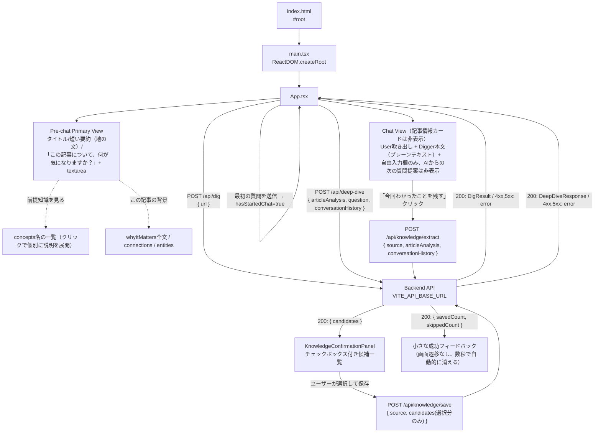

# digger-frontend

React + Vite + TypeScript 製のSPA。バックエンド（Hono API）に `fetch` で直接アクセスします。

## ディレクトリ構成

```
frontend/
├── index.html       # Viteのエントリーhtml。#root にReactをマウント
├── public/
│   └── assets/         # 静的アセット（ビルド時にそのままdist直下へコピーされる）
│       ├── digger-mole-dig.gif          # 「掘る」ローディング表示用のモグラアニメーション
│       ├── digger-mole-dig-spritesheet.png  # 元素材（今回は未使用）
│       └── frames/
│           ├── mole-dig-1.png〜4.png       # 掘るモグラの静止フレーム（prefers-reduced-motion時にmole-dig-1.pngを使用）
│           ├── mole-icon.png               # ロゴ横アイコン/ファビコン用（mole-dig-1.pngを透明余白なしに切り抜いたもの）
│           └── mole-note-1.png〜4.png      # Knowledge Extraction用「ノートに書き込むモグラ」の静止フレーム（NoteMoleLoaderがsetIntervalで順番に切り替え）
├── src/
│   ├── main.tsx      # Reactのエントリーポイント（createRoot）
│   ├── App.tsx        # アプリ本体。URL入力〜「掘る」結果表示のUI
│   ├── App.css          # App.tsx のスタイル
│   ├── types.ts          # /api/dig のリクエスト/レスポンス型
│   └── vite-env.d.ts   # Vite用の型定義（import.meta.env等）
├── Dockerfile
├── vite.config.ts
└── tsconfig.json
```

## アーキテクチャ



- **`index.html`**: ファビコン（`favicon-32x32.png` / `favicon-16x16.png` / `apple-touch-icon.png`、いずれも`public/`直下）を`<link>`で指定。3つとも`public/assets/frames/mole-icon.png`（後述）から`sips`で生成した派生物です。
- **`main.tsx`**: `App` を `React.StrictMode` でラップしてDOMにマウントするだけの薄いエントリーポイント。
- **`App.tsx`**:
  - タイトル「Digger」の左に`brand-icon`としてモグラのアイコン（`public/assets/frames/mole-icon.png`）を表示します（`alt=""` + `aria-hidden="true"`で装飾画像として扱い、スクリーンリーダーには読み上げさせません）。`mole-icon.png`は`mole-dig-1.png`（512x512、MoleLoaderの静止フレームと共用の元画像）から、透明ピクセルの外接矩形で切り抜いた上でその向きに合わせた最小限の余白のみを残したものです。元画像はキャラクター周囲の透明な余白が大きく、そのまま40px前後の小サイズで縮小表示するとキャラクターが小さく見えすぎる問題があったため、このアイコン専用に切り抜き直しました（`MoleLoader`側は96px/72pxと表示サイズが大きいため`mole-dig-1.png`のままで問題なく、変更していません）。ファビコンの3ファイルも同じ`mole-icon.png`から生成しています。
  - `API_BASE_URL` は `import.meta.env.VITE_API_BASE_URL`（未設定時は `http://localhost:8787` にフォールバック）。
  - フォームでURLを入力し「掘る」を押すと `digUrl()` が `POST /api/dig` を呼び出します。バックエンドが実際にURLへアクセスして抽出した`title`と、Article Analysis（backendの`LLM_PROVIDER`に応じてモックまたはVertex AI Geminiによる実解析）の結果が表示されます。ローディング中は`MoleLoader`コンポーネント（後述）が「記事を掘っています…」と表示します。
  - 状態は `DigState`（`idle` / `loading` / `error` / `success`）という判別可能なユニオン型1つで管理し、状態管理ライブラリは使わず `useState` のみです。
  - **情報カード中心から会話中心へ**: Diggerの差別化は「大量のカードや機能を見せること」ではなく「今読んでいる記事を理解している」「会話から理解を深める」という裏側の体験にある、という方針のもと、表側のUIは`hasStartedChat`（`messages.length > 0`から導出。stateとしては持たない）を境に2つの画面に分かれます。**ArticleAnalysisのデータ自体・`DeepDiveInput`/`DeepDiveResponse`の型は変更していません**（表側は簡素化、裏側に渡すコンテキストは従来通り豊富なまま）。
    - **AI主導の「次の質問」提案は一切表示しない**: `deepDiveQuestions`（記事解析結果）も`suggestedFollowUps`（Deep Dive回答）も、Diggerの「ユーザー自身の疑問を起点に掘る」という方針に反するため、UI上には一切表示しません。バックエンドは引き続き生成・返却しており、`DigResult`/`DeepDiveResponse`の型・schemaも変更していません（frontendが単に無視しているだけです）。次のアクションは常に自由入力のみです。
    - **Pre-chat Primary View**（`!hasStartedChat`）: 記事情報は`summary`の冒頭3文（`firstSentences()`というローカル関数で文末（。！？）区切りに冒頭N文だけ切り出す）を、カードや枠を持たない地の文として表示するだけです。主役は「この記事について、何が気になりますか？」という一言の下にある大きめの`<textarea>`（`DeepDiveInputForm`コンポーネント、Enterで送信・Shift+Enterで改行）です。`whyItMatters`・`concepts`（名前を含め一切）・`connections`・`entities`はここでは一切出しません。
    - **補助UI**（初期は非表示、Pre-chat Primary Viewのみに存在。AI主導の質問提案とは無関係な、記事の背景情報のみを扱う）: ①「前提知識を見る」→`concepts`の名前だけをプレーンテキストのリンク風の行として並べ（カード化しない）、`ConceptDisclosure`コンポーネントによりクリックした概念だけ説明文を展開する2段階の開示。②「この記事の背景」→`whyItMatters`全文・`connections`・`entities`をまとめたパネル。どちらも既定では閉じています。
    - **Chat View**（`hasStartedChat`）: 最初の質問を送った瞬間、記事情報・前提知識・背景パネルは全て非表示になり、画面はほぼ会話のみになります（タイトル行と、任意で開ける「記事の要点を見る」だけが記事の目印として残る）。ユーザーの発言は右寄せの吹き出し、Diggerの回答はカードや枠を持たない地の文（ChatGPTに近い見た目）で表示するだけで、回答の下には何も続きません（`suggestedFollowUps`は受け取った`DeepDiveResponse`から読み捨てており、`ChatMessage`型にも保持しません）。
    - **自由入力欄（`DeepDiveInputForm`）**: pre-chat/chat両方で共有する小さなコンポーネントで、`<textarea rows={3}>`（横幅いっぱい、`resize: vertical`）＋送信ボタンで構成されます。Enterキー押下（Shift未併用）で送信、Shift+Enterで改行、送信中は入力欄・ボタンとも無効化、空文字は送信不可です。プレースホルダーは特定の質問例に寄せすぎないよう「分からないことを、そのまま書いてください」（pre-chat）「さらに気になることを入力してください」（chat）としています。
    - 自由入力欄から質問すると`handleDeepDive(questionText)`が呼ばれ、`askDeepDive()`（`POST /api/deep-dive`）を叩きます。送信のたびに、それまでの`messages`を`{ role, content }[]`に変換して`conversationHistory`として一緒に送ります（backendへ渡す文脈の豊富さは変えていません）。ページ遷移はせず、`messages`にユーザーの質問とDiggerの回答を追記していくだけです。深掘り用のローディング/エラー状態は`DeepDiveState`という別のstateで、記事解析の`DigState`とは独立しています。
    - **「今回わかったことを残す」（Knowledge Extraction）**: Chat Viewの入力欄の下に、控えめな`link-button`として表示されます（常時大きなKnowledge UIは出さない方針）。表示条件は`messages.some(m => m.role === "assistant")`（少なくとも1往復の会話があること）で、押すたびに`handleExtractKnowledge()`が`extractKnowledge()`（`POST /api/knowledge/extract`）を呼び、会話ログ全体（`messages`）を渡します。抽出中は`NoteMoleLoader`（後述、「わかったことを整理中…」）を表示します。
    - **候補確認パネル（`KnowledgeConfirmationPanel`）**: 抽出結果（`KnowledgeCandidate[]`。`confidence: "low"`は事前にbackend側で除外済み）をチェックボックス付きの一覧として表示し、`details-panel`/`card-list`と同じCSSパターンを再利用しています。各候補の`concept`・`statement`・`confidence`を表示し（`evidence`は内部の判断材料のためUIには常時表示しません）、ユーザーが選んだものだけが「N件を保存する」ボタンで有効になります。**AIは自動保存しません**。選択状態は`Set<number>`（`knowledgeSelectedIndices`）で管理します。
    - 保存を押すと`handleSaveSelectedKnowledge()`が`saveKnowledge()`（`POST /api/knowledge/save`）を呼び、選択された候補（`id`を含む、`/api/knowledge/extract`のレスポンスをそのまま利用）を送ります。保存後は画面遷移せず、パネルを閉じてチャット画面上に小さく「N件の理解を保存しました」（backendが重複としてスキップした件数があれば「M件は既に保存済みのためスキップしました」も併記）と表示し、4秒後に自動的に消えます。状態は`KnowledgeSaveState`（`idle`/`extracting`/`extracted`/`saving`/`saved`/`error`）という1つの判別可能なユニオン型で管理します。
    - 保存失敗時は`error-message`で`error`メッセージを表示するのみで、チャット自体やそれまでの会話状態は壊れません（`knowledgeSaveState`は独立したstateのため）。
  - **「保存済みの理解を見る（テスト表示）」**: `GET /api/knowledge`で保存済みのKnowledge全件を取得し、確認できるようにするための**暫定的な動作確認用UI**です（`showKnowledgeList`/`knowledgeListState`という、記事の解析やチャットの状態とは完全に独立したstateで管理）。タグライン直下（記事を掘る前でもクリック可能）に控えめな`link-button`として置かれ、押すたびに一覧を取得し直します（キャッシュしません）。パネルはオレンジ系の破線枠（`.knowledge-list-panel`）で他のUIと視覚的に区別しており、各項目は`concept`/`statement`/`confidence`/保存日時/出典記事へのリンクのみを並べる簡素な表示です（編集・削除・ページネーションなし）。**恒久的な一覧UIではなく、Knowledge Extraction機能の動作確認のための一時的な実装として追加したもので、将来的にきちんとした一覧UIに置き換えるか削除する想定です。**
  - エラー時はバックエンドが返した `error` メッセージ、またはネットワークエラーの内容を表示します（`400`/`403`/`422`/`502`いずれも同じ見た目で表示、種別による出し分けは未実装）。
  - **`MoleLoader`（掘るモグラのローディング表示）**: 通常のspinnerの代わりに、Diggerのキャラクター（スコップで掘るモグラ）のGIFアニメーションを表示するコンポーネントです。`public/assets/digger-mole-dig.gif`（96px、モバイルは72px。`@media (max-width: 480px)`で切り替え）とラベル文言を横並びで表示するだけの軽量な実装で、画面全体を覆うオーバーレイにはせず、処理中のセクション内に自然に差し込みます。3箇所で使用: ①`digUrl()`実行中（「記事を掘っています…」）、②Pre-chat Primary Viewでの初回Deep Dive送信中、③Chat Viewでの2回目以降のDeep Dive送信中（②③とも「もう少し掘っています…」、`deepDiveState.status === "loading"`から表示）。`usePrefersReducedMotion()`という小さなフックが`window.matchMedia("(prefers-reduced-motion: reduce)")`を監視し、有効な環境ではGIFの代わりに静止フレーム`public/assets/frames/mole-dig-1.png`を表示します。エラー時・完了時はstateが`loading`から外れるため、既存のローディング分岐の仕組みに乗る形でDOMから自動的に消えます（表示/非表示のロジック自体は変更していません）。
  - **`NoteMoleLoader`（ノートに書き込んで整理しているモグラのローディング表示）**: Knowledge Extraction専用のローディング表示で、`knowledgeSaveState.status === "extracting"`（`handleExtractKnowledge()`が`POST /api/knowledge/extract`のレスポンス待ちをしている間）にのみ表示されます。`MoleLoader`とは素材（GIF vs 静止PNG4枚）が異なるため別コンポーネントにしていますが、見た目・DOM構造は共通の`.mole-loader`/`.mole-loader-image`/`.mole-loader-label`クラスを再利用しており、サイズ（96px/72px）も`MoleLoader`と同じです。GIFを持たないため、`public/assets/frames/mole-note-1.png`〜`mole-note-4.png`という4枚の静止フレームを`setInterval`（`NOTE_FRAME_INTERVAL_MS = 350ms`）で単純に順番切り替えする方式（GIF化やスプライトシート化は行わず、新規ライブラリも導入していません）。`usePrefersReducedMotion()`が有効な場合はタイマー自体を起動せず、常に1枚目（`mole-note-1.png`）だけを表示します（`alt="Diggerがわかったことを整理しています"`）。`knowledgeSaveState`が`extracting`から`extracted`/`error`のいずれかに遷移した時点でコンポーネントごとアンマウントされ、`setInterval`は`useEffect`のクリーンアップで確実に解除されるため、成功時・失敗時ともにローディングが残り続けることはありません。ラベル文言（`label`プロップ）は呼び出し側で自由に変えられるため、将来`/api/knowledge/save`の保存中表示にも同じコンポーネントをそのまま再利用できます（今回はKnowledge Extractionの抽出中のみで使用）。
- **`types.ts`**: `/api/dig`・`/api/deep-dive`・`/api/knowledge/extract`・`GET /api/knowledge` のレスポンス型（`DigResult` / `DigSource` / `ArticleAnalysis` / `Concept` / `Entity` / `Connection` / `ConversationTurn` / `DeepDiveResponse` / `KnowledgeCandidate` / `SavedKnowledge`）を定義。backend側の `src/types.ts`・`src/llm/*.ts` と同じ形を手動で同期しています（共有パッケージ化はまだしていません）。チャットUI用の`ChatMessage`型（`App.tsx`内のローカル型）は`{ role, content }`のみを持ち、`suggestedFollowUps`は保持しません（UIで使わないため）。
- **`App.css`**: 余白の広いシンプルなレイアウト。`flex-wrap` と相対単位でスマホ幅でも崩れないようにしています。CSSフレームワーク等は未導入です。

## 環境変数（`.env`）

`.env.example` をコピーして使用します。Viteの仕様上、クライアントに埋め込まれる変数は `VITE_` プレフィックスが必須です。

| 変数名 | 説明 | デフォルト |
| --- | --- | --- |
| `VITE_API_BASE_URL` | バックエンドAPIのベースURL | `http://localhost:8787` |

ビルド時に値が埋め込まれるため、Docker Compose経由でも `docker-compose.yml` の `environment` で渡した値を反映するには開発サーバー（Vite dev server）の再起動が必要です。

## スクリプト

| コマンド | 内容 |
| --- | --- |
| `npm run dev` | `vite --host` — 開発サーバー起動（HMR対応、`--host` でLAN内からもアクセス可） |
| `npm run build` | `tsc -b && vite build` — 型チェック後に本番ビルド |
| `npm run preview` | ビルド成果物をローカルでプレビュー |

## 依存関係

- `react` / `react-dom` — UIライブラリ本体
- `@vitejs/plugin-react` — Viteの公式Reactプラグイン（Fast Refresh対応）
- `vite` — 開発サーバー/バンドラー
- `typescript` — 型チェック（`tsc -b` はビルド時のみ実行、Vite自体はesbuildでトランスパイル）

## ローカル起動

```bash
cp .env.example .env
npm install
npm run dev
```

`http://localhost:5173` を開き、URL入力欄に記事URLを入れて「掘る」を押すと、実際に取得したタイトルとArticle Analysisの解析結果が表示されます（backendが`LLM_PROVIDER=mock`なら日銀の利上げに関する固定デモデータ、`LLM_PROVIDER=vertex`なら実際の記事内容に応じたVertex AI Geminiの解析結果）。バックエンドが起動していない、またはURLが不正だとエラーメッセージが表示されます。「この記事について、何が気になりますか？」欄から自由入力で質問すると、その場でチャット形式の深掘りができます（`LLM_PROVIDER=vertex`なら記事とこれまでの会話を踏まえたVertex AI Geminiの回答、`mock`なら固定応答）。

## 今後の拡張ポイント（未実装）

- Chat Viewから「前提知識を見る」「この記事の背景」相当の情報に戻れる導線（現状は「記事の要点を見る」で短い要約だけ再表示可能。前提知識・背景はChat View突入後は見られない）
- 保存済みKnowledgeのきちんとした一覧UI（現状は「保存済みの理解を見る（テスト表示）」という動作確認用の暫定表示のみ。デザイン・ページネーション・編集/削除等は未実装で、いずれ作り直すか削除する前提）
- エラー種別（`400`/`403`/`422`/`502`）に応じたUIの出し分け（現状は全て同じ見た目。`/api/knowledge/*`も同様）
- 深掘りの会話をリロード後も残すための永続化（現状はページをリロードすると消える）
- ルーティング（現状はApp.tsx単一ページ）
- 状態管理ライブラリ（現状はuseStateのみ）
- UIコンポーネントの共通化・デザインシステム導入
- APIクライアントの共通化（現状は `digUrl` 関数に `fetch` 直書き）
- frontend/backend間で重複しているレスポンス型の共有化
- `POST /api/knowledge/save`（保存処理中）にも`NoteMoleLoader`を再利用する（`label`を変えて呼ぶだけで対応可能な構造にはなっているが、今回はKnowledge Extractionの抽出中のみで使用）
