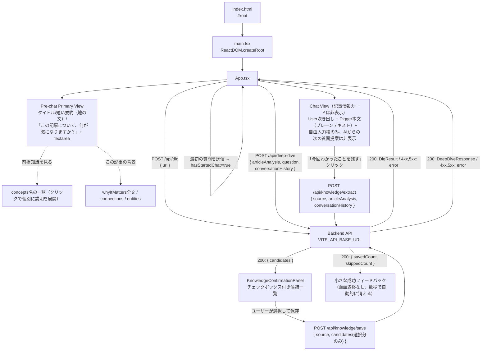

# digger-frontend

React + Vite + TypeScript 製のSPA。バックエンド（Hono API）に `fetch` で直接アクセスします。

## ディレクトリ構成

```
frontend/
├── index.html       # Viteのエントリーhtml。#root にReactをマウント
├── public/
│   └── assets/         # 静的アセット（ビルド時にそのままdist直下へコピーされる）
│       ├── digger-mole-dig.gif          # 「掘る」ローディング表示用のモグラアニメーション
│       ├── digger-mole-dig-spritesheet.png  # 元素材（今回は未使用）
│       └── frames/
│           ├── mole-dig-1.png〜4.png       # 掘るモグラの静止フレーム（prefers-reduced-motion時にmole-dig-1.pngを使用）
│           ├── mole-icon.png               # ロゴ横アイコン/ファビコン用（mole-dig-1.pngを透明余白なしに切り抜いたもの）
│           └── mole-note-1.png〜4.png      # Knowledge Extraction用「ノートに書き込むモグラ」の静止フレーム（NoteMoleLoaderがsetIntervalで順番に切り替え）
├── src/
│   ├── main.tsx      # Reactのエントリーポイント（createRoot）
│   ├── App.tsx        # アプリ本体。URL入力〜「掘る」結果表示のUIと、ヘッダーナビゲーション
│   ├── UnderstandingPage.tsx  # 「自分の理解」ページ（最近/トピック/マップの3タブ切り替え、Knowledge詳細モーダル）
│   ├── UnderstandingMapView.tsx # 「マップ」タブの実体。Topic/Concept/ConceptRelationモデルによる3ペインMap UI
│   ├── mapLayout.ts       # d3-forceによるMapの初期配置計算（Reactに依存しない純粋ロジック）
│   ├── ConceptNode.tsx    # React FlowのCustom Node（Concept node本体）
│   ├── App.css          # App.tsx・UnderstandingPage.tsx・UnderstandingMapView.tsx共通のスタイル
│   ├── types.ts          # /api/dig 等のリクエスト/レスポンス型
│   └── vite-env.d.ts   # Vite用の型定義（import.meta.env等）
├── Dockerfile
├── vite.config.ts
└── tsconfig.json
```

## アーキテクチャ



- **`index.html`**: ファビコン（`favicon-32x32.png` / `favicon-16x16.png` / `apple-touch-icon.png`、いずれも`public/`直下）を`<link>`で指定。3つとも`public/assets/frames/mole-icon.png`（後述）から`sips`で生成した派生物です。
- **`main.tsx`**: `App` を `React.StrictMode` でラップしてDOMにマウントするだけの薄いエントリーポイント。
- **`App.tsx`**:
  - タイトル「Digger」の左に`brand-icon`としてモグラのアイコン（`public/assets/frames/mole-icon.png`）を表示します（`alt=""` + `aria-hidden="true"`で装飾画像として扱い、スクリーンリーダーには読み上げさせません）。`mole-icon.png`は`mole-dig-1.png`（512x512、MoleLoaderの静止フレームと共用の元画像）から、透明ピクセルの外接矩形で切り抜いた上でその向きに合わせた最小限の余白のみを残したものです。元画像はキャラクター周囲の透明な余白が大きく、そのまま40px前後の小サイズで縮小表示するとキャラクターが小さく見えすぎる問題があったため、このアイコン専用に切り抜き直しました（`MoleLoader`側は96px/72pxと表示サイズが大きいため`mole-dig-1.png`のままで問題なく、変更していません）。ファビコンの3ファイルも同じ`mole-icon.png`から生成しています。
  - `API_BASE_URL` は `import.meta.env.VITE_API_BASE_URL`（未設定時は `http://localhost:8787` にフォールバック）。
  - **ヘッダーナビゲーション**: タグライン下に「掘る」「自分の理解」の2つのリンクを置き、`view`（`"dig" | "understanding"`）というstateだけで表示を切り替えます。大規模なNavigation設計・URLルーティング（react-router等）は導入せず、単純な条件分岐で十分としています（`view`はブラウザのURLには反映されないため、リロードすると常に「掘る」に戻ります）。
  - フォームでURLを入力し「掘る」を押すと `digUrl()` が `POST /api/dig` を呼び出します。バックエンドが実際にURLへアクセスして抽出した`title`と、Article Analysis（backendの`LLM_PROVIDER`に応じてモックまたはVertex AI Geminiによる実解析）の結果が表示されます。ローディング中は`MoleLoader`コンポーネント（後述）が「記事を掘っています…」と表示します。
  - 状態は `DigState`（`idle` / `loading` / `error` / `success`）という判別可能なユニオン型1つで管理し、状態管理ライブラリは使わず `useState` のみです。
  - **情報カード中心から会話中心へ**: Diggerの差別化は「大量のカードや機能を見せること」ではなく「今読んでいる記事を理解している」「会話から理解を深める」という裏側の体験にある、という方針のもと、表側のUIは`hasStartedChat`（`messages.length > 0`から導出。stateとしては持たない）を境に2つの画面に分かれます。**ArticleAnalysisのデータ自体・`DeepDiveInput`/`DeepDiveResponse`の型は変更していません**（表側は簡素化、裏側に渡すコンテキストは従来通り豊富なまま）。
    - **AI主導の「次の質問」提案は一切表示しない**: `deepDiveQuestions`（記事解析結果）も`suggestedFollowUps`（Deep Dive回答）も、Diggerの「ユーザー自身の疑問を起点に掘る」という方針に反するため、UI上には一切表示しません。バックエンドは引き続き生成・返却しており、`DigResult`/`DeepDiveResponse`の型・schemaも変更していません（frontendが単に無視しているだけです）。次のアクションは常に自由入力のみです。
    - **Pre-chat Primary View**（`!hasStartedChat`）: 記事情報は`summary`の冒頭3文（`firstSentences()`というローカル関数で文末（。！？）区切りに冒頭N文だけ切り出す）を、カードや枠を持たない地の文として表示するだけです。主役は「この記事について、何が気になりますか？」という一言の下にある大きめの`<textarea>`（`DeepDiveInputForm`コンポーネント、Enterで送信・Shift+Enterで改行）です。`whyItMatters`・`concepts`（名前を含め一切）・`connections`・`entities`はここでは一切出しません。
    - **補助UI**（初期は非表示、Pre-chat Primary Viewのみに存在。AI主導の質問提案とは無関係な、記事の背景情報のみを扱う）: ①「前提知識を見る」→`concepts`の名前だけをプレーンテキストのリンク風の行として並べ（カード化しない）、`ConceptDisclosure`コンポーネントによりクリックした概念だけ説明文を展開する2段階の開示。②「この記事の背景」→`whyItMatters`全文・`connections`・`entities`をまとめたパネル。どちらも既定では閉じています。
    - **Chat View**（`hasStartedChat`）: 最初の質問を送った瞬間、記事情報・前提知識・背景パネルは全て非表示になり、画面はほぼ会話のみになります（タイトル行と、任意で開ける「記事の要点を見る」だけが記事の目印として残る）。ユーザーの発言は右寄せの吹き出し、Diggerの回答はカードや枠を持たない地の文（ChatGPTに近い見た目）で表示するだけで、回答の下には何も続きません（`suggestedFollowUps`は受け取った`DeepDiveResponse`から読み捨てており、`ChatMessage`型にも保持しません）。
    - **自由入力欄（`DeepDiveInputForm`）**: pre-chat/chat両方で共有する小さなコンポーネントで、`<textarea rows={3}>`（横幅いっぱい、`resize: vertical`）＋送信ボタンで構成されます。Enterキー押下（Shift未併用）で送信、Shift+Enterで改行、送信中は入力欄・ボタンとも無効化、空文字は送信不可です。プレースホルダーは特定の質問例に寄せすぎないよう「分からないことを、そのまま書いてください」（pre-chat）「さらに気になることを入力してください」（chat）としています。
    - 自由入力欄から質問すると`handleDeepDive(questionText)`が呼ばれ、`askDeepDive()`（`POST /api/deep-dive`）を叩きます。送信のたびに、それまでの`messages`を`{ role, content }[]`に変換して`conversationHistory`として一緒に送ります（backendへ渡す文脈の豊富さは変えていません）。ページ遷移はせず、`messages`にユーザーの質問とDiggerの回答を追記していくだけです。深掘り用のローディング/エラー状態は`DeepDiveState`という別のstateで、記事解析の`DigState`とは独立しています。
    - **「今回わかったことを残す」（Knowledge Extraction）**: Chat Viewの入力欄の下に、控えめな`link-button`として表示されます（常時大きなKnowledge UIは出さない方針）。表示条件は`messages.some(m => m.role === "assistant")`（少なくとも1往復の会話があること）で、押すたびに`handleExtractKnowledge()`が`extractKnowledge()`（`POST /api/knowledge/extract`）を呼び、会話ログ全体（`messages`）を渡します。抽出中は`NoteMoleLoader`（後述、「わかったことを整理中…」）を表示します。
    - **候補確認パネル（`KnowledgeConfirmationPanel`）**: Diggerは「保存するKnowledge一覧」ではなく「今回、理解がどう変わったか」を見せたいという方針で、見出しも「今回、理解がどう変わったか」としています。backendがLLMの生の`relationToExisting`を`displayCategory`（`new`/`deepened`/`updated`。`reinforces`は`shouldShowForConfirmation()`でそもそも候補一覧から除外済み）に変換して返すため、frontendはそれをそのままグルーピングして表示するだけです（`groupCandidatesByCategory()`）。
      - **`new`**（「新しくわかったこと」）・**`deepened`**（「理解が深まったこと」）・**`updated`**（「理解を更新する」）の3見出しを、候補がある場合だけ表示します（`CATEGORY_LABELS`/`CATEGORY_ORDER`）。
      - `deepened`の候補は、backendが付与した`relatedKnowledge`（参照元Knowledgeの`concept`/`statement`）があれば「以前の『◯◯』から理解が深まりました」という控えめなヒント（`.knowledge-relation-hint`）を表示します。
      - `updated`の候補は、`relatedKnowledge`があれば「以前の理解: 〜」「今回の理解: 〜」という比較表示（`.knowledge-update-compare`）にします。**既存Knowledgeを自動で`outdated`へ変更する機能はまだ無いため**、ここではあくまで「更新候補として分かる」表示にとどめています（選択して保存すると、新しいKnowledgeとして追加されるだけです）。
      - 全カテゴリとも0件（＝`reinforces`しか無かった等）の場合は候補一覧自体を出さず、「今回は新しく保存する内容はありませんでした」という控えめな1文だけを表示します。
      - 選択状態は`Set<string>`（`knowledgeSelectedIds`、候補の`id`をキーにする。グルーピング表示に伴い、配列インデックスではなく`id`で管理する方が安全なため）で管理し、1件以上選ぶと「保存する」ボタンが有効になります。**AIは自動保存しません**。`evidence`・`relationToExisting.reason`・紐付け先の`knowledgeId`はUIには常時表示しません（内部的な判断材料として保持するのみ）。
    - 保存を押すと`handleSaveSelectedKnowledge()`が`saveKnowledge()`（`POST /api/knowledge/save`）を呼び、選択された候補（`id`を含む、`/api/knowledge/extract`のレスポンスをそのまま利用）を送ります。保存後のフィードバックは単純な「N件保存しました」だけでなく、`describeSaveResult()`が選択した候補の`displayCategory`の内訳から「新しい理解を1件保存しました。理解が2件深まりました。」のようなrelationに応じた文言を組み立てます（実際の保存件数と多少ずれる可能性がある簡易な実装で、backendが重複等でスキップした件数があれば「（M件は既に保存済みのためスキップしました）」も併記）。画面遷移はせず、パネルを閉じてチャット画面上に小さく表示し、4秒後に自動的に消えます。状態は`KnowledgeSaveState`（`idle`/`extracting`/`extracted`/`saving`/`saved`/`error`）という1つの判別可能なユニオン型で管理します。
    - 保存失敗時は`error-message`で`error`メッセージを表示するのみで、チャット自体やそれまでの会話状態は壊れません（`knowledgeSaveState`は独立したstateのため）。
  - エラー時はバックエンドが返した `error` メッセージ、またはネットワークエラーの内容を表示します（`400`/`403`/`422`/`502`いずれも同じ見た目で表示、種別による出し分けは未実装）。
  - **`MoleLoader`（掘るモグラのローディング表示）**: 通常のspinnerの代わりに、Diggerのキャラクター（スコップで掘るモグラ）のGIFアニメーションを表示するコンポーネントです。`public/assets/digger-mole-dig.gif`（96px、モバイルは72px。`@media (max-width: 480px)`で切り替え）とラベル文言を横並びで表示するだけの軽量な実装で、画面全体を覆うオーバーレイにはせず、処理中のセクション内に自然に差し込みます。3箇所で使用: ①`digUrl()`実行中（「記事を掘っています…」）、②Pre-chat Primary Viewでの初回Deep Dive送信中、③Chat Viewでの2回目以降のDeep Dive送信中（②③とも「もう少し掘っています…」、`deepDiveState.status === "loading"`から表示）。`usePrefersReducedMotion()`という小さなフックが`window.matchMedia("(prefers-reduced-motion: reduce)")`を監視し、有効な環境ではGIFの代わりに静止フレーム`public/assets/frames/mole-dig-1.png`を表示します。エラー時・完了時はstateが`loading`から外れるため、既存のローディング分岐の仕組みに乗る形でDOMから自動的に消えます（表示/非表示のロジック自体は変更していません）。
  - **`NoteMoleLoader`（ノートに書き込んで整理しているモグラのローディング表示）**: Knowledge Extraction専用のローディング表示で、`knowledgeSaveState.status === "extracting"`（`handleExtractKnowledge()`が`POST /api/knowledge/extract`のレスポンス待ちをしている間）にのみ表示されます。`MoleLoader`とは素材（GIF vs 静止PNG4枚）が異なるため別コンポーネントにしていますが、見た目・DOM構造は共通の`.mole-loader`/`.mole-loader-image`/`.mole-loader-label`クラスを再利用しており、サイズ（96px/72px）も`MoleLoader`と同じです。GIFを持たないため、`public/assets/frames/mole-note-1.png`〜`mole-note-4.png`という4枚の静止フレームを`setInterval`（`NOTE_FRAME_INTERVAL_MS = 350ms`）で単純に順番切り替えする方式（GIF化やスプライトシート化は行わず、新規ライブラリも導入していません）。`usePrefersReducedMotion()`が有効な場合はタイマー自体を起動せず、常に1枚目（`mole-note-1.png`）だけを表示します（`alt="Diggerがわかったことを整理しています"`）。`knowledgeSaveState`が`extracting`から`extracted`/`error`のいずれかに遷移した時点でコンポーネントごとアンマウントされ、`setInterval`は`useEffect`のクリーンアップで確実に解除されるため、成功時・失敗時ともにローディングが残り続けることはありません。ラベル文言（`label`プロップ）は呼び出し側で自由に変えられるため、将来`/api/knowledge/save`の保存中表示にも同じコンポーネントをそのまま再利用できます（今回はKnowledge Extractionの抽出中のみで使用）。
- **`UnderstandingPage.tsx`**: 「自分の理解」ページ。保存済みKnowledgeを「一覧」ではなく「自分の理解が育っている」と感じられる形で見せることを目的にした画面で、独立したファイルに分離しています（`App.tsx`が既に大きいため）。マウント時に`fetchSavedKnowledge()`（`GET /api/knowledge`）を1回呼び、以降はタブ切り替えのみで同じデータを使い回します（タブごとに再取得しません）。
  - **タブ**: 「最近」「トピック」「マップ」の3つを`understanding-tab`ボタンで切り替えるだけの単純なUIです（`UnderstandingTab`型のstate）。
  - **「最近」ビュー**: `groupByDate()`が、backendが`createdAt`降順で返す配列を前提に、連続する同じ日付（今日/昨日/それ以外は「9月17日」のような表示）の項目をまとめてグルーピングします。各行（`KnowledgeRow`）は`concept`・`statement`の冒頭・出典記事タイトルを表示し、`status`が`active`以外の場合だけ控えめなバッジ（`understanding-item-status`）を添えます。クリックするとKnowledge詳細モーダルが開きます。
  - **「トピック」ビュー**: `buildTopicTree()`が、各Knowledgeの`topicPath`（backendが付与する1〜3階層のパス。無ければ「未分類」）から、共通の接頭辞をまとめた木構造を組み立て、`TopicTree`コンポーネントが再帰的に描画します。正規化されたTopicコレクションではなく、`topicPath: string[]`をそのままグルーピングに使う単純な実装です。
  - **「マップ」タブ（`UnderstandingMapView.tsx`）**: 独立したファイルに分離された、Topic/Concept/ConceptRelationモデル（[`backend/README.md`](../backend/README.md#topic--concept--conceptrelationモデルtopicts--conceptts--conceptrelationts--understandingstructurets)参照）ベースの3ペインUI。詳細は同ファイルの説明を参照。
  - **Knowledge詳細（`KnowledgeDetailModal`）**: 固定オーバーレイの簡易モーダルで、`concept`・`statement`・`理解した日`（`createdAt`）・`状態`（`status`を`STATUS_LABELS`で日本語化）・`元の記事`（`source.title`へのリンク）・（`relationsOut`があれば）`関連する理解`（参照先Knowledgeの`concept`を`allItems`から逆引き）を表示します。現在のKnowledge schemaで取得できる情報だけを使い、存在しないデータは表示しません。
  - **Empty State**: Knowledgeが0件の場合はタブ自体を表示せず、モグラのアイコンと「まだ理解マップは小さいです。気になる記事を掘ると、ここにあなたの理解が少しずつ育っていきます。」という一言、「記事を掘る」ボタン（`onGoDig`経由で`App.tsx`の`view`を`"dig"`に戻す）だけを表示します。
- **`UnderstandingMapView.tsx`**: 「マップ」タブの実体。Topic/Concept/ConceptRelationモデル（backendの`GET /api/understanding-map`・`POST /api/understanding-map/refresh`）を使い、「保存したKnowledgeを並べたグラフ」ではなく「今のユーザーの理解状態」を感じられる3ペインUIを構築します。マップの見た目改善（PR「Map View の改善」）とは別に、データモデル刷新（PR「Topic/Concept/Knowledgeデータモデルの整理」）を経て今回初めて新モデルへ全面的に載せ替えました。「最近」「トピック」タブは引き続き旧`Knowledge.topicPath`モデルのまま無変更です（2つの分類システムが並存。詳細は[`backend/README.md`](../backend/README.md#topic--concept--conceptrelationモデルtopicts--conceptts--conceptrelationts--understandingstructurets)を参照）。
  - **データ取得**: マウント時に`GET /api/understanding-map`を呼びます（読み取り専用でlazy migrationやLLM呼び出しなどの副作用が無いため、タブを開き直すたびに呼んでも軽い）。`knowledge`（`SavedKnowledge[]`）は親の`UnderstandingPage`が既に持っているものをpropsで受け取り、二重fetchしません。
  - **「理解マップを更新」ボタン**: `POST /api/understanding-map/refresh`を呼びます（未移行のKnowledgeのConcept化＋未分類ConceptのLLM Topic分類を行う、相対的に重い処理）。ボタン付近に未分類Concept数を表示し、押すタイミングの目安にします。押している間はボタンを無効化するだけの簡易的なローディング表現です。
  - **左: Topic Navigation（`TopicNavTree`）**: `Topic.parentId`から`buildTopicHierarchy()`で階層ツリーを構築（archived/mergedは除外）。「すべて」＋階層リストで、クリックすると`selectedTopicId`が変わり中央のMapが絞り込まれます。
  - **中央: Concept Map（`mapLayout.ts` + `ConceptNode.tsx`）**: 主役はConceptで、Knowledge本文はnode labelに使いません（`concept.name`のみ）。node配置は[`d3-force`](https://github.com/d3/d3-force)のforce-directed layoutで計算します（`computeForceLayout()`）。「トピックごとに二重円で機械的に並べる」だけだった以前の実装（PR「Map View の改善」）から、「関連するConceptは近く、同じTopicのConceptは自然に集まる」有機的な配置に変更しました。
    - **力の構成**: `forceLink`（`ConceptRelation`で繋がるConcept同士を引き寄せる）・`forceManyBody`（反発力で密集を防ぐ）・`forceCollide`（node半径＋余白で重なりを防ぐ）・`forceX`/`forceY`によるクラスタリング力（各Conceptを、そのConceptが属するルートTopic＝`findRootTopicId()`で求めた中心点へ弱く引き寄せる。トップレベルTopicごとの中心点自体は`computeClusterCenters()`が外周円上に配置する。`topicIds`が空のConceptは「未分類」クラスタに入る）を組み合わせています。
    - **一度だけ計算して止める**: `forceSimulation`はcontinuous animationにはせず、`simulation.stop()`を呼んだ上で`tick()`を固定回数（300回）同期的に回してから最終座標を読み取ります。React Flowの`useNodesState`/`useEdgesState`を使い、`setNodes(...)`を呼ぶのは「①データ取得・更新」「②Topicフィルタ変更」「③『整列』ボタン押下」の3か所だけに限定しているため、hoverや詳細パネルの開閉などそれ以外の再レンダーではレイアウトが再計算されず、ユーザーがドラッグした位置も勝手に戻りません。フィルタ変更時は直前のnode位置をwarm start（力学シミュレーションの初期値）として渡すため、絞り込みの前後で表示が大きく飛ばないようにしています。「整列」ボタンはこのwarm startを使わず、全nodeをクラスタ中心付近へ明示的に再シードします。
    - **hover interaction**: nodeにカーソルを合わせると、そのnodeと直接`ConceptRelation`で繋がるnode・edgeだけを強調し、それ以外を薄くします（`ConceptNode.tsx`の`highlighted`/`dimmed` propと、`UnderstandingMapView.tsx`の`displayNodes`/`displayEdges`という「位置はそのままに見た目だけを動的に上書きする」派生配列で実現）。
    - **色分け**: トップレベルTopic（ルートTopic）ごとに固定パレットから色を割り当て（`buildTopicColorMap()`）、node枠線・クラスタラベル・Topic Navigationの色ドットに使います。未分類は常に固定のグレーです。以前のPRでこの色分けが実装から抜け落ちていた（後退）ため、今回復元しました。
    - **node size**: 紐づくKnowledge数と関係数から求めた`degree`（`computeConceptDegree()`）で、視覚サイズと衝突判定半径の両方を決めます（`computeConceptRadius()`）。差は小さく抑えています。直近7日以内に追加・更新されたConceptには`NEW`バッジを付けます。
    - **edge**: 色分けは最小限（灰色1色＋小さな日本語typeラベル）にとどめ、hover時のみ強調します。
    - **MiniMap**: Concept 15件以上のときだけ表示します（React Flowの`<MiniMap />`をそのまま使用）。
    - **モバイルでのはまりどころ**: `.understanding-map-layout`がモバイルで`flex-direction: column`になるため、Map要素のbase CSS（`.concept-map { flex: 1 1 0%; }`）のflex-basisがcolumn方向では高さの基準として優先され、`height`指定を上書きしてしまい、モバイルでMapの高さが0になって何も表示されないバグがありました。モバイル用メディアクエリ側で`flex: none;`をリセットすることで解消しています。
  - **右: Concept Detail（`ConceptDetailPanel`）**: 選択したConceptの名前、所属Topicのパンくず（`buildTopicBreadcrumb()`）、紐づくKnowledge一覧（`SavedKnowledge.conceptIds`から逆引き。`outdated`は除外、`merged`は控えめ表示、`foundational`はラベル付き。`UnderstandingPage.tsx`の`STATUS_LABELS`/`effectiveStatus`/`statusClassName`をexportして再利用）、関連Concept一覧（`ConceptRelation`の双方向）、参照元記事リンクを表示します。
  - **成長summary（`computeMapSummary()`）**: 「Knowledge N件・トピック N個・概念 N個・つながり N件」＋「今週 +N件の理解・+M件のつながり」を、既存データ（`createdAt`）だけから計算して表示します。
  - **Empty State**: active Conceptが0件のときは、モグラのアイコンと「理解マップを更新」ボタンだけを表示する専用の軽量表示にしています（Concept未作成＝多くの場合まだ一度もrefreshを実行していない状態のため）。
  - **レスポンシブ**: デスクトップは3カラムflex。モバイル（`max-width: 900px`）ではTopic Navが左からのドロワー、Concept Detailがノードクリック時に下からのシート風パネルになります（どちらも既存の`.modal-overlay`的な考え方をCSSだけで再現したもので、新しいジェスチャーライブラリは導入していません）。
  - **旧「トピック」タブとの橋渡し（ベストエフォート）**: 旧トピックタブの「この分野をマップで見る」で渡されるトピック名文字列と、新モデルのTopic名が一致すれば`selectedTopicId`の初期値として使います（`initialTopicName` prop）。2つの分類システムは独立しているため、一致しない場合は「すべて」表示にフォールバックします。
- **`types.ts`**: `/api/dig`・`/api/deep-dive`・`/api/knowledge/extract`・`GET /api/knowledge`・`GET /api/understanding-map` のレスポンス型（`DigResult` / `DigSource` / `ArticleAnalysis` / `Concept` / `Entity` / `Connection` / `ConversationTurn` / `DeepDiveResponse` / `KnowledgeCandidate` / `SavedKnowledge` / `KnowledgeRelationOut` / `Topic` / `UnderstandingConcept` / `ConceptRelationType` / `ConceptRelation`）を定義。backend側の `src/types.ts`・`src/llm/*.ts`・`src/topic.ts`・`src/concept.ts`・`src/conceptRelation.ts` と同じ形を手動で同期しています（共有パッケージ化はまだしていません）。`UnderstandingConcept`という名前にしているのは、Article Analysisの前提知識カード用に既存の`Concept`型が使われているため（名前の衝突を避けるための別名）。チャットUI用の`ChatMessage`型（`App.tsx`内のローカル型）は`{ role, content }`のみを持ち、`suggestedFollowUps`は保持しません（UIで使わないため）。
- **`App.css`**: 余白の広いシンプルなレイアウト。`flex-wrap` と相対単位でスマホ幅でも崩れないようにしています。CSSフレームワーク等は未導入です。「自分の理解」ページを表示しているときだけ、3ペインMapが収まるようルート要素に`.page-wide`（`max-width: 1100px`）を足しています（他の画面は既存の640pxの会話中心レイアウトのまま）。

## 環境変数（`.env`）

`.env.example` をコピーして使用します。Viteの仕様上、クライアントに埋め込まれる変数は `VITE_` プレフィックスが必須です。

| 変数名 | 説明 | デフォルト |
| --- | --- | --- |
| `VITE_API_BASE_URL` | バックエンドAPIのベースURL | `http://localhost:8787` |

ビルド時に値が埋め込まれるため、Docker Compose経由でも `docker-compose.yml` の `environment` で渡した値を反映するには開発サーバー（Vite dev server）の再起動が必要です。

## スクリプト

| コマンド | 内容 |
| --- | --- |
| `npm run dev` | `vite --host` — 開発サーバー起動（HMR対応、`--host` でLAN内からもアクセス可） |
| `npm run build` | `tsc -b && vite build` — 型チェック後に本番ビルド |
| `npm run preview` | ビルド成果物をローカルでプレビュー |

## 依存関係

- `react` / `react-dom` — UIライブラリ本体
- `@vitejs/plugin-react` — Viteの公式Reactプラグイン（Fast Refresh対応）
- `vite` — 開発サーバー/バンドラー
- `typescript` — 型チェック（`tsc -b` はビルド時のみ実行、Vite自体はesbuildでトランスパイル）
- `reactflow` — 「自分の理解」ページのマップ表示（zoom/pan/drag/クリック/MiniMap等）
- `d3-force`（+ `@types/d3-force`） — マップのnode初期配置計算（force-directed layout）。`d3`本体ではなくforce計算に必要な`d3-force`のみを導入しバンドルサイズを抑えている

## ローカル起動

```bash
cp .env.example .env
npm install
npm run dev
```

`http://localhost:5173` を開き、URL入力欄に記事URLを入れて「掘る」を押すと、実際に取得したタイトルとArticle Analysisの解析結果が表示されます（backendが`LLM_PROVIDER=mock`なら日銀の利上げに関する固定デモデータ、`LLM_PROVIDER=vertex`なら実際の記事内容に応じたVertex AI Geminiの解析結果）。バックエンドが起動していない、またはURLが不正だとエラーメッセージが表示されます。「この記事について、何が気になりますか？」欄から自由入力で質問すると、その場でチャット形式の深掘りができます（`LLM_PROVIDER=vertex`なら記事とこれまでの会話を踏まえたVertex AI Geminiの回答、`mock`なら固定応答）。

## 今後の拡張ポイント（未実装）

- Chat Viewから「前提知識を見る」「この記事の背景」相当の情報に戻れる導線（現状は「記事の要点を見る」で短い要約だけ再表示可能。前提知識・背景はChat View突入後は見られない）
- 保存済みKnowledgeのきちんとした一覧UI（現状は「保存済みの理解を見る（テスト表示）」という動作確認用の暫定表示のみ。デザイン・ページネーション・編集/削除等は未実装で、いずれ作り直すか削除する前提）
- エラー種別（`400`/`403`/`422`/`502`）に応じたUIの出し分け（現状は全て同じ見た目。`/api/knowledge/*`も同様）
- 深掘りの会話をリロード後も残すための永続化（現状はページをリロードすると消える）
- ルーティング（現状はApp.tsx単一ページ）
- 状態管理ライブラリ（現状はuseStateのみ）
- UIコンポーネントの共通化・デザインシステム導入
- APIクライアントの共通化（現状は `digUrl` 関数に `fetch` 直書き）
- frontend/backend間で重複しているレスポンス型の共有化
- `POST /api/knowledge/save`（保存処理中）にも`NoteMoleLoader`を再利用する（`label`を変えて呼ぶだけで対応可能な構造にはなっているが、今回はKnowledge Extractionの抽出中のみで使用）
- 「理解を更新する」（`updated`/`supersedes`）候補を保存した際に、実際に既存Knowledgeを`outdated`へ変更する導線（現状はbackendが自動遷移しないため、UI上も「更新候補」として見せるだけで、保存すると新しいKnowledgeが追加されるのみ）
- `describeSaveResult()`は選択時点の`displayCategory`から件数を計算する簡易な実装のため、backendの実際の保存結果（`savedCount`）とcategory別の内訳が完全に一致するとは限らない（重複スキップ等で稀にずれ得る）
