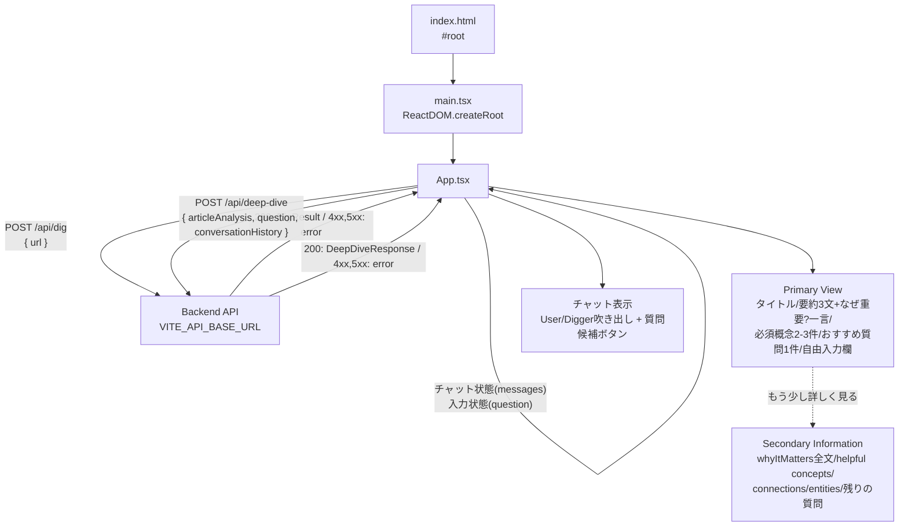

# digger-frontend

React + Vite + TypeScript 製のSPA。バックエンド（Hono API）に `fetch` で直接アクセスします。

## ディレクトリ構成

```
frontend/
├── index.html       # Viteのエントリーhtml。#root にReactをマウント
├── src/
│   ├── main.tsx      # Reactのエントリーポイント（createRoot）
│   ├── App.tsx        # アプリ本体。URL入力〜「掘る」結果表示のUI
│   ├── App.css          # App.tsx のスタイル
│   ├── types.ts          # /api/dig のリクエスト/レスポンス型
│   └── vite-env.d.ts   # Vite用の型定義（import.meta.env等）
├── Dockerfile
├── vite.config.ts
└── tsconfig.json
```

## アーキテクチャ



- **`main.tsx`**: `App` を `React.StrictMode` でラップしてDOMにマウントするだけの薄いエントリーポイント。
- **`App.tsx`**:
  - `API_BASE_URL` は `import.meta.env.VITE_API_BASE_URL`（未設定時は `http://localhost:8787` にフォールバック）。
  - フォームでURLを入力し「掘る」を押すと `digUrl()` が `POST /api/dig` を呼び出します。バックエンドが実際にURLへアクセスして抽出した`title`と、Article Analysis（backendの`LLM_PROVIDER`に応じてモックまたはVertex AI Geminiによる実解析）の結果が表示されます。ローディング中は「記事を読み解いています…」と表示します。
  - 状態は `DigState`（`idle` / `loading` / `error` / `success`）という判別可能なユニオン型1つで管理し、状態管理ライブラリは使わず `useState` のみです。
  - **Progressive Disclosure**: 「全部説明するサービス」ではなく「今理解するために必要な一段だけを見せ、興味に応じて掘れるサービス」というUXコンセプトのもと、解析結果を**Primary View**（常に表示）と**Secondary Information**（初期状態は折りたたみ）に分けています。ArticleAnalysisのデータ自体は変えず、**AIが生成する情報量とユーザーに最初に見せる情報量を分離**しています（バックエンドのschemaは変更していません）。
    - **Primary View**: ①「この記事で大事なのは」= `summary`の冒頭3文＋`whyItMatters`の冒頭1文を一言添える（`firstSentences()`というローカル関数で文末（。！？）区切りに冒頭N文だけ切り出す）。②「まず知っておくこと」= `concepts`のうち`importance === "required"`のものを最大3件、各カードは冒頭1文だけを表示し、続きがあれば「詳しく見る」で個別に展開（`ConceptCard`コンポーネント、カードごとに独立した開閉state）。③「次に掘るなら」= `deepDiveQuestions`の先頭1件のみをボタン表示し、残りは「他の質問を見る（N件）」で展開。④「他に気になることは？」の自由入力欄（常時表示）。
    - **Secondary Information**: 「もう少し詳しく見る」をクリックすると、`whyItMatters`全文・`importance === "helpful"`の`concepts`（同じ`ConceptCard`で個別展開可）・`connections`・`entities`（今回表示を追加）をまとめて展開します。表示すべき二次情報が何もない場合（`whyItMatters`が短く要約と差がなく、helpful concepts/connections/entitiesも空）はこのトグル自体を表示しません。
    - `concepts`カード・展開済みの二次情報自体をクリックしても深掘りは開始されません（深掘りは「次に掘るなら」「他に気になることは？」からのみ）。
  - **深掘りチャット**: 解析結果の下に「他に気になることは？」セクションがあり、`messages: ChatMessage[]`（`useState`）でチャットのやり取りを保持します。「次に掘るなら」の質問ボタン、回答内の`suggestedFollowUps`ボタン、自由入力欄のいずれから質問しても、同じ`handleDeepDive(questionText)`関数が呼ばれ、同じ`askDeepDive()`（`POST /api/deep-dive`）を叩きます。送信のたびに、それまでの`messages`を`{ role, content }[]`に変換して`conversationHistory`として一緒に送ります。ページ遷移はせず、`messages`にユーザーの質問とDiggerの回答を追記していくだけです。深掘り用のローディング/エラー状態は`DeepDiveState`という別のstateで、記事解析の`DigState`とは独立しています。
  - エラー時はバックエンドが返した `error` メッセージ、またはネットワークエラーの内容を表示します（`400`/`403`/`422`/`502`いずれも同じ見た目で表示、種別による出し分けは未実装）。
- **`types.ts`**: `/api/dig`・`/api/deep-dive` のレスポンス型（`DigResult` / `DigSource` / `ArticleAnalysis` / `Concept` / `Entity` / `Connection` / `ConversationTurn` / `DeepDiveResponse`）を定義。backend側の `src/types.ts`・`src/llm/*.ts` と同じ形を手動で同期しています（共有パッケージ化はまだしていません）。チャットUI用の`ChatMessage`型（`ConversationTurn`に`suggestedFollowUps`を加えたもの）は`App.tsx`内にのみ存在するローカル型で、`types.ts`には含めていません。
- **`App.css`**: 余白の広いシンプルなレイアウト。`flex-wrap` と相対単位でスマホ幅でも崩れないようにしています。CSSフレームワーク等は未導入です。

## 環境変数（`.env`）

`.env.example` をコピーして使用します。Viteの仕様上、クライアントに埋め込まれる変数は `VITE_` プレフィックスが必須です。

| 変数名 | 説明 | デフォルト |
| --- | --- | --- |
| `VITE_API_BASE_URL` | バックエンドAPIのベースURL | `http://localhost:8787` |

ビルド時に値が埋め込まれるため、Docker Compose経由でも `docker-compose.yml` の `environment` で渡した値を反映するには開発サーバー（Vite dev server）の再起動が必要です。

## スクリプト

| コマンド | 内容 |
| --- | --- |
| `npm run dev` | `vite --host` — 開発サーバー起動（HMR対応、`--host` でLAN内からもアクセス可） |
| `npm run build` | `tsc -b && vite build` — 型チェック後に本番ビルド |
| `npm run preview` | ビルド成果物をローカルでプレビュー |

## 依存関係

- `react` / `react-dom` — UIライブラリ本体
- `@vitejs/plugin-react` — Viteの公式Reactプラグイン（Fast Refresh対応）
- `vite` — 開発サーバー/バンドラー
- `typescript` — 型チェック（`tsc -b` はビルド時のみ実行、Vite自体はesbuildでトランスパイル）

## ローカル起動

```bash
cp .env.example .env
npm install
npm run dev
```

`http://localhost:5173` を開き、URL入力欄に記事URLを入れて「掘る」を押すと、実際に取得したタイトルとArticle Analysisの解析結果が表示されます（backendが`LLM_PROVIDER=mock`なら日銀の利上げに関する固定デモデータ、`LLM_PROVIDER=vertex`なら実際の記事内容に応じたVertex AI Geminiの解析結果）。バックエンドが起動していない、またはURLが不正だとエラーメッセージが表示されます。その下の「他に気になることは？」欄から自由入力、または「次に掘るなら」の質問ボタンをクリックすると、その場でチャット形式の深掘りができます（Deep Diveは現状もモック応答）。

## 今後の拡張ポイント（未実装）

- 前提知識カード（`concepts`）から「次に掘るなら」と同様の深掘り導線への接続（現状は展開のみで、深掘り開始はできない）
- エラー種別（`400`/`403`/`422`/`502`）に応じたUIの出し分け（現状は全て同じ見た目）
- 深掘りの会話をリロード後も残すための永続化（現状はページをリロードすると消える）
- ルーティング（現状はApp.tsx単一ページ）
- 状態管理ライブラリ（現状はuseStateのみ）
- UIコンポーネントの共通化・デザインシステム導入
- APIクライアントの共通化（現状は `digUrl` 関数に `fetch` 直書き）
- frontend/backend間で重複しているレスポンス型の共有化
