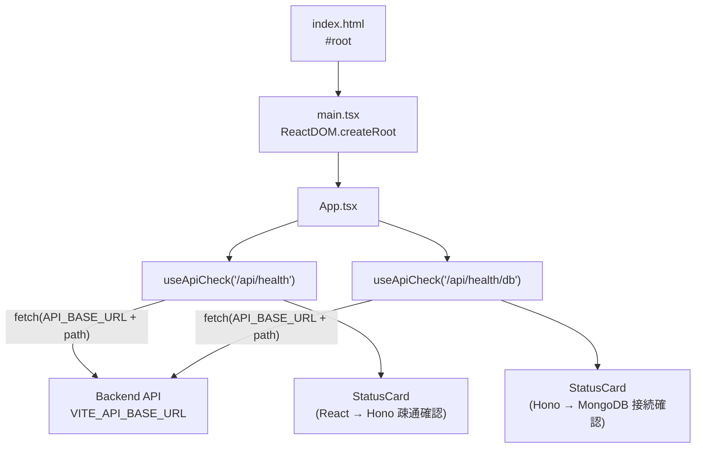

# digger-frontend

React + Vite + TypeScript 製のSPA。バックエンド（Hono API）に `fetch` で直接アクセスします。

## ディレクトリ構成

```
frontend/
├── index.html       # Viteのエントリーhtml。#root にReactをマウント
├── src/
│   ├── main.tsx      # Reactのエントリーポイント（createRoot）
│   ├── App.tsx        # アプリ本体。ヘルスチェックUIを含む
│   └── vite-env.d.ts   # Vite用の型定義（import.meta.env等）
├── Dockerfile
├── vite.config.ts
└── tsconfig.json
```

## アーキテクチャ



- **`main.tsx`**: `App` を `React.StrictMode` でラップしてDOMにマウントするだけの薄いエントリーポイント。
- **`App.tsx`**:
  - `useApiCheck(path)` というカスタムフックが、指定パスに `fetch` し `{ loading, data, error }` を状態管理します（`AbortController` は使わず `cancelled` フラグでアンマウント後の `setState` を防止）。
  - `API_BASE_URL` は `import.meta.env.VITE_API_BASE_URL`（未設定時は `http://localhost:8787` にフォールバック）。
  - `/api/health` と `/api/health/db` の2つを呼び出し、それぞれ `StatusCard` コンポーネントで結果（ローディング中／エラー／JSONレスポンス）を表示します。
  - スタイリングはインラインstyleのみで、CSSフレームワークやUIライブラリは未導入です。

## 環境変数（`.env`）

`.env.example` をコピーして使用します。Viteの仕様上、クライアントに埋め込まれる変数は `VITE_` プレフィックスが必須です。

| 変数名 | 説明 | デフォルト |
| --- | --- | --- |
| `VITE_API_BASE_URL` | バックエンドAPIのベースURL | `http://localhost:8787` |

ビルド時に値が埋め込まれるため、Docker Compose経由でも `docker-compose.yml` の `environment` で渡した値を反映するには開発サーバー（Vite dev server）の再起動が必要です。

## スクリプト

| コマンド | 内容 |
| --- | --- |
| `npm run dev` | `vite --host` — 開発サーバー起動（HMR対応、`--host` でLAN内からもアクセス可） |
| `npm run build` | `tsc -b && vite build` — 型チェック後に本番ビルド |
| `npm run preview` | ビルド成果物をローカルでプレビュー |

## 依存関係

- `react` / `react-dom` — UIライブラリ本体
- `@vitejs/plugin-react` — Viteの公式Reactプラグイン（Fast Refresh対応）
- `vite` — 開発サーバー/バンドラー
- `typescript` — 型チェック（`tsc -b` はビルド時のみ実行、Vite自体はesbuildでトランスパイル）

## ローカル起動

```bash
cp .env.example .env
npm install
npm run dev
```

`http://localhost:5173` を開くと、バックエンドの2つのヘルスチェックAPIの結果がカード表示されます。バックエンド（とMongoDB）が起動していないと `error` 表示になります。

## 今後の拡張ポイント（未実装）

- ルーティング（現状はApp.tsx単一ページ）
- 状態管理ライブラリ（現状はuseState/useEffectのみ）
- UIコンポーネントの共通化・デザインシステム導入
- APIクライアントの共通化（現状は `useApiCheck` 内に `fetch` 直書き）
