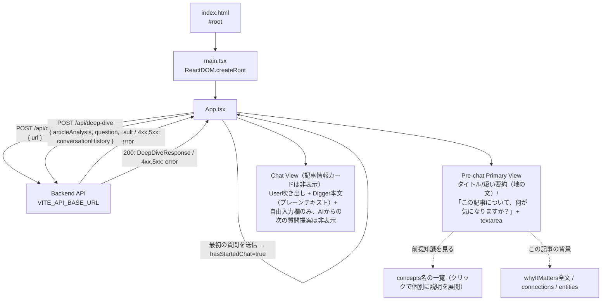

# digger-frontend

React + Vite + TypeScript 製のSPA。バックエンド（Hono API）に `fetch` で直接アクセスします。

## ディレクトリ構成

```
frontend/
├── index.html       # Viteのエントリーhtml。#root にReactをマウント
├── public/
│   └── assets/         # 静的アセット（ビルド時にそのままdist直下へコピーされる）
│       ├── digger-mole-dig.gif          # ローディング表示用のモグラアニメーション
│       ├── digger-mole-dig-spritesheet.png  # 元素材（今回は未使用）
│       └── frames/
│           └── mole-dig-1.png〜4.png       # 静止フレーム（prefers-reduced-motion時にmole-dig-1.pngを使用）
├── src/
│   ├── main.tsx      # Reactのエントリーポイント（createRoot）
│   ├── App.tsx        # アプリ本体。URL入力〜「掘る」結果表示のUI
│   ├── App.css          # App.tsx のスタイル
│   ├── types.ts          # /api/dig のリクエスト/レスポンス型
│   └── vite-env.d.ts   # Vite用の型定義（import.meta.env等）
├── Dockerfile
├── vite.config.ts
└── tsconfig.json
```

## アーキテクチャ



- **`main.tsx`**: `App` を `React.StrictMode` でラップしてDOMにマウントするだけの薄いエントリーポイント。
- **`App.tsx`**:
  - `API_BASE_URL` は `import.meta.env.VITE_API_BASE_URL`（未設定時は `http://localhost:8787` にフォールバック）。
  - フォームでURLを入力し「掘る」を押すと `digUrl()` が `POST /api/dig` を呼び出します。バックエンドが実際にURLへアクセスして抽出した`title`と、Article Analysis（backendの`LLM_PROVIDER`に応じてモックまたはVertex AI Geminiによる実解析）の結果が表示されます。ローディング中は`MoleLoader`コンポーネント（後述）が「記事を掘っています…」と表示します。
  - 状態は `DigState`（`idle` / `loading` / `error` / `success`）という判別可能なユニオン型1つで管理し、状態管理ライブラリは使わず `useState` のみです。
  - **情報カード中心から会話中心へ**: Diggerの差別化は「大量のカードや機能を見せること」ではなく「今読んでいる記事を理解している」「会話から理解を深める」という裏側の体験にある、という方針のもと、表側のUIは`hasStartedChat`（`messages.length > 0`から導出。stateとしては持たない）を境に2つの画面に分かれます。**ArticleAnalysisのデータ自体・`DeepDiveInput`/`DeepDiveResponse`の型は変更していません**（表側は簡素化、裏側に渡すコンテキストは従来通り豊富なまま）。
    - **AI主導の「次の質問」提案は一切表示しない**: `deepDiveQuestions`（記事解析結果）も`suggestedFollowUps`（Deep Dive回答）も、Diggerの「ユーザー自身の疑問を起点に掘る」という方針に反するため、UI上には一切表示しません。バックエンドは引き続き生成・返却しており、`DigResult`/`DeepDiveResponse`の型・schemaも変更していません（frontendが単に無視しているだけです）。次のアクションは常に自由入力のみです。
    - **Pre-chat Primary View**（`!hasStartedChat`）: 記事情報は`summary`の冒頭3文（`firstSentences()`というローカル関数で文末（。！？）区切りに冒頭N文だけ切り出す）を、カードや枠を持たない地の文として表示するだけです。主役は「この記事について、何が気になりますか？」という一言の下にある大きめの`<textarea>`（`DeepDiveInputForm`コンポーネント、Enterで送信・Shift+Enterで改行）です。`whyItMatters`・`concepts`（名前を含め一切）・`connections`・`entities`はここでは一切出しません。
    - **補助UI**（初期は非表示、Pre-chat Primary Viewのみに存在。AI主導の質問提案とは無関係な、記事の背景情報のみを扱う）: ①「前提知識を見る」→`concepts`の名前だけをプレーンテキストのリンク風の行として並べ（カード化しない）、`ConceptDisclosure`コンポーネントによりクリックした概念だけ説明文を展開する2段階の開示。②「この記事の背景」→`whyItMatters`全文・`connections`・`entities`をまとめたパネル。どちらも既定では閉じています。
    - **Chat View**（`hasStartedChat`）: 最初の質問を送った瞬間、記事情報・前提知識・背景パネルは全て非表示になり、画面はほぼ会話のみになります（タイトル行と、任意で開ける「記事の要点を見る」だけが記事の目印として残る）。ユーザーの発言は右寄せの吹き出し、Diggerの回答はカードや枠を持たない地の文（ChatGPTに近い見た目）で表示するだけで、回答の下には何も続きません（`suggestedFollowUps`は受け取った`DeepDiveResponse`から読み捨てており、`ChatMessage`型にも保持しません）。
    - **自由入力欄（`DeepDiveInputForm`）**: pre-chat/chat両方で共有する小さなコンポーネントで、`<textarea rows={3}>`（横幅いっぱい、`resize: vertical`）＋送信ボタンで構成されます。Enterキー押下（Shift未併用）で送信、Shift+Enterで改行、送信中は入力欄・ボタンとも無効化、空文字は送信不可です。プレースホルダーは特定の質問例に寄せすぎないよう「分からないことを、そのまま書いてください」（pre-chat）「さらに気になることを入力してください」（chat）としています。
    - 自由入力欄から質問すると`handleDeepDive(questionText)`が呼ばれ、`askDeepDive()`（`POST /api/deep-dive`）を叩きます。送信のたびに、それまでの`messages`を`{ role, content }[]`に変換して`conversationHistory`として一緒に送ります（backendへ渡す文脈の豊富さは変えていません）。ページ遷移はせず、`messages`にユーザーの質問とDiggerの回答を追記していくだけです。深掘り用のローディング/エラー状態は`DeepDiveState`という別のstateで、記事解析の`DigState`とは独立しています。
  - エラー時はバックエンドが返した `error` メッセージ、またはネットワークエラーの内容を表示します（`400`/`403`/`422`/`502`いずれも同じ見た目で表示、種別による出し分けは未実装）。
  - **`MoleLoader`（掘るモグラのローディング表示）**: 通常のspinnerの代わりに、Diggerのキャラクター（スコップで掘るモグラ）のGIFアニメーションを表示するコンポーネントです。`public/assets/digger-mole-dig.gif`（96px、モバイルは72px。`@media (max-width: 480px)`で切り替え）とラベル文言を横並びで表示するだけの軽量な実装で、画面全体を覆うオーバーレイにはせず、処理中のセクション内に自然に差し込みます。3箇所で使用: ①`digUrl()`実行中（「記事を掘っています…」）、②Pre-chat Primary Viewでの初回Deep Dive送信中、③Chat Viewでの2回目以降のDeep Dive送信中（②③とも「もう少し掘っています…」、`deepDiveState.status === "loading"`から表示）。`usePrefersReducedMotion()`という小さなフックが`window.matchMedia("(prefers-reduced-motion: reduce)")`を監視し、有効な環境ではGIFの代わりに静止フレーム`public/assets/frames/mole-dig-1.png`を表示します。エラー時・完了時はstateが`loading`から外れるため、既存のローディング分岐の仕組みに乗る形でDOMから自動的に消えます（表示/非表示のロジック自体は変更していません）。
- **`types.ts`**: `/api/dig`・`/api/deep-dive` のレスポンス型（`DigResult` / `DigSource` / `ArticleAnalysis` / `Concept` / `Entity` / `Connection` / `ConversationTurn` / `DeepDiveResponse`）を定義。backend側の `src/types.ts`・`src/llm/*.ts` と同じ形を手動で同期しています（共有パッケージ化はまだしていません）。チャットUI用の`ChatMessage`型（`App.tsx`内のローカル型）は`{ role, content }`のみを持ち、`suggestedFollowUps`は保持しません（UIで使わないため）。
- **`App.css`**: 余白の広いシンプルなレイアウト。`flex-wrap` と相対単位でスマホ幅でも崩れないようにしています。CSSフレームワーク等は未導入です。

## 環境変数（`.env`）

`.env.example` をコピーして使用します。Viteの仕様上、クライアントに埋め込まれる変数は `VITE_` プレフィックスが必須です。

| 変数名 | 説明 | デフォルト |
| --- | --- | --- |
| `VITE_API_BASE_URL` | バックエンドAPIのベースURL | `http://localhost:8787` |

ビルド時に値が埋め込まれるため、Docker Compose経由でも `docker-compose.yml` の `environment` で渡した値を反映するには開発サーバー（Vite dev server）の再起動が必要です。

## スクリプト

| コマンド | 内容 |
| --- | --- |
| `npm run dev` | `vite --host` — 開発サーバー起動（HMR対応、`--host` でLAN内からもアクセス可） |
| `npm run build` | `tsc -b && vite build` — 型チェック後に本番ビルド |
| `npm run preview` | ビルド成果物をローカルでプレビュー |

## 依存関係

- `react` / `react-dom` — UIライブラリ本体
- `@vitejs/plugin-react` — Viteの公式Reactプラグイン（Fast Refresh対応）
- `vite` — 開発サーバー/バンドラー
- `typescript` — 型チェック（`tsc -b` はビルド時のみ実行、Vite自体はesbuildでトランスパイル）

## ローカル起動

```bash
cp .env.example .env
npm install
npm run dev
```

`http://localhost:5173` を開き、URL入力欄に記事URLを入れて「掘る」を押すと、実際に取得したタイトルとArticle Analysisの解析結果が表示されます（backendが`LLM_PROVIDER=mock`なら日銀の利上げに関する固定デモデータ、`LLM_PROVIDER=vertex`なら実際の記事内容に応じたVertex AI Geminiの解析結果）。バックエンドが起動していない、またはURLが不正だとエラーメッセージが表示されます。その下の「他に気になることは？」欄から自由入力、または「次に掘るなら」の質問ボタンをクリックすると、その場でチャット形式の深掘りができます（Deep Diveは現状もモック応答）。

## 今後の拡張ポイント（未実装）

- Chat Viewから「前提知識を見る」「この記事の背景」相当の情報に戻れる導線（現状は「記事の要点を見る」で短い要約だけ再表示可能。前提知識・背景はChat View突入後は見られない）
- 会話から理解したことを蓄積するUI（backendのKnowledge Extractionが実LLM化・接続された後に追加）
- エラー種別（`400`/`403`/`422`/`502`）に応じたUIの出し分け（現状は全て同じ見た目）
- 深掘りの会話をリロード後も残すための永続化（現状はページをリロードすると消える）
- ルーティング（現状はApp.tsx単一ページ）
- 状態管理ライブラリ（現状はuseStateのみ）
- UIコンポーネントの共通化・デザインシステム導入
- APIクライアントの共通化（現状は `digUrl` 関数に `fetch` 直書き）
- frontend/backend間で重複しているレスポンス型の共有化
