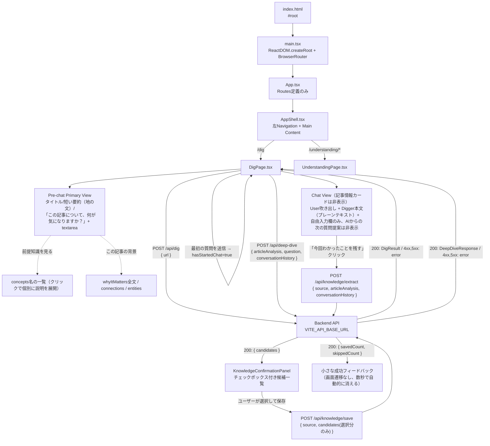

# digger-frontend

React + Vite + TypeScript 製のSPA。バックエンド（Hono API）に `fetch` で直接アクセスします。

## ディレクトリ構成

```
frontend/
├── index.html       # Viteのエントリーhtml。#root にReactをマウント
├── public/
│   └── assets/         # 静的アセット（ビルド時にそのままdist直下へコピーされる）
│       ├── digger-mole-dig.gif          # 「掘る」ローディング表示用のモグラアニメーション
│       ├── digger-mole-dig-spritesheet.png  # 元素材（今回は未使用）
│       └── frames/
│           ├── mole-dig-1.png〜4.png       # 掘るモグラの静止フレーム（prefers-reduced-motion時にmole-dig-1.pngを使用）
│           ├── mole-icon.png               # ロゴ横アイコン/ファビコン用（mole-dig-1.pngを透明余白なしに切り抜いたもの）
│           └── mole-note-1.png〜4.png      # Knowledge Extraction用「ノートに書き込むモグラ」の静止フレーム（NoteMoleLoaderがsetIntervalで順番に切り替え）
├── src/
│   ├── main.tsx      # Reactのエントリーポイント（createRoot、BrowserRouterでApp全体をラップ）
│   ├── App.tsx        # ルート定義のみ（AppShellの中に/dig・/understanding/*をマウントする）
│   ├── AppShell.tsx    # アプリ全体の骨格。左Navigation（サイドバー/モバイルはボトムナビ）＋Main Content
│   ├── DigPage.tsx     # 「掘る」ページ本体。URL入力〜Article Analysis〜Deep Dive〜Knowledge Extractionまでの一連のUI
│   ├── UnderstandingPage.tsx  # 「自分の理解」ページ（最近/トピック/マップのsecondary navigation、Knowledge詳細モーダル）
│   ├── UnderstandingMapView.tsx # 「マップ」タブの実体。Topic/Concept/ConceptRelationモデルによる3ペインMap UI
│   ├── mapLayout.ts       # dagreによるMapの階層レイアウト計算（Reactに依存しない純粋ロジック）
│   ├── TopicNode.tsx      # React FlowのCustom Node（Root Topic / Subtopic共用の丸node）
│   ├── ConceptNode.tsx    # React FlowのCustom Node（Concept node本体）
│   ├── KnowledgeNode.tsx  # React FlowのCustom Node（Knowledge leaf、角丸pill）
│   ├── App.css          # App.tsx・UnderstandingPage.tsx・UnderstandingMapView.tsx共通のスタイル
│   ├── types.ts          # /api/dig 等のリクエスト/レスポンス型
│   └── vite-env.d.ts   # Vite用の型定義（import.meta.env等）
├── Dockerfile
├── vite.config.ts
└── tsconfig.json
```

## アーキテクチャ



- **`index.html`**: ファビコン（`favicon-32x32.png` / `favicon-16x16.png` / `apple-touch-icon.png`、いずれも`public/`直下）を`<link>`で指定。3つとも`public/assets/frames/mole-icon.png`（後述）から`sips`で生成した派生物です。
- **`main.tsx`**: `App` を `React.StrictMode` と `BrowserRouter`（`react-router-dom`）でラップしてDOMにマウントするだけの薄いエントリーポイント。URLに対応したナビゲーション（direct URL access・ブラウザの戻る/進む）を実現するため、今回`react-router-dom`を導入しました。
- **`App.tsx`**: `AppShell`の中に`<Routes>`をマウントするだけの、ルート定義専用の薄いコンポーネントです。`/`は`/dig`へ`Navigate`、`/dig`は`DigPage`、`/understanding/*`は`UnderstandingPage`（内部でさらにネストしたルートを持つ）にそれぞれ対応します。以前はこのファイルに「掘る」フローの全ロジック・JSXが集中していましたが（1ファイル700行超）、Navigation構造の変更に合わせて`AppShell.tsx`（骨格）と`DigPage.tsx`（「掘る」フロー本体）に分離しました。ロジックの切り出しは機械的なもので、`DigPage.tsx`側の挙動は分離前と変わっていません。
- **`AppShell.tsx`**（新規）: アプリ全体で共通の骨格。デスクトップでは左に固定サイドバー（`brand`/`tagline` + 「掘る」`/dig`・「自分の理解」`/understanding`への`NavLink`2つ）、右に`<main className="app-main">{children}</main>`という構成です。現在地は`NavLink`の`isActive`で判定し、下線ではなく控えめな背景色で示します（タブ的な強い強調は避ける方針）。ルート遷移のたびにこのコンポーネント自体が再マウントされることはなく（`App.tsx`の`<Routes>`は`AppShell`の**子**として描画される）、サイドバーの位置・幅は画面間で一切変化しません。`.app-main`は常に同じ`max-width: 1100px`を持ち、外枠の幅もルートに関わらず固定です（「掘る」の会話中心な狭いレイアウトは、`DigPage.tsx`内部の`.dig-page-inner { max-width: 640px; }`という内側ラッパーで実現しており、外枠自体は動きません）。モバイル（`max-width: 900px`、Understanding Map刷新時に導入した既存ブレークポイントを流用）ではサイドバーを`display: none`にし、代わりに画面下部固定のBottom Navigation（同じ2項目）と、ブランドロゴを表示する軽量な`.app-mobile-header`を表示します。
- **`DigPage.tsx`**（`App.tsx`から分離、内容は従来通り）:
  - タイトル「Digger」の左に`brand-icon`としてモグラのアイコン（`public/assets/frames/mole-icon.png`）を表示します（`alt=""` + `aria-hidden="true"`で装飾画像として扱い、スクリーンリーダーには読み上げさせません）。`mole-icon.png`は`mole-dig-1.png`（512x512、MoleLoaderの静止フレームと共用の元画像）から、透明ピクセルの外接矩形で切り抜いた上でその向きに合わせた最小限の余白のみを残したものです。元画像はキャラクター周囲の透明な余白が大きく、そのまま40px前後の小サイズで縮小表示するとキャラクターが小さく見えすぎる問題があったため、このアイコン専用に切り抜き直しました（`MoleLoader`側は96px/72pxと表示サイズが大きいため`mole-dig-1.png`のままで問題なく、変更していません）。ファビコンの3ファイルも同じ`mole-icon.png`から生成しています。（※ブランドアイコン自体は現在`AppShell.tsx`のサイドバー/モバイルヘッダー側に表示されます。この説明は元々のアイコン切り抜きの経緯として残しています。）
  - `API_BASE_URL` は `import.meta.env.VITE_API_BASE_URL`（未設定時は `http://localhost:8787` にフォールバック）。
  - フォームでURLを入力し「掘る」を押すと `digUrl()` が `POST /api/dig` を呼び出します。バックエンドが実際にURLへアクセスして抽出した`title`と、Article Analysis（backendの`LLM_PROVIDER`に応じてモックまたはVertex AI Geminiによる実解析）の結果が表示されます。ローディング中は`MoleLoader`コンポーネント（後述）が「記事を掘っています…」と表示します。
  - 状態は `DigState`（`idle` / `loading` / `error` / `success`）という判別可能なユニオン型1つで管理し、状態管理ライブラリは使わず `useState` のみです。
  - **情報カード中心から会話中心へ**: Diggerの差別化は「大量のカードや機能を見せること」ではなく「今読んでいる記事を理解している」「会話から理解を深める」という裏側の体験にある、という方針のもと、表側のUIは`hasStartedChat`（`messages.length > 0`から導出。stateとしては持たない）を境に2つの画面に分かれます。**ArticleAnalysisのデータ自体・`DeepDiveInput`/`DeepDiveResponse`の型は変更していません**（表側は簡素化、裏側に渡すコンテキストは従来通り豊富なまま）。
    - **AI主導の「次の質問」提案は一切表示しない**: `deepDiveQuestions`（記事解析結果）も`suggestedFollowUps`（Deep Dive回答）も、Diggerの「ユーザー自身の疑問を起点に掘る」という方針に反するため、UI上には一切表示しません。バックエンドは引き続き生成・返却しており、`DigResult`/`DeepDiveResponse`の型・schemaも変更していません（frontendが単に無視しているだけです）。次のアクションは常に自由入力のみです。
    - **Pre-chat Primary View**（`!hasStartedChat`）: 記事情報は`summary`の冒頭3文（`firstSentences()`というローカル関数で文末（。！？）区切りに冒頭N文だけ切り出す）を、カードや枠を持たない地の文として表示するだけです。主役は「この記事について、何が気になりますか？」という一言の下にある大きめの`<textarea>`（`DeepDiveInputForm`コンポーネント、Enterで送信・Shift+Enterで改行）です。`whyItMatters`・`concepts`（名前を含め一切）・`connections`・`entities`はここでは一切出しません。
    - **補助UI**（初期は非表示、Pre-chat Primary Viewのみに存在。AI主導の質問提案とは無関係な、記事の背景情報のみを扱う）: ①「前提知識を見る」→`concepts`の名前だけをプレーンテキストのリンク風の行として並べ（カード化しない）、`ConceptDisclosure`コンポーネントによりクリックした概念だけ説明文を展開する2段階の開示。②「この記事の背景」→`whyItMatters`全文・`connections`・`entities`をまとめたパネル。どちらも既定では閉じています。
    - **Chat View**（`hasStartedChat`）: 最初の質問を送った瞬間、記事情報・前提知識・背景パネルは全て非表示になり、画面はほぼ会話のみになります（タイトル行と、任意で開ける「記事の要点を見る」だけが記事の目印として残る）。ユーザーの発言は右寄せの吹き出し、Diggerの回答はカードや枠を持たない地の文（ChatGPTに近い見た目）で表示するだけで、回答の下には何も続きません（`suggestedFollowUps`は受け取った`DeepDiveResponse`から読み捨てており、`ChatMessage`型にも保持しません）。
    - **自由入力欄（`DeepDiveInputForm`）**: pre-chat/chat両方で共有する小さなコンポーネントで、`<textarea rows={3}>`（横幅いっぱい、`resize: vertical`）＋送信ボタンで構成されます。Enterキー押下（Shift未併用）で送信、Shift+Enterで改行、送信中は入力欄・ボタンとも無効化、空文字は送信不可です。プレースホルダーは特定の質問例に寄せすぎないよう「分からないことを、そのまま書いてください」（pre-chat）「さらに気になることを入力してください」（chat）としています。
    - 自由入力欄から質問すると`handleDeepDive(questionText)`が呼ばれ、`askDeepDive()`（`POST /api/deep-dive`）を叩きます。送信のたびに、それまでの`messages`を`{ role, content }[]`に変換して`conversationHistory`として一緒に送ります（backendへ渡す文脈の豊富さは変えていません）。ページ遷移はせず、`messages`にユーザーの質問とDiggerの回答を追記していくだけです。深掘り用のローディング/エラー状態は`DeepDiveState`という別のstateで、記事解析の`DigState`とは独立しています。
    - **「今回わかったことを残す」（Knowledge Extraction）**: Chat Viewの入力欄の下に、控えめな`link-button`として表示されます（常時大きなKnowledge UIは出さない方針）。表示条件は`messages.some(m => m.role === "assistant")`（少なくとも1往復の会話があること）で、押すたびに`handleExtractKnowledge()`が`extractKnowledge()`（`POST /api/knowledge/extract`）を呼び、会話ログ全体（`messages`）を渡します。抽出中は`NoteMoleLoader`（後述、「わかったことを整理中…」）を表示します。
    - **候補確認パネル（`KnowledgeConfirmationPanel`）**: Diggerは「保存するKnowledge一覧」ではなく「今回、理解がどう変わったか」を見せたいという方針で、見出しも「今回、理解がどう変わったか」としています。backendがLLMの生の`relationToExisting`を`displayCategory`（`new`/`deepened`/`updated`。`reinforces`は`shouldShowForConfirmation()`でそもそも候補一覧から除外済み）に変換して返すため、frontendはそれをそのままグルーピングして表示するだけです（`groupCandidatesByCategory()`）。
      - **`new`**（「新しくわかったこと」）・**`deepened`**（「理解が深まったこと」）・**`updated`**（「理解を更新する」）の3見出しを、候補がある場合だけ表示します（`CATEGORY_LABELS`/`CATEGORY_ORDER`）。
      - `deepened`の候補は、backendが付与した`relatedKnowledge`（参照元Knowledgeの`concept`/`statement`）があれば「以前の『◯◯』から理解が深まりました」という控えめなヒント（`.knowledge-relation-hint`）を表示します。
      - `updated`の候補は、`relatedKnowledge`があれば「以前の理解: 〜」「今回の理解: 〜」という比較表示（`.knowledge-update-compare`）にします。**既存Knowledgeを自動で`outdated`へ変更する機能はまだ無いため**、ここではあくまで「更新候補として分かる」表示にとどめています（選択して保存すると、新しいKnowledgeとして追加されるだけです）。
      - 全カテゴリとも0件（＝`reinforces`しか無かった等）の場合は候補一覧自体を出さず、「今回は新しく保存する内容はありませんでした」という控えめな1文だけを表示します。
      - 選択状態は`Set<string>`（`knowledgeSelectedIds`、候補の`id`をキーにする。グルーピング表示に伴い、配列インデックスではなく`id`で管理する方が安全なため）で管理し、1件以上選ぶと「保存する」ボタンが有効になります。**AIは自動保存しません**。`evidence`・`relationToExisting.reason`・紐付け先の`knowledgeId`はUIには常時表示しません（内部的な判断材料として保持するのみ）。
    - 保存を押すと`handleSaveSelectedKnowledge()`が`saveKnowledge()`（`POST /api/knowledge/save`）を呼び、選択された候補（`id`を含む、`/api/knowledge/extract`のレスポンスをそのまま利用）を送ります。保存後のフィードバックは単純な「N件保存しました」だけでなく、`describeSaveResult()`が選択した候補の`displayCategory`の内訳から「新しい理解を1件保存しました。理解が2件深まりました。」のようなrelationに応じた文言を組み立てます（実際の保存件数と多少ずれる可能性がある簡易な実装で、backendが重複等でスキップした件数があれば「（M件は既に保存済みのためスキップしました）」も併記）。画面遷移はせず、パネルを閉じてチャット画面上に小さく表示し、4秒後に自動的に消えます。状態は`KnowledgeSaveState`（`idle`/`extracting`/`extracted`/`saving`/`saved`/`error`）という1つの判別可能なユニオン型で管理します。
    - 保存失敗時は`error-message`で`error`メッセージを表示するのみで、チャット自体やそれまでの会話状態は壊れません（`knowledgeSaveState`は独立したstateのため）。
  - エラー時はバックエンドが返した `error` メッセージ、またはネットワークエラーの内容を表示します（`400`/`403`/`422`/`502`いずれも同じ見た目で表示、種別による出し分けは未実装）。
  - **`MoleLoader`（掘るモグラのローディング表示）**: 通常のspinnerの代わりに、Diggerのキャラクター（スコップで掘るモグラ）のGIFアニメーションを表示するコンポーネントです。`public/assets/digger-mole-dig.gif`（96px、モバイルは72px。`@media (max-width: 480px)`で切り替え）とラベル文言を横並びで表示するだけの軽量な実装で、画面全体を覆うオーバーレイにはせず、処理中のセクション内に自然に差し込みます。3箇所で使用: ①`digUrl()`実行中（「記事を掘っています…」）、②Pre-chat Primary Viewでの初回Deep Dive送信中、③Chat Viewでの2回目以降のDeep Dive送信中（②③とも「もう少し掘っています…」、`deepDiveState.status === "loading"`から表示）。`usePrefersReducedMotion()`という小さなフックが`window.matchMedia("(prefers-reduced-motion: reduce)")`を監視し、有効な環境ではGIFの代わりに静止フレーム`public/assets/frames/mole-dig-1.png`を表示します。エラー時・完了時はstateが`loading`から外れるため、既存のローディング分岐の仕組みに乗る形でDOMから自動的に消えます（表示/非表示のロジック自体は変更していません）。
  - **`NoteMoleLoader`（ノートに書き込んで整理しているモグラのローディング表示）**: Knowledge Extraction専用のローディング表示で、`knowledgeSaveState.status === "extracting"`（`handleExtractKnowledge()`が`POST /api/knowledge/extract`のレスポンス待ちをしている間）にのみ表示されます。`MoleLoader`とは素材（GIF vs 静止PNG4枚）が異なるため別コンポーネントにしていますが、見た目・DOM構造は共通の`.mole-loader`/`.mole-loader-image`/`.mole-loader-label`クラスを再利用しており、サイズ（96px/72px）も`MoleLoader`と同じです。GIFを持たないため、`public/assets/frames/mole-note-1.png`〜`mole-note-4.png`という4枚の静止フレームを`setInterval`（`NOTE_FRAME_INTERVAL_MS = 350ms`）で単純に順番切り替えする方式（GIF化やスプライトシート化は行わず、新規ライブラリも導入していません）。`usePrefersReducedMotion()`が有効な場合はタイマー自体を起動せず、常に1枚目（`mole-note-1.png`）だけを表示します（`alt="Diggerがわかったことを整理しています"`）。`knowledgeSaveState`が`extracting`から`extracted`/`error`のいずれかに遷移した時点でコンポーネントごとアンマウントされ、`setInterval`は`useEffect`のクリーンアップで確実に解除されるため、成功時・失敗時ともにローディングが残り続けることはありません。ラベル文言（`label`プロップ）は呼び出し側で自由に変えられるため、将来`/api/knowledge/save`の保存中表示にも同じコンポーネントをそのまま再利用できます（今回はKnowledge Extractionの抽出中のみで使用）。
- **`UnderstandingPage.tsx`**: 「自分の理解」ページ。保存済みKnowledgeを「一覧」ではなく「自分の理解が育っている」と感じられる形で見せることを目的にした画面で、独立したファイルに分離しています（`App.tsx`が既に大きいため）。マウント時に`fetchSavedKnowledge()`（`GET /api/knowledge`）を1回呼び、以降はタブ切り替えのみで同じデータを使い回します（タブごとに再取得しません）。
  - **タブ（secondary navigation）**: 「最近」「トピック」「マップ」を`/understanding/recent`・`/understanding/topic`・`/understanding/map`という3つのネストしたルートとして実装しています（`index`ルートは`recent`へ`Navigate`）。タブ見出しは`understanding-tab`クラスの`NavLink`で、見た目は従来のボタンUIのままですが、選択状態はローカルstateではなくURLで管理されるため、直接アクセスやリロードでも選択中のタブが保たれます。`AppShell.tsx`の「掘る/自分の理解」という**アプリ全体**のNavigationとは別階層の、**「自分の理解」内**の2段目のNavigationという位置づけです。`NavLink`の`to`はいずれも絶対パス（例: `to="/understanding/map"`）で指定しています。相対パス（`to="map"`）だと、現在地が`/understanding/recent`のときに`/understanding/recent/map`という誤ったURLに解決されてしまうため（React Routerのネストルートにおける相対パス解決の仕様）、必ず絶対パスを使う必要があります。
  - **「最近」ビュー**: `groupByDate()`が、backendが`createdAt`降順で返す配列を前提に、連続する同じ日付（今日/昨日/それ以外は「9月17日」のような表示）の項目をまとめてグルーピングします。各行（`KnowledgeRow`）は`concept`・`statement`の冒頭・出典記事タイトルを表示し、`status`が`active`以外の場合だけ控えめなバッジ（`understanding-item-status`）を添えます。クリックするとKnowledge詳細モーダルが開きます。
  - **「トピック」ビュー**: `buildTopicTree()`が、各Knowledgeの`topicPath`（backendが付与する1〜3階層のパス。無ければ「未分類」）から、共通の接頭辞をまとめた木構造を組み立て、`TopicTree`コンポーネントが再帰的に描画します。正規化されたTopicコレクションではなく、`topicPath: string[]`をそのままグルーピングに使う単純な実装です。
  - **「マップ」タブ（`UnderstandingMapView.tsx`）**: 独立したファイルに分離された、Topic/Concept/ConceptRelationモデル（[`backend/README.md`](../backend/README.md#topic--concept--conceptrelationモデルtopicts--conceptts--conceptrelationts--understandingstructurets)参照）ベースの3ペインUI。詳細は同ファイルの説明を参照。
  - **Knowledge詳細（`KnowledgeDetailModal`）**: 固定オーバーレイの簡易モーダルで、`concept`・`statement`・`理解した日`（`createdAt`）・`状態`（`status`を`STATUS_LABELS`で日本語化）・`元の記事`（`source.title`へのリンク）・（`relationsOut`があれば）`関連する理解`（参照先Knowledgeの`concept`を`allItems`から逆引き）を表示します。現在のKnowledge schemaで取得できる情報だけを使い、存在しないデータは表示しません。
  - **Empty State**: Knowledgeが0件の場合はタブ自体を表示せず、モグラのアイコンと「まだ理解マップは小さいです。気になる記事を掘ると、ここにあなたの理解が少しずつ育っていきます。」という一言、「記事を掘る」ボタン（`useNavigate()`で`/dig`へ遷移。以前は`onGoDig`というpropを`App.tsx`から受け取っていましたが、ルーティング導入に伴い各コンポーネントが`useNavigate()`を直接呼ぶ形にし、このprop受け渡しは廃止しました）だけを表示します。
- **`UnderstandingMapView.tsx`**: 「マップ」タブの実体。Topic/Concept/ConceptRelationモデル（backendの`GET /api/understanding-map`・`POST /api/understanding-map/refresh`）を使い、「保存したKnowledgeを並べたグラフ」ではなく「今のユーザーの理解状態」を感じられるUIを構築します。**Root Topic → Subtopic → Concept → Knowledgeという階層構造そのものをMapの骨格にする**（Topic hierarchyを基本構造とし、ConceptRelationはそれを補足する横断的なつながりとして重ねるだけ）という設計に作り替えています。「最近」「トピック」タブは引き続き旧`Knowledge.topicPath`モデルのまま無変更です（2つの分類システムが並存。Mapの階層は`Topic.parentId`由来のTopic/Conceptモデル側を単一の情報源として使っており、`topicPath`とは完全には一致しません。詳細は[`backend/README.md`](../backend/README.md#topic--concept--conceptrelationモデルtopicts--conceptts--conceptrelationts--understandingstructurets)を参照）。
  - **データ取得**: マウント時に`GET /api/understanding-map`を呼びます（読み取り専用でlazy migrationやLLM呼び出しなどの副作用が無いため、タブを開き直すたびに呼んでも軽い）。`knowledge`（`SavedKnowledge[]`）は親の`UnderstandingPage`が既に持っているものをpropsで受け取り、二重fetchしません。
  - **「理解マップを更新」ボタン**: `POST /api/understanding-map/refresh`を呼びます（未移行のKnowledgeのConcept化＋未分類ConceptのLLM Topic分類を行う、相対的に重い処理）。ボタン付近に未分類Concept数を表示し、押すタイミングの目安にします。押している間はボタンを無効化するだけの簡易的なローディング表現です。
  - **Topicフィルタ（`.map-topic-filter-bar`）**: Map上部に、ルートTopic（`Topic.parentId`が無いもの）だけをクリック可能なボタン（チップ）として並べています。選択すると`selectedTopicId`が変わり、そのTopicとその子孫すべて（Subtopic・配下のConcept・Knowledge）だけをMapに表示します（`collectDescendantTopicIds()`。Topic Viewと同じ`Topic.parentId`の親子関係をそのままsubtree絞り込みに使っています）。「すべて」で解除すると、すべてのルートTopicがそれぞれ独立したtreeとして横に並びます。ルートTopicが多い場合に一覧が縦に伸びすぎないよう、初期表示は5個までにとどめ、「もっと表示する」ボタンで全件表示に切り替えられます（`topicFilterExpanded` state）。
  - **検索（`.map-search-bar`）**: 「見たいものが既に決まっている」場合の直接アクセス。`searchMap()`がTopic名・Subtopic名・Concept名・Knowledgeの`concept`/`statement`を横断して部分一致検索し、結果を種別バッジ（トピック/概念/理解）付きで最大20件返します（Embedding/Semantic Searchは今回のスコープ外）。結果をクリックすると`focusNode()`が呼ばれ、該当Nodeを選択状態にしてDetail Panelを開き、後述のカメラ移動でMap上のNodeへ視点を寄せます。0件のときは「該当する理解はまだありません」と表示するだけです。`/`または`Cmd/Ctrl+K`で検索欄にフォーカス、Escで閉じるショートカットも用意しています（必須ではない任意機能）。
  - **中央: 階層構造マップ（`mapLayout.ts` + `TopicNode.tsx` + `ConceptNode.tsx` + `KnowledgeNode.tsx`）**: 「Conceptをランダムに散らしてつなぐもの」ではなく「ユーザーの現在の理解構造（Topic hierarchy）を視覚化したもの」として設計しています。**force-directed layout（d3-force）はやめ、[`dagre`](https://github.com/dagrejs/dagre)による階層レイアウトに全面的に置き換えました**（`computeHierarchyLayout()`）。dagreは決定的なレイアウトアルゴリズムのため、d3-forceのような「毎回計算して収束させる」処理も「前回位置をwarm startとして使う」工夫も不要で、同じnode/edge構成なら常に同じ配置になります。
    - **4種類のNodeを明確に区別する**: `rootTopic`（`parentId`の無いTopic）・`subtopic`（それ以外のTopic、深さに関わらず1種類として扱う）・`concept`・`knowledge`の4種類をReact Flowの別々のcustom nodeとして描画し、サイズ・形をはっきり変えています。
      - Root Topic（`TopicNode.tsx`、`variant="root"`）: 円、`computeRootTopicSize()`で基本64px（直属の子数に応じて最大+6px）、太い枠・強めの塗りつぶし。
      - Subtopic（`TopicNode.tsx`、`variant="sub"`）: 円、`computeSubtopicSize()`で基本50px（直属の子数に応じて最大+5px）、Root Topicより細い枠・薄い塗りつぶし。
      - Concept（`ConceptNode.tsx`）: 円、`computeConceptSize()`で基本40px（紐づくKnowledge数に応じて最大+4px）。名前は12文字を超えたら`truncateLabel()`で省略し1〜2行に収め、フルテキストは`title`属性のhover tooltipとDetail Panelで確認します。
      - Knowledge（`KnowledgeNode.tsx`）: 円やpillカードではなく、22px固定の小さなdot＋その下に短いcaption（14文字を超えたら省略、1行のみ）という「dot + short label」のleaf表現にしています。statement全文はMap上に一切出さず、フルテキストはhover tooltipとクリック後のDetail Panelでのみ確認できます（「Mapは内容を読む場所ではなく理解構造を見る場所」という方針を最も強く反映している部分で、以前の横長pillカードだとKnowledgeが増えるほどMapが横に間延びして階層が読みにくくなっていた問題への対応です）。
      - サイズの主基準は常に「階層のどの役割か」で、以前より各階層の差をはっきり付けています（64→50→40→22という段差）。Knowledge数・relation数はあくまで同階層内の小さな補助差（最大+4〜6px程度）にとどめ、relationが多いConceptでもConcept以上の大きさにはなりません。
    - **階層をレイアウトの骨格に、ConceptRelationは補助edgeに**: `recomputeLayout()`はまずTopic→Topic（親子）・Topic→Concept（所属）・Concept→Knowledge（`SavedKnowledge.conceptIds[0]`が一致するものだけを1本の親として扱う）という**parent-child edgeだけ**を`dagre`に渡してレイアウトします（`rankdir: "LR"`で左→右に階層が広がる）。位置が決まった後、`ConceptRelation`（横断的なつながり）を`buildCrossRelationEdges()`で別途重ねるだけで、レイアウト計算そのものには一切関与しません。そのためConceptRelationが0件でも、Topic hierarchyだけでMapとして完全に成立します（実データでも確認済み。関連は今回の実データでは0件でした）。
    - **edgeの見た目の主従**: parent-child edge（`buildParentChildEdges()`）はReact Flowの`smoothstep`（elbow風の折れ線）にし、branch構造・子方向が追いやすいようにしています。太さも1.75pxへ少し上げ「細すぎない」程度にしつつ、色は控えめなグレー（`#b0b0b0`）にとどめ「主張しすぎない」バランスを取っています。cross relation edge（`buildCrossRelationEdges()`）はデフォルトの曲線（bezier）のまま、薄いグレーの破線＋小さな日本語typeラベルにして、階層edgeよりはっきり控えめにしています（elbowの実線 vs 曲線の破線、という形自体の違いでも主従を表現しています）。
    - **複数のルートTopicは独立したtreeとして横に並ぶ**: 「すべて」表示では、dagreが非連結なグラフ（複数のルートTopicにまたがるtree群）をまとめて配置し、それぞれ独立したtreeとして並びます。無理に1つのグラフへ繋げようとはしません（「複数の島」ではなく「複数の理解領域」に見えるよう、`nodesep`/`ranksep`は木同士が混ざらない程度の余白にとどめています。Knowledgeが小さなdotになったことでMap全体の密度も下がったため、`ranksep`を70→60に詰めてコンパクトさを保ちつつ、`nodesep`は20→28に広げて兄弟node・label同士が詰まって見えないようにしています）。
    - **未分類Conceptの扱い**: `topicIds`が空のConceptは、「すべて」表示のときだけ`__unclassified__`という専用のRoot Topic相当のnode（名前は「未分類」、グレー固定色）の直下に並べます。特定のTopicで絞り込んでいるときは未分類は表示しません（どのTopicのsubtreeにも属さないため）。
    - **隣接強調（hover/選択）**: parent-child edgeとConceptRelation edgeの両方を対象に、hoverまたは選択中のNodeと直接つながるNode・edgeだけを強調し、それ以外を薄くします（優先順位: hover > 選択中）。これにより「このNodeから次にどこへ辿れるか」が親・子・横断関連の別を問わず直感的に分かります。**無関係なnodeを薄くしすぎるとMap全体の位置関係が分からなくなる**という指摘を受け、dimmed時のopacityを0.25→0.6へ引き上げています（他のtreeの存在も薄っすら見え続けるようにする）。選択中のNode（Topic/Concept/Knowledgeいずれも共通）には、hoverの軽い強調（枠線をやや太くするだけ）とは別に、outline＋わずかな拡大（`transform: scale(1.06〜1.15)`、Knowledgeのdotは小さいぶん拡大率を大きめにしています）という独立した「選択中」の見た目を常時表示します。
    - **クリック interaction（node種別ごとに詳細パネルを出し分け）**: `onNodeClick`はクリックしたNodeの`type`（`topic`/`concept`/`knowledge`）に応じて`selectedNode`（`{ kind, id }`の判別可能なユニオン）を設定し、後述のDetail Panel側がその種別に応じた内容を描画します。
    - **Node Navigation（辿る）**: Detail Panelの各種リンク（関連する概念・配下のトピック・所属する概念など）や検索結果を選ぶと`focusNode()`が呼ばれます。対象NodeがすでにMap上に見えていれば即座にカメラを寄せ、現在のTopicフィルタの都合で隠れている場合はフィルタを一旦解除してから、その再描画を待ってカメラを寄せます（`pendingFocusId`という一時state経由。ReactFlowインスタンスはTopicフィルタ変更等での再マウントのたびに`onInit`で参照を取り直すため、`useReactFlow()`ではなくrefで保持しています）。Map上でNodeを直接クリックしたとき（`handleSelectNode`）は、既に見えている位置なのでカメラは動かしません。
    - **カメラ移動は控えめに**: `panToNode()`は選択したNodeを中心に据えますが、毎回激しくズーム/パンしてユーザーの位置感覚を失わせないよう、現在のズームがある程度（0.6以上）あればそれを保ち、大きくズームアウトしている場合だけ0.8まで軽く寄せます。
    - **NEWの表現はKnowledgeのdotだけに、7日以内だけ**: 以前はConcept nodeにもテキストの「NEW」バッジを表示していましたが、Knowledge nodeだけに限定しました（`isRecent()`、`createdAt`が7日以内かどうかだけを見るシンプルな判定）。Knowledgeのdot自体が22pxとごく小さいため、テキストバッジではなくdotの縁を彩る細いリング（`.knowledge-leaf-dot-new`）という控えめな表現に変え、Map全体のNodeに何かしらの印が付いて視認性が下がることを避けています。
    - **色分け**: トップレベルTopic（ルートTopic）ごとに固定パレットから色を割り当て（`buildTopicColorMap()`）、Topic/Concept/Knowledgeいずれのnodeの枠線・塗りにも同じ色を使い、同じtree（理解領域）に属することが一目で分かるようにしています。未分類は常に固定のグレーです。
    - **「整列」ボタン**: dagreは決定的なレイアウトのため、同じデータであれば毎回同じ配置になります。ユーザーがドラッグしてNodeを動かした場合に、それを明示的にリセットして`recomputeLayout()`をもう一度呼ぶためのボタンとして残しています（d3-force時代の「warm start」という概念自体が無くなったため、以前あった「resetPositions」引数は廃止しました）。
    - **MiniMap**: 全Node（Topic+Concept+Knowledgeの合計）が25件以上のときだけ表示します（React Flowの`<MiniMap />`をそのまま使用。以前はConcept数だけを基準にしていましたが、階層化でNode総数が増えたため合計件数に基準を変えています）。
    - **ドラッグ時に画面全体が意図せずズーム/パンするバグの修正（既存）**: 詳細パネル列を常時確保したことでMapのcanvas幅が狭くなり、node1つをドラッグしただけでReact Flowが「node がpaneの端に近づいた」と判定し、`autoPanOnNodeDrag`（デフォルト`true`）によってcanvas全体を大きくズームアウト・再配置してしまう現象があったため、`<ReactFlow autoPanOnNodeDrag={false}>`を指定しています。
    - **モバイルでのはまりどころ（既存）**: `.understanding-map-layout`がモバイルで`flex-direction: column`になるため、Map要素のbase CSS（`.concept-map { flex: 1 1 0%; }`）のflex-basisがcolumn方向では高さの基準として優先され、`height`指定を上書きしてしまい、モバイルでMapの高さが0になって何も表示されないバグがありました。モバイル用メディアクエリ側で`flex: none;`をリセットすることで解消しています。
  - **右: Detail Panel（`ConceptDetailPanel`/`TopicDetailPanel`/`KnowledgeDetailPanel`）**: Nodeを「理解する場所」として扱い、Map上には詰め込まない情報をここに寄せます。`selectedNode.kind`に応じて3つのコンポーネントを出し分けます。
    - **Topic選択時（`TopicDetailPanel`）**: Topic名、パンくず（`buildTopicBreadcrumb()`）、配下のTopic一覧、直属のConcept一覧を表示します。それぞれクリックすると`focusNode()`でそのNodeへ遷移します。
    - **Concept選択時（`ConceptDetailPanel`）**: Concept名、所属Topicのパンくず、紐づくKnowledge一覧（`SavedKnowledge.conceptIds`から逆引き。`outdated`は除外、`merged`は控えめ表示、`foundational`はラベル付き。`UnderstandingPage.tsx`の`STATUS_LABELS`/`effectiveStatus`/`statusClassName`をexportして再利用。各Knowledgeの文もクリックでそのKnowledge nodeへ遷移）、関連する概念一覧（`ConceptRelation`の双方向、1-hopのみ）、参照元記事リンクを表示します。
    - **Knowledge選択時（`KnowledgeDetailPanel`）**: そのKnowledgeのstatement全文、状態バッジ、出典記事リンク、所属する概念（クリックでConceptへ遷移）を表示します。
    - パネルの列（`.concept-detail-panel-wrapper`、幅固定320px）は選択の有無に関わらず常にレンダリングし、未選択時は「Topic / Concept / Knowledgeを選択すると、ここに詳細が表示されます」というプレースホルダーを表示します。列自体を常時確保することでMapの表示幅は選択・非選択に関わらず変化しません（幅が同一であることをPlaywrightで直接検証済み）。
  - **成長summary（`computeMapSummary()`）**: 「Knowledge N件・トピック N個・概念 N個・つながり N件」＋「今週 +N件の理解・+M件のつながり」を、既存データ（`createdAt`）だけから計算して表示します。
  - **Empty State**: active Conceptが0件のときは、モグラのアイコンと「理解マップを更新」ボタンだけを表示する専用の軽量表示にしています（Concept未作成＝多くの場合まだ一度もrefreshを実行していない状態のため）。
  - **レスポンシブ**: デスクトップは検索/Topicフィルタ行＋Map＋Detail Panelの縦積み＋横flex構成。検索はテキスト入力、Topicフィルタはボタンの折り返しなので、モバイルでも同じUIでそのまま操作できます（専用のドロワーは不要。Topicフィルタで選択Topicのsubtreeだけに絞り込む操作自体が、モバイルでの「今見たい範囲だけ表示する」navigationを兼ねています）。Detail Panelだけはモバイルでノードクリック時に下からのシート風パネルになります（既存の`.modal-overlay`的な考え方をCSSだけで再現したもので、新しいジェスチャーライブラリは導入していません）。
  - **旧「トピック」タブとの橋渡し（ベストエフォート）**: 旧トピックタブの「この分野をマップで見る」で渡されるトピック名文字列と、新モデルのTopic名が一致すれば、そのTopicが属するルートTopicをTopicフィルタの初期値として使います（`initialTopicName` prop、`findRootTopicId()`）。2つの分類システムは独立しているため、一致しない場合は「すべて」表示にフォールバックします。
- **`types.ts`**: `/api/dig`・`/api/deep-dive`・`/api/knowledge/extract`・`GET /api/knowledge`・`GET /api/understanding-map` のレスポンス型（`DigResult` / `DigSource` / `ArticleAnalysis` / `Concept` / `Entity` / `Connection` / `ConversationTurn` / `DeepDiveResponse` / `KnowledgeCandidate` / `SavedKnowledge` / `KnowledgeRelationOut` / `Topic` / `UnderstandingConcept` / `ConceptRelationType` / `ConceptRelation`）を定義。backend側の `src/types.ts`・`src/llm/*.ts`・`src/topic.ts`・`src/concept.ts`・`src/conceptRelation.ts` と同じ形を手動で同期しています（共有パッケージ化はまだしていません）。`UnderstandingConcept`という名前にしているのは、Article Analysisの前提知識カード用に既存の`Concept`型が使われているため（名前の衝突を避けるための別名）。チャットUI用の`ChatMessage`型（`DigPage.tsx`内のローカル型）は`{ role, content }`のみを持ち、`suggestedFollowUps`は保持しません（UIで使わないため）。
- **`App.css`**: 余白の広いシンプルなレイアウト。`flex-wrap` と相対単位でスマホ幅でも崩れないようにしています。CSSフレームワーク等は未導入です。ページ間の幅の揺れ（ガタつき）を防ぐため、外枠の幅は`.app-main`（`max-width: 1100px`、ルートに関わらず常に同じ）が一元管理し、ページごとの見た目の違いは内側のラッパーだけで表現します：「掘る」は`.dig-page-inner`（`max-width: 640px`）、「自分の理解」の最近/トピックは`.understanding-view`（`max-width: 720px`）、マップだけは`.understanding-view-map`でこの上限を`max-width: none`に戻し`.app-main`いっぱいまで使います。

## 環境変数（`.env`）

`.env.example` をコピーして使用します。Viteの仕様上、クライアントに埋め込まれる変数は `VITE_` プレフィックスが必須です。

| 変数名 | 説明 | デフォルト |
| --- | --- | --- |
| `VITE_API_BASE_URL` | バックエンドAPIのベースURL | `http://localhost:8787` |

ビルド時に値が埋め込まれるため、Docker Compose経由でも `docker-compose.yml` の `environment` で渡した値を反映するには開発サーバー（Vite dev server）の再起動が必要です。

## スクリプト

| コマンド | 内容 |
| --- | --- |
| `npm run dev` | `vite --host` — 開発サーバー起動（HMR対応、`--host` でLAN内からもアクセス可） |
| `npm run build` | `tsc -b && vite build` — 型チェック後に本番ビルド |
| `npm run preview` | ビルド成果物をローカルでプレビュー |

## 依存関係

- `react` / `react-dom` — UIライブラリ本体
- `@vitejs/plugin-react` — Viteの公式Reactプラグイン（Fast Refresh対応）
- `vite` — 開発サーバー/バンドラー
- `typescript` — 型チェック（`tsc -b` はビルド時のみ実行、Vite自体はesbuildでトランスパイル）
- `reactflow` — 「自分の理解」ページのマップ表示（zoom/pan/drag/クリック/MiniMap等）
- `dagre`（+ `@types/dagre`） — マップのnode配置計算（Topic hierarchyを骨格にした階層レイアウト）。以前使っていた`d3-force`（force-directed layout）は、階層構造を主役にする今回の再設計に伴い置き換えて削除した
- `react-router-dom` — アプリ全体のURLルーティング（`/dig`・`/understanding/recent`・`/understanding/topic`・`/understanding/map`等）。direct URL access・ブラウザの戻る/進む・左サイドバーNavigationの現在地表示を実現するために導入

## ローカル起動

```bash
cp .env.example .env
npm install
npm run dev
```

`http://localhost:5173` を開き、URL入力欄に記事URLを入れて「掘る」を押すと、実際に取得したタイトルとArticle Analysisの解析結果が表示されます（backendが`LLM_PROVIDER=mock`なら日銀の利上げに関する固定デモデータ、`LLM_PROVIDER=vertex`なら実際の記事内容に応じたVertex AI Geminiの解析結果）。バックエンドが起動していない、またはURLが不正だとエラーメッセージが表示されます。「この記事について、何が気になりますか？」欄から自由入力で質問すると、その場でチャット形式の深掘りができます（`LLM_PROVIDER=vertex`なら記事とこれまでの会話を踏まえたVertex AI Geminiの回答、`mock`なら固定応答）。

## 今後の拡張ポイント（未実装）

- Chat Viewから「前提知識を見る」「この記事の背景」相当の情報に戻れる導線（現状は「記事の要点を見る」で短い要約だけ再表示可能。前提知識・背景はChat View突入後は見られない）
- 保存済みKnowledgeのきちんとした一覧UI（現状は「保存済みの理解を見る（テスト表示）」という動作確認用の暫定表示のみ。デザイン・ページネーション・編集/削除等は未実装で、いずれ作り直すか削除する前提）
- エラー種別（`400`/`403`/`422`/`502`）に応じたUIの出し分け（現状は全て同じ見た目。`/api/knowledge/*`も同様）
- 深掘りの会話をリロード後も残すための永続化（現状はページをリロードすると消える）
- ルーティング（現状はApp.tsx単一ページ）
- 状態管理ライブラリ（現状はuseStateのみ）
- UIコンポーネントの共通化・デザインシステム導入
- APIクライアントの共通化（現状は `digUrl` 関数に `fetch` 直書き）
- frontend/backend間で重複しているレスポンス型の共有化
- `POST /api/knowledge/save`（保存処理中）にも`NoteMoleLoader`を再利用する（`label`を変えて呼ぶだけで対応可能な構造にはなっているが、今回はKnowledge Extractionの抽出中のみで使用）
- 「理解を更新する」（`updated`/`supersedes`）候補を保存した際に、実際に既存Knowledgeを`outdated`へ変更する導線（現状はbackendが自動遷移しないため、UI上も「更新候補」として見せるだけで、保存すると新しいKnowledgeが追加されるのみ）
- `describeSaveResult()`は選択時点の`displayCategory`から件数を計算する簡易な実装のため、backendの実際の保存結果（`savedCount`）とcategory別の内訳が完全に一致するとは限らない（重複スキップ等で稀にずれ得る）
